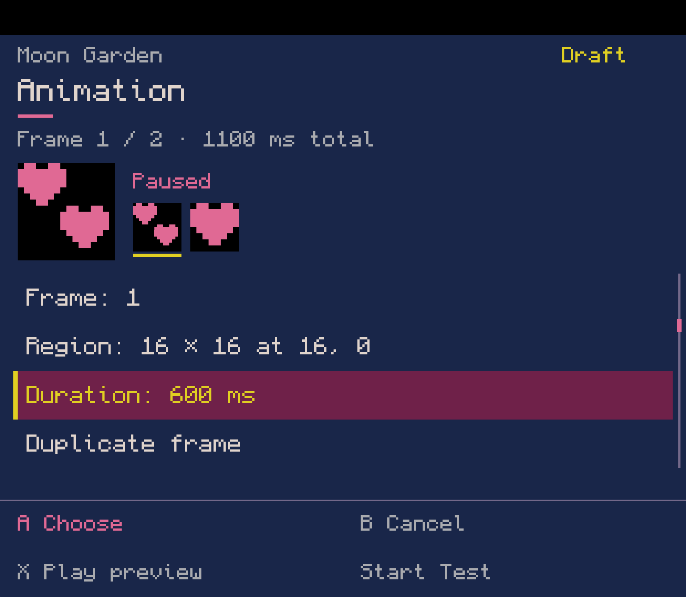
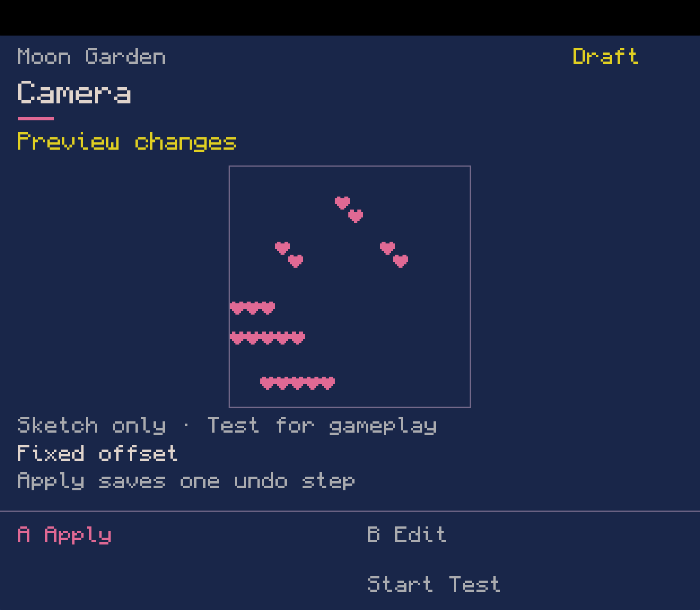
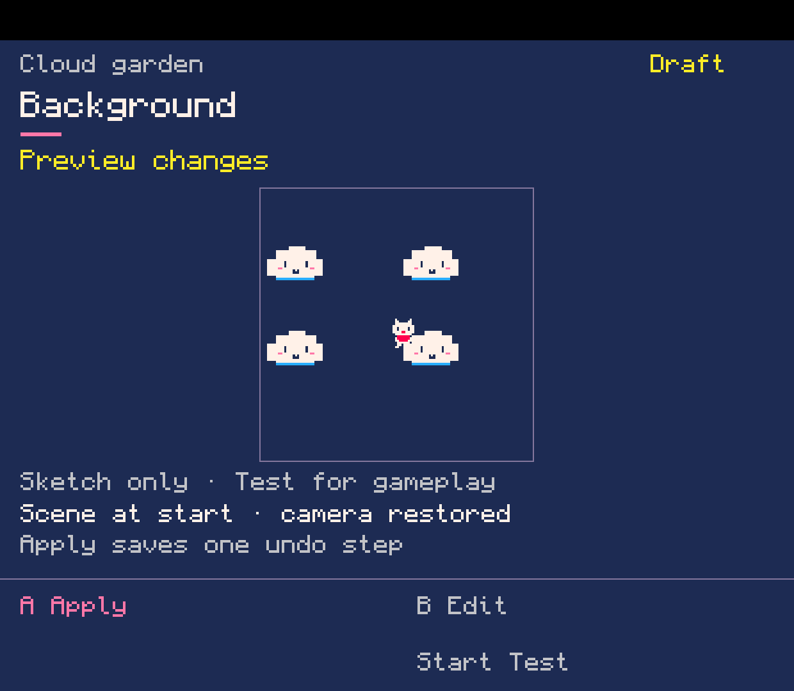

# PikoNest

The current development build combines Play, Workshop and runtime setup in
**one Android APK**. Import your purchased Raspberry Pi PICO-8 ZIP inside PikoNest.
Bring old PICO-8 data through a verified copy with conflict review; the source stays
safe. [Device checks and remaining setup/migration work](docs/showcase/0.0.71-en/README.md).

**A tiny PICO-8 home and game-making workshop for handhelds.**

**Early development · Android first · No public APK release yet.**
The working lab includes Play, project workflows and several editors. The complete
game-creation workflow is still being built. Playing requires your own purchased
copy of official PICO-8; this project does not supply it.

[Shared sprite/map editing and official draft Test](docs/showcase/0.0.73-en/README.md) |
[A game made from Blank through the tools](docs/showcase/0.0.72-en/README.md) ·
[Current scope and roadmap](docs/README.md) · [Build and contribute](CONTRIBUTING.md) ·
[Open tasks](docs/ISSUES.md) · [Screenshots](docs/showcase/README.md)

Original PikoNest code is available under the [MIT License](LICENSE).
[Third-party notices](THIRD_PARTY_NOTICES.md) describe separate component terms.

PikoNest is for that moment when you finish a little game and think:  
*“I wonder what happens if I change this.”*

Play your cartridges like a normal handheld library. Open one up when curiosity wins. Change a sprite, tweak a rule, borrow something you like, or start a game of your own — without turning your handheld into a tiny laptop.

**Play it → open it → change it → make your own.**

  

## Your PICO-8 shelf

Sometimes you just want to play.

PikoNest keeps **Play** separate from the Workshop, with covers, folders, favorites and recent games. Pick a cartridge, launch it and come back to the same place when you're done.

No project setup. No editor popping up. No lesson you have to finish first.

Just your games.

## And when you want to mess with one...

Open the **Workshop**.

PikoNest is designed around a gamepad instead of pretending a four-inch handheld has a comfortable keyboard. Draw pixels, select parts of a sprite sheet, build maps, arrange scenes and change how things behave with the controls already in your hands.

<table>
  <tr>
    <td width="50%"></td>
    <td width="50%"></td>
  </tr>
  <tr>
    <td align="center">Draw and edit your own sprites.</td>
    <td align="center">Pick exactly the piece of the sheet you want to use.</td>
  </tr>
</table>

The finished Workshop is meant to cover the whole little-game loop: **sprites, maps, animation, camera, rooms, backgrounds, effects, SFX, music, rules and code**.

<table>
  <tr>
    <td width="50%"></td>
    <td width="50%"></td>
  </tr>
  <tr>
    <td align="center">Build a world, one tile at a time.</td>
    <td align="center">Arrange frames and set their timing.</td>
  </tr>
</table>

Background images show the regular 0.0.68 build; animation and camera show 0.0.67; Play shows 0.0.66.
The other editors show the earlier 0.0.65 English capture build. [Browse the complete English website gallery and download the image pack](docs/showcase/README.md).

Start from a blank cartridge if you know what you want. Start from a small template if you do not. The tools are the same either way — PikoNest is not built around one genre, one hero, or one kind of game.

## Make rules without typing every character

Writing Lua on a handheld should not mean pecking out punctuation with a D-pad.

PikoNest can present common game logic as small, controller-friendly tools: conditions, values, drawing, input, movement, collisions, transitions and other reusable pieces. Pick what you need, change the useful parts, preview it and put it into the game.

The new **Rules & state** path connects starting numbers, button input, conditions,
add/set/reset actions and live readouts without opening Lua.
[See the blank-project workflow and its current limits](docs/showcase/0.0.69-en/README.md).

<table>
  <tr>
    <td width="50%"></td>
    <td width="50%"></td>
  </tr>
  <tr>
    <td align="center">Preview how the camera frames placed resources.</td>
    <td align="center">Arrange background strips and adjust their movement.</td>
  </tr>
</table>

Underneath, it is still **real Lua**.

There is no special PikoNest scripting language and no block format that owns your project. If you want to open the code and change it yourself, it is right there. The cartridge remains a normal PICO-8 cartridge.

That also means PikoNest can teach without turning into homework: change something first, see what happened, then look at the little piece of Lua responsible for it.

## Keep the good bits

Made a sprite you like? A useful setup? A mechanic you keep rebuilding?

Save it for later.

PikoNest is growing a shared library for reusable parts of your games, so useful things do not have to disappear inside one cartridge. The goal is to carry sprites, animations, backgrounds, sounds, music, effects and reusable game ideas from one project to another without hiding where they came from.

<table>
  <tr>
    <td width="50%"></td>
    <td width="50%"></td>
  </tr>
  <tr>
    <td align="center">Your own little shelf of reusable pieces.</td>
    <td align="center">Then play the result in the real PICO-8 runtime.</td>
  </tr>
</table>

## Change something. Press Test. Play it.

The edit/test loop is one of the main reasons PikoNest exists.

Change a sprite or rule, press Test, play the result in the **official PICO-8 runtime**, exit, and land back where you were working.

The aim is for experimentation to feel cheap enough that you keep doing it.

## Peek inside. Remix. Learn by accident.

PikoNest is also being built around the idea that playing somebody else's tiny game is one of the best ways to become curious about making one.

The intended flow is simple:

- find or play a cartridge;
- peek at its sprites, map, sounds or code;
- make a copy and change something;
- save useful pieces to your own library;
- gradually understand what the game is doing;
- eventually stop needing the friendly tools for things you already know.

The point is not to replace PICO-8 with an easier fake version of it.

The point is to make the first few steps into **real PICO-8** much less annoying.

## The finished PikoNest

PikoNest is being built to feel like one small machine rather than a pile of separate apps:

**Play** — a comfortable cartridge library for everyday use.  
**Create** — make a game from a blank cart or a lightweight starting point.  
**Remix** — open an existing cart and make it yours.  
**Learn** — explanations and examples appear when they are useful, not before.  
**Reuse** — keep assets, presets and mechanics for the next project.  
**Test** — jump into official PICO-8 and straight back into your work.  
**Share** — export normal PICO-8 projects instead of PikoNest-only files.

Larger projects will be able to use multiple cartridges without making the beginner deal with file plumbing. Later experiments include handheld-to-handheld **Link Play**, Linux handheld support, and optional PikoNest-aware online cartridges.

## Still being built

PikoNest is **not ready for a general release yet**.

The screenshots on this page are real captures from Android development builds 0.0.65 and 0.0.66. The editor captures use an isolated English presentation build; the regular app's full localization is still in progress. A lot of the Workshop already works, but several parts of the full experience — especially sound/music creation, effects, deeper remix workflows, first-run setup and final controller/device polish — are still being finished.

Android gaming handhelds are the first target. Linux handhelds are planned later.

PikoNest uses the user's own copy of **official PICO-8** and does not include PICO-8 itself.

<strong>Development notes and project docs</strong>

For implementation status, roadmap and the rather obsessive acceptance checks:

- [Product vision](docs/PRODUCT_VISION.md)
- [Current status](docs/STATUS.md)
- [Roadmap](docs/ROADMAP.md)
- [End-to-end acceptance](docs/ACCEPTANCE.md)
- [New English shelves and website screenshot pack — 0.0.66](docs/showcase/0.0.66-en/README.md)
- [English editor screenshot pack — 0.0.65](docs/showcase/0.0.65-en/README.md)
- [Original screenshot set — 0.0.61](docs/showcase/0.0.61/README.md)
- [Project rename and planned identifier migration](docs/PROJECT_NAME.md)

PikoNest was previously called PIKOOS. The original 0.0.61 screenshots and
installed APK still show that name. Technical identifiers and data paths will be
migrated separately, with existing projects and settings preserved.

---

PikoNest is an independent project and is not affiliated with Lexaloffle Games. PICO-8 must be obtained separately from its official publisher.
