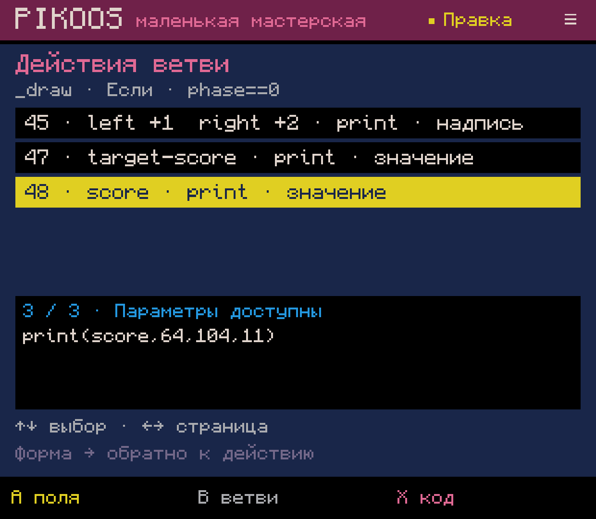
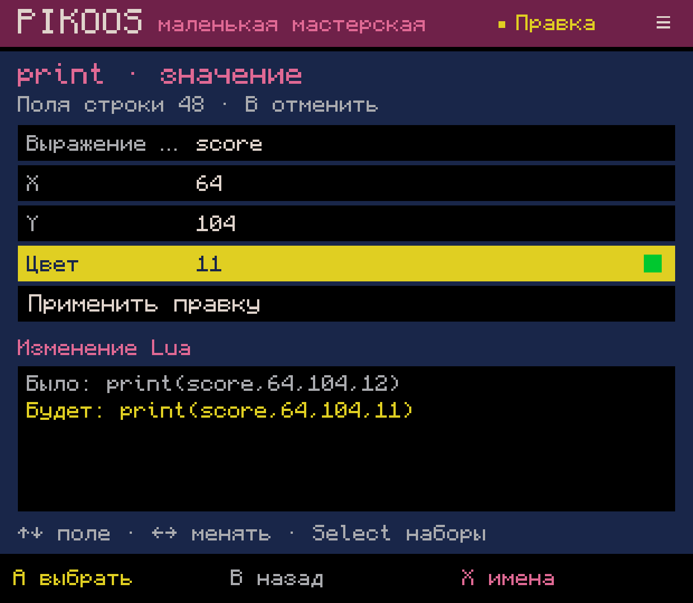
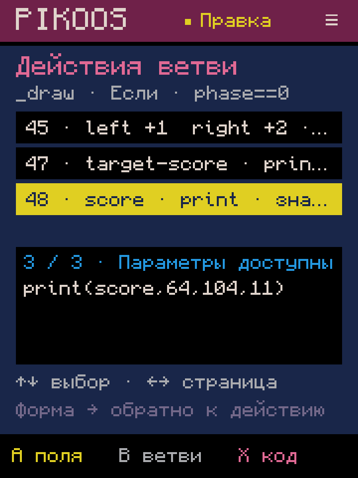
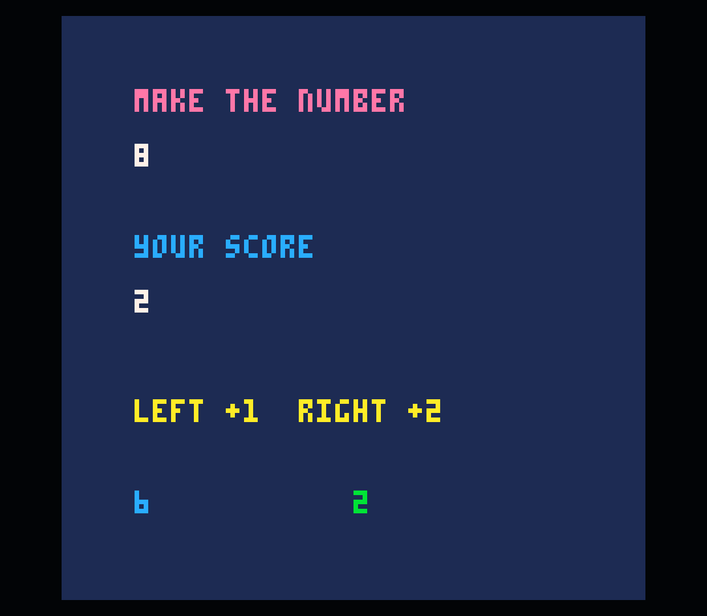

# 0.0.58 — действия внутри ветви

Следующий ограниченный срез M02.2, 2026-10-04. В списке условий A открывает
действия выбранной ветви. Теперь нужную строку можно выбрать без поиска курсором.
Это общий инструмент Lua; герой, движение и конкретный жанр не требуются.

- Крестовина выбирает действие; внизу виден его исходный Lua.
- **A** открывает поддерживаемую форму параметров. Подтверждение и отмена
  возвращают к тому же действию. На компактном экране значение стоит перед типом
  операции, чтобы отличать, например, `score` от `target-score`.
- **X** открывает выбранное место в коде. Незнакомые строки и вложенные блоки
  по A также открываются в Lua, без преобразования.
- **B** возвращает к выбранной ветви. Добавление остаётся на X в списке ветвей.

## Границы реализации

Переносимый `LuaBranchActions` строит консервативный список на основе существующего
сканера блоков. Вложенный if/else, цикл, многострочная таблица/строка/вызов остаются
одной записью. Внутренние ветви доступны через общий список условий.
Однострочные поддерживаемые операции используют существующий `LuaCall`; меняются
только выбранные аргументы. Комментарии, форматирование и соседние строки сохраняются.
Это не полный AST и не визуальный язык. Неподдерживаемая структура сохраняет
ограничения прежнего списка ветвей. Удаление и перестановка пока не реализованы.

Журнал v10 оборачивает прежний формат черновика, сохраняя выбранную ветвь/действие
и адрес возврата из формы. Старые журналы читаются прежним путём. Метаданные
не добавляются в `.p8`; результат остаётся обычным PICO-8 Lua.
Синтаксис сверен с [официальным руководством](https://www.lexaloffle.com/dl/docs/pico-8_manual.html#_Lua_Syntax_Primer).

## Проверки

Полная сборка и существующие тесты прошли. **LuaBranchActionsTest: 58 проверок**:
LF/CRLF/CR, прямые и вложенные действия, многострочные конструкции, точная правка,
отмена, Undo/Redo, пустая ветвь, восстановление списка и незавершённой формы,
повреждённые журналы, контроллерные переходы и блокировка фоновых команд в списке.

На Retroid, событиями контроллера ADB:

1. Создана копия 23 сохранённой числовой игры. В ветви `_draw / phase==0` выбран
   третий вызов `print`, а не первое действие.
2. Цвет изменён с 12 на 11; приложение перезапущено до подтверждения. Форма
   восстановилась. B вернул к тому же действию без изменения исходника.
3. Повторная правка подтверждена; список сохранил выбор. X → Undo/Redo побайтно
   отменили и вернули единственную правку.
4. Save/Test запустил официальный PICO-8. Нижний счёт стал зелёным; Right изменил
   счёт с 0 до 2 и оставшуюся цель с 8 до 6.
5. Список восстановлен после force-stop на 720×960. Проверен родной 1240×1080,
   родной размер возвращён. Звук остаётся 0.

Все **40 прежних файлов** проектов и библиотеки совпадают побайтно. Добавлен
только `remix-0023/game.p8`; отличие от копии 22 — аргумент цвета одного `print`.
[Сохранность](preservation.json), [проверка сборки](verification.json),
[журнал](build-final.log), [исходный cart](before.p8), [проверенный cart](tested.p8).

После Test мастерская возвращается к сохранённому коду; список открывается заново
через редактор. События ADB не заменяют физическую UX-приёмку владельцем.
APK установлен локально; GitHub Release не создавался.

## Дальше

M02.2 остаётся частичным: безопасное удаление и перестановка с просмотром результата,
единой отменой и сохранением ручного Lua. Затем продолжить остальные инструменты
M2/M3, общую библиотеку и полный авторский цикл по ROADMAP.
