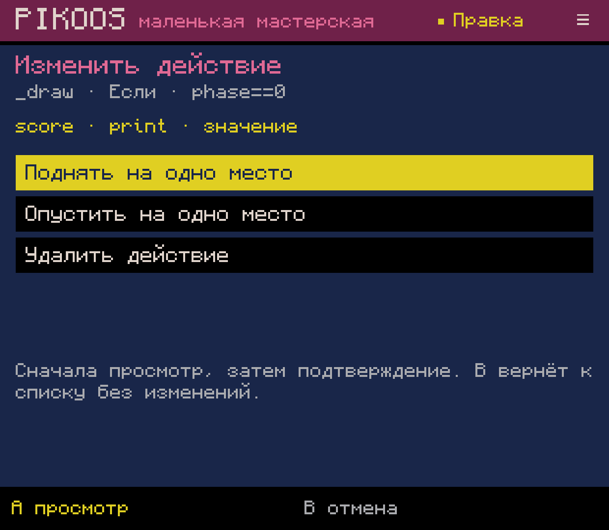
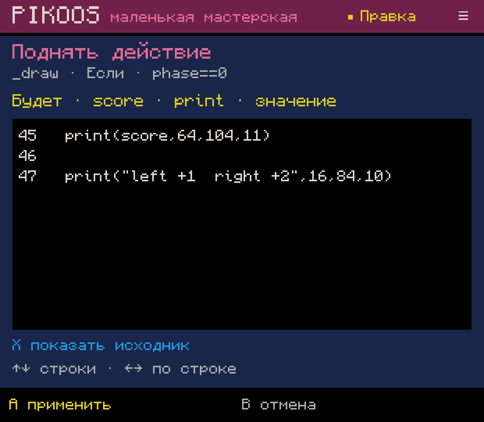
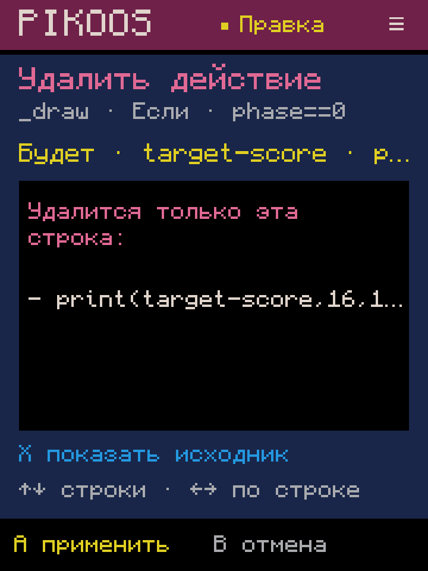
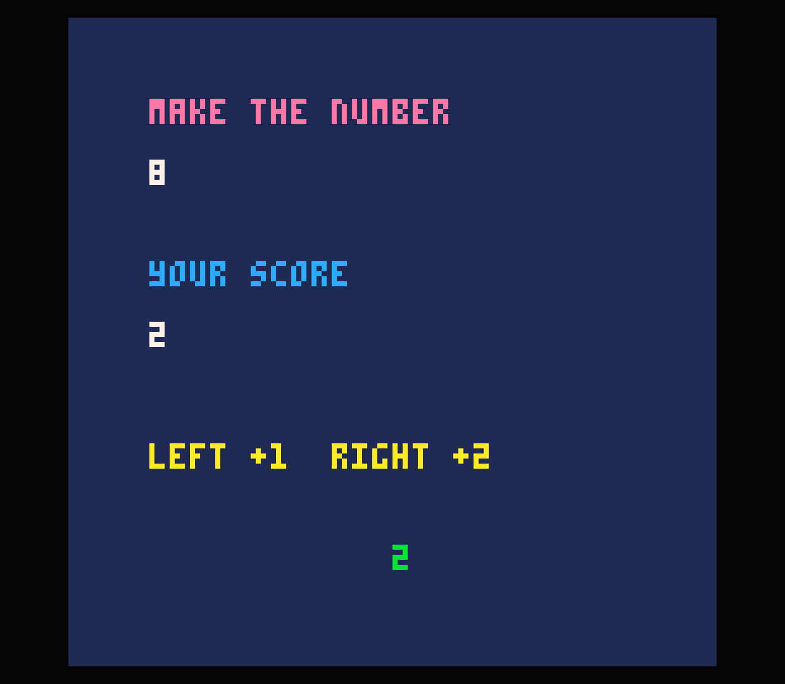

# 0.0.59 — порядок и удаление действий

Ограниченный срез M02.2, 2026-10-04. В списке действий ветви **Select** открывает
операции «поднять», «опустить», «удалить». A сначала показывает результат,
повторное A применяет его. X переключает «было/будет»; B отменяет просмотр,
затем возвращает к выбранному действию. Крестовина прокручивает длинный исходник.

## Данные и ограничения

Переносимый `LuaActionChange` создаёт неизменяемое предложение: исходник, результат,
затронутый фрагмент и выбор после операции. Просмотр и отмена не меняют черновик.
Перед применением проверяется совпадение исходника; одна операция создаёт одну
запись Undo. После применения список сохраняет перемещённое действие либо выбирает
соседнее после удаления. Удаление последнего оставляет обычную пустую ветвь.
Отмена правки доступна через X → Y в коде; для пустой ветви — B → B → Y.

В этом срезе **вся выбранная ветвь** должна состоять из распознанных однострочных
вызовов/присваиваний. Ветка с local, вложенным блоком, return/break или незнакомым
Lua открывается для структурной правки только в коде. Это ограничение редактора,
не PICO-8. Соседние ветви и остальной исходник могут содержать произвольный Lua.
Нет анализа зависимостей значений: перестановка намеренно меняет порядок выполнения;
результат нужно проверять в игре.

Строка переносится целиком с отступом, переводом строки и комментарием справа.
Пустые строки между действиями остаются на своём месте. Перестановка через отдельный
комментарий отклоняется, поскольку его принадлежность неизвестна. Удаление сохраняет
отдельные комментарии и все соседние строки. Вложенные блоки не разбираются на части.
Обычный `.p8` остаётся источником игры; новых runtime-зависимостей нет.
Синтаксис сверялся с [официальным руководством PICO-8](https://www.lexaloffle.com/dl/docs/pico-8_manual.html#_Lua_Syntax_Primer).

Журнал v11 сохраняет меню, операцию, сторону просмотра и прокрутку; предложение
после восстановления заново вычисляется из сохранённого исходника. Журналы v1–10
по-прежнему читаются. Фоновые команды сохранения, Test, ввода и Undo блокируются
до выхода из просмотра, как и в остальных формах.

## Проверки

Полная сборка прошла. **LuaActionChangeTest: 82 проверки**: LF/CRLF/CR,
перестановка в обе стороны, точное удаление первой/средней/последней строки,
пустая ветвь, inline/отдельные комментарии, неизвестные и многострочные конструкции,
local/return, границы ветви, устаревший исходник, no-op, восстановление меню/просмотра,
повреждённый журнал, контроллерный путь, одна отмена и повтор.

На Retroid через события контроллера ADB:

1. Создана копия 24 из сохранённой копии 23. Выбран третий `print` в `_draw / phase==0`.
2. Просмотр подъёма восстановлен после force-stop; отмена оставила исходник прежним.
   Повторное подтверждение поменяло местами ровно два вызова. X → Undo/Redo вернули
   точные строки в обоих направлениях.
3. Открыто удаление `print(target-score,16,104,12)`, проверены обе стороны и отмена.
   Повторный просмотр восстановлен на 720×960 и после обновления APK. Родной размер
   1240×1080 возвращён, удаление применено и проверено через Undo/Redo.
4. Save/Test запустил официальный PICO-8 0.2.7: голубой остаток цели исчез, зелёный
   счёт остался и изменился с 0 на 2 по Right. Возврат открыл сохранённый код.
5. На итоговой сборке снят ещё один просмотр перестановки оставшихся действий;
   он отменён. На консоли оставлен список действий копии 24.

Все **41 прежний файл** проектов/библиотеки сохранились побайтно. Добавлен только
`remix-0024/game.p8`; итоговое отличие — удалённый вызов остатка цели. Перестановка
до удаления отдельно проверена сравнением текста черновика.
[Сохранность](preservation.json), [APK и устройство](verification.json),
[сборка](build-final.log), [до](before.p8), [после](tested.p8).

Звук 0; GitHub Release нет. ADB не заменяет физическую и пользовательскую приёмку.
M02.2 остаётся частичным для сложного Lua и переноса между ветвями.

## Дальше

Следующий пользовательский инструмент — N03: фоновые слои, независимое движение
и параллакс через обычный PICO-8 Lua. Сложные структурные правки M02.2 остаются
отдельным долгом; они не блокируют развитие недостающих инструментов M2/M3.
