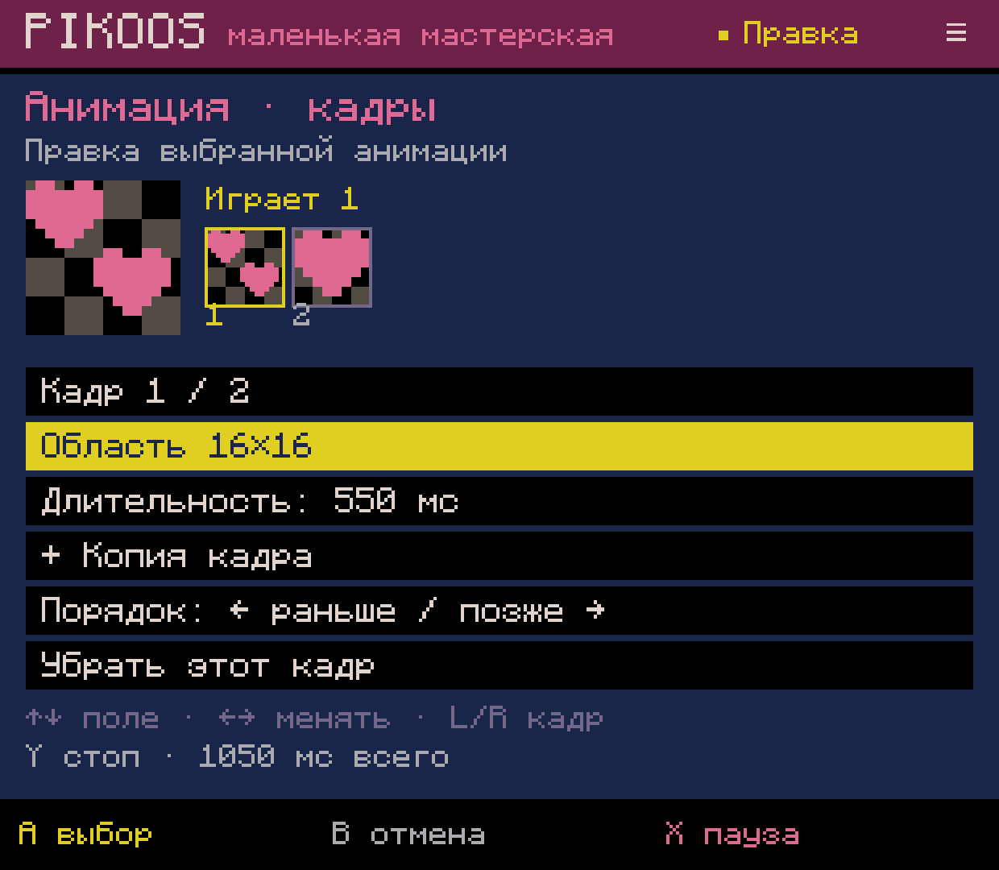
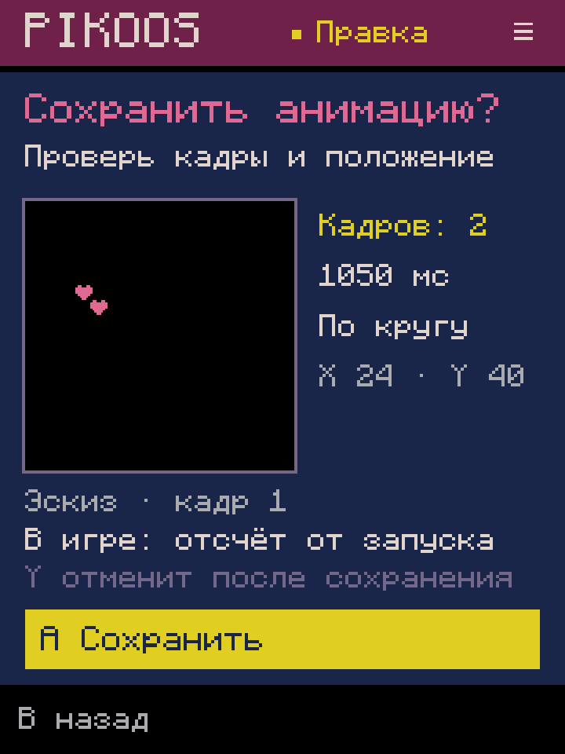
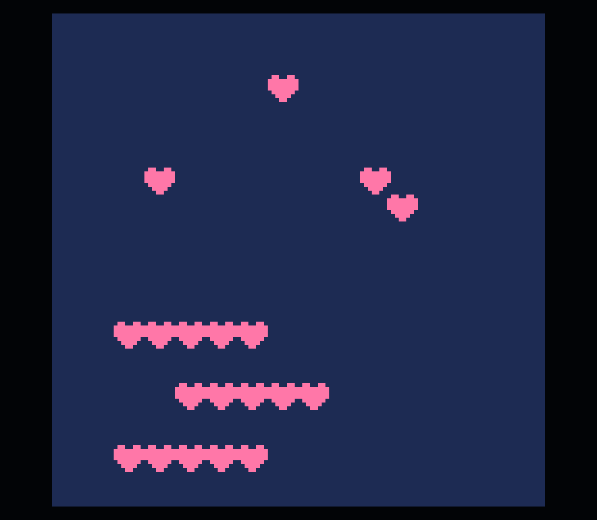

# Анимации из мастерской — Android lab 0.0.64

Проверено 2026-10-04 на Retroid Pocket Classic. Срез N01.3/G04 соединяет уже
существующий редактор кадров со списком размещений. Это технические свидетельства,
не приёмка всей N01/M2 и не законченные связи поведения игры.

## Путь пользователя

Мастерская → Select → «Размещения в игре» → Select:

- «Добавить анимацию» начинает последовательность из выбранной области листа.
- «Оживить выбранный спрайт» заменяет именно выбранное использование и сохраняет
  его положение. Другое использование тех же пикселей остаётся самостоятельным.
- A на строке анимации открывает кадры, длительности, порядок, повтор и положение.
- «Дублировать выбранное» создаёт самостоятельную последовательность; изменение
  её положения/кадров не меняет оригинал. Пиксели листа остаются общим ресурсом.
- «Убрать использование» удаляет выбранный блок анимации, сохраняя сами пиксели.

В форме: ↑↓ выбирают поле, ←→ изменяют значение; L/R выбирают кадр, X запускает
или приостанавливает preview, Y останавливает. Выбор области/положения работает
через крестовину и два угла; touch необязателен. Последнее поле — «Проверить и
сохранить». Подтверждение показывает кадр, положение, число кадров, общую длительность
и повтор; обязательного просмотра Lua нет. B возвращает шаг или отменяет форму.
После сохранения Y/R2 выполняют Undo/Redo целой операции. Start запускает сохранённый
cart из списка; незаконченная форма не запускается обходным сочетанием кнопок.
Открыть Lua можно отдельно через меню списка.

## Совместимость и границы

Это обычный PICO-8 Lua: локальная таблица кадров, `time()`, `sspr()` и стандартные
области спрайт-листа. Руководство из пользовательского PICO-8 0.2.7 подтверждает
пиксельные области `sspr` и отсчёт `time()` от запуска cart. Нет обязательной
метадаты или собственного runtime API. Сканер принимает только точную известную
форму блока в поддержанной плоской `_draw`; остальной исходник и ресурсные секции
сохраняются. При превращении спрайта его inline-комментарий остаётся отдельной
строкой перед анимацией. Неизвестный или изменённый вручную блок не нормализуется.

Текущие ограничения:

- Общий список ещё не работает с произвольной вложенной/динамической отрисовкой,
  неизвестной камерой или изменёнными блоками. Нет полного разбора Lua в сцену.
- Анимации стартуют вместе с игрой. «Один раз» удерживает последний кадр после
  завершения; начало по событию, перезапуск и переходы состояний ещё не связаны.
- До 32 кадров, 50–5000 мс на кадр, позиции −127…127 — границы текущего редактора,
  не ограничения PICO-8. `spr`/`sspr` вне этого диапазона нельзя автоматически
  превращать в анимацию этой формой.
- Undo хранится в памяти. Восстановление незаконченной формы не является P04.
  После cold start/resize вход остаётся через Play → Workshop (долг Q02).
- ADB-проверки используют путь контроллера, но физическую эргономику принимает
  владелец отдельно. Общие события, камера и полная игра без Lua ещё не закрыты.

## Проверки

- `AnimationUsesTest`: **81** новая проверка. LF/CRLF/CR, сохранность комментариев
  и ресурсов, положение/регион при преобразовании, повторное сохранение без изменений,
  правка только выбранного блока, копия/удаление, соседние статические размещения,
  создание `_draw` из blank, устаревший cart, повреждённый журнал, неизвестный Lua,
  переопределённые API, миграция журнала v1 → v2, отмена формы, ошибка записи без
  потери черновика, одна Undo/Redo, Test и необязательный переход к Lua.
- Полный существующий build/test suite прошёл; APK 0.0.64 установлен локально.
  GitHub Release не создавался, звук не включался.
- На устройстве через ADB-кнопки создана копия `remix-0027` → `remix-0028`.
  Первое использование спрайта `(24,40)` превращено в анимацию из областей
  `(16,0,16,16)` и `(16,0,8,8)`. Кадры сначала по 500 мс, затем первый изменён
  на 550 мс повторным входом. Проверены Undo/Redo преобразования и recovery
  незавершённой формы после force-stop на небольшом экране 720×960.
- Через меню создана копия с положением `(56,16)`, проверены удаление/Cancel/Undo.
  Остались две последовательности по 1050 мс и прежний статический спрайт `(80,40)`.
  Пиксели, обычная и общая карта и остальные ресурсные секции побайтно сохранены.
- Официальный **PICO-8 0.2.7 / Runtime Test 8** воспроизвёл оба кадра. В восьми
  последовательных скриншотах проверены все 16 384 пикселя; расхождений нет.
  Наблюдалась последовательность кадров `1,2,1,2,1,1,2,1`. Это проверка содержания
  и смены кадров, не точное измерение длительностей по времени снимков.
- Возврат в мастерскую пройден. Все **46 прежних файлов** проектов/библиотеки
  сохранились побайтно; добавлен один проект, всего 47 файлов.
  [Машинный итог и хэши](verification.json), [обычный итоговый cart](final.p8).

## Скриншоты итоговой сборки

Редактор кадров с живым просмотром:

Подтверждение на маленьком экране:

Официальный runtime, [кадр 1](runtime-frame-1.png) и [кадр 2](runtime-frame-2.png).
Справа остаётся статический спрайт; слева и сверху меняются две последовательности:

Далее — вход и управление камерой N02/G04 без поиска строк Lua; затем связный
путь мира, фона, движения/событий и HUD. Наборы и жанровые шаблоны пока не расширяем.
