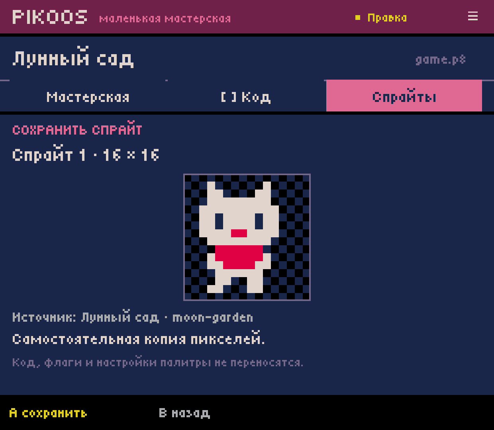
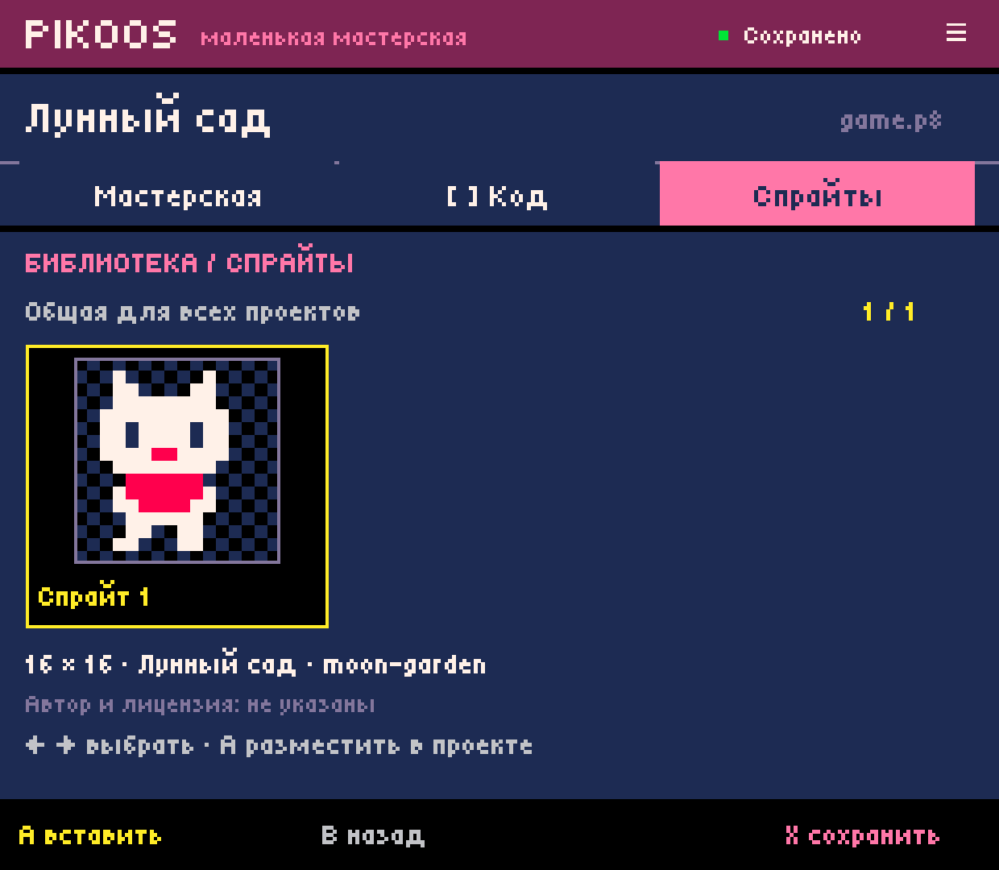
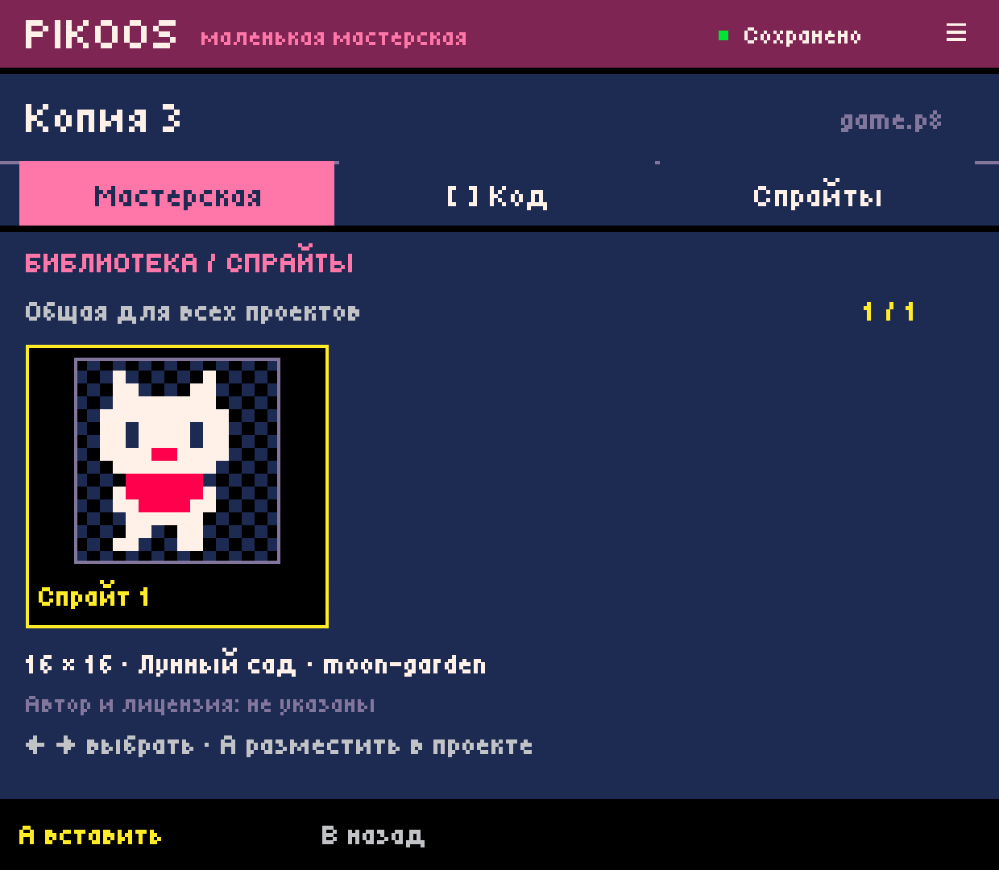
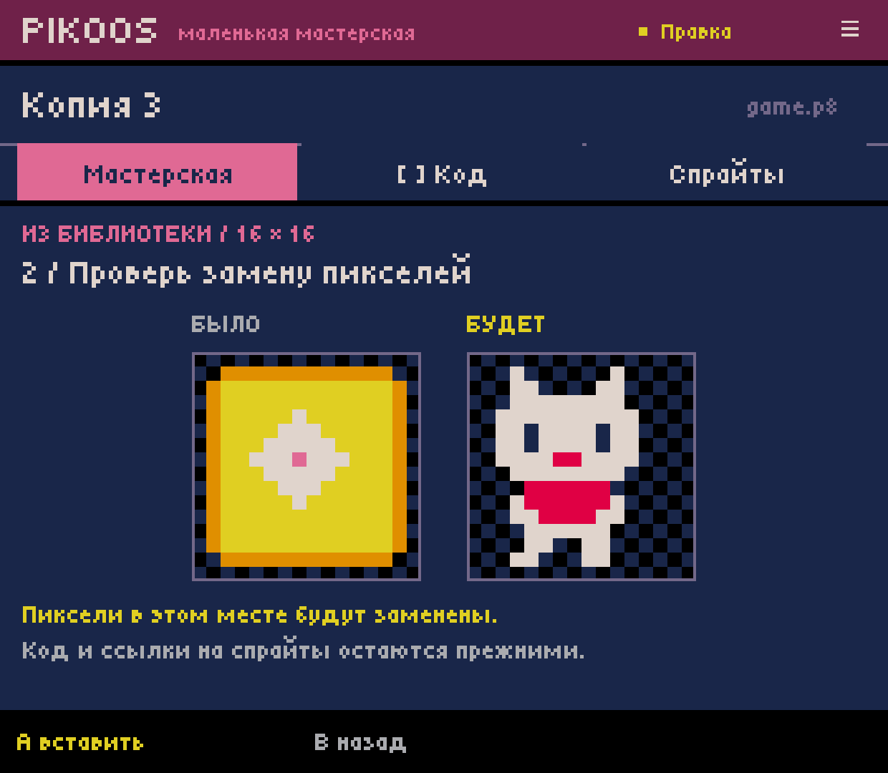
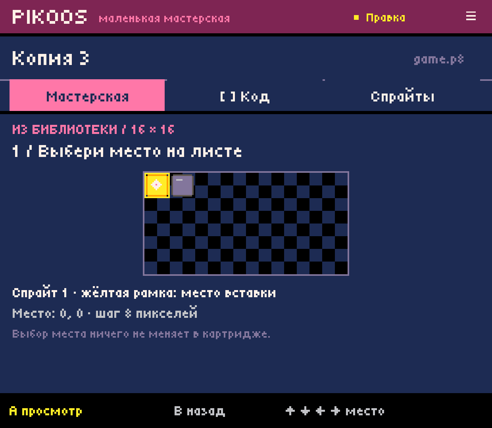
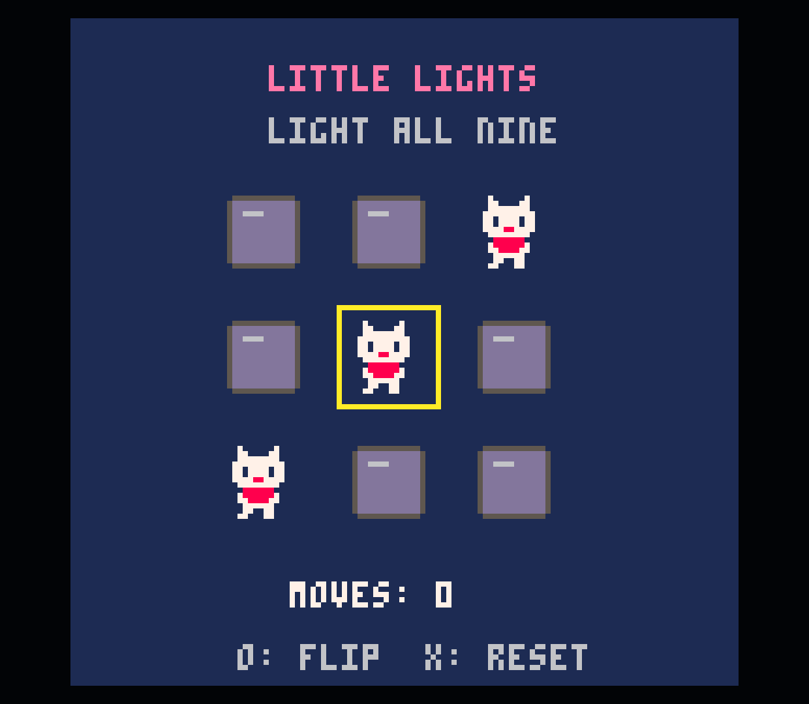
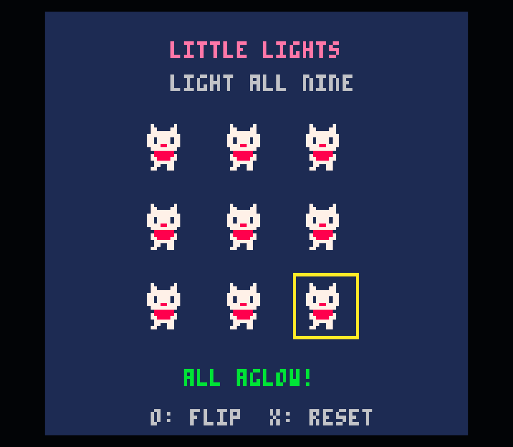

# Android 0.0.11 — shared sprite library

2026-10-03. Actual Retroid Pocket Classic captures, 1240×1080.

## User workflow

Select a sprite/region → Select/menu → Resources → X Save → preview → Confirm.
In another project: menu → Resources → choose record → Confirm → place → review
before/after → Confirm. Cancel backs out without writes. Undo reverses insertion.
The catalogue is available regardless of template, genre or hero presence.

The saved record owns its pixels. Editing an inserted copy does not update the
record, source project or other games. Export does not modify the source cart or
its undo history. A normal inserted `.p8` needs no library access at runtime.
Only pixel color indexes are transferred: flags, palette/transparent-color Lua
state, animation and behavior are explicitly outside this slice.

## Device verification

- Updated in place to versionCode 11 / 0.0.11; existing app data retained.
- Used controller-equivalent semantic button key events throughout.
- Saved the first 16×16 cat sprite from `moon-garden` into the shared library.
  The source hash stayed unchanged.
- Backgrounded/killed the app; `pidof` returned empty. Cold start restored the
  catalogue and read its stored record successfully.
- Created independent `remix-0003` from `puzzle-0001`. Opened Resources from the
  generic workshop tab, placed the cat over the lit-cell sprite at `(0,0)`.
- Before confirmation, backgrounded/killed again. Cold start restored placement
  with the copied asset snapshot and required reviewing the preview again. The
  canonical target remained byte-exact before confirmation.
- Committed, undid byte-exactly, inserted again and launched in the user's
  official PICO-8 wrapper. The puzzle showed cats for lit cells and retained its
  original rules. Solved it in two moves; the win screen is captured below.
- Returned, edited one inserted pixel and confirmed the library record hash was
  unchanged. Undid that edit. Left `Copy 3` as a playable cat-puzzle example.
- All six pre-existing project hashes matched the pre-install baseline.

Target before insertion / after Undo:
`994fa36116ea6384017b5b48f43596775563471f47cb6f59827da0b95684c296`.
Target with inserted cat, retained as Copy 3:
`ff13fa507c3084cf692f92893627a80524e8a8efd6a1b59e2a5fca04b229bcd3`.
Library record hash, unchanged by target edit/run:
`1d028c963d98231f0a3e0a7efe61008733871a3fba4f52195327f1357e60be8b`.

## Automated verification

`experiments/android-host/build.ps1`: all ten core/lab suites pass, plus Android
compilation and APK signature verification. `AssetLibraryTest` covers standalone
record roundtrip, bounds/color/version/truncation validation, immutable data,
controller routes, cancel, failed export/import and retry, no source mutation,
blank/puzzle/platformer insertion, exact undo including newly created gfx,
unchanged pixels outside the destination, no role/Lua injection, and restoring
an insertion after discarding both source project and library record. Tests run
the portable domain on the JDK without Android.

Final installed APK SHA256:
`12d6c05d98bd3799d8e9dbbde94166c6f089e9926fd0dd231b1b68bf17a6c34f`.

Graphics semantics checked against the [official PICO-8 manual, Graphics](https://www.lexaloffle.com/dl/docs/pico-8_manual.html):
ordinary indexed sheet pixels, not a new sprite storage model inside games.
The current upper-half/8-pixel-grid insertion limit is a lab limitation. Shared
map-half editing and dynamic draw-state reconstruction remain separate work.

## Experimental persistence format

Location: app-private `files/asset-library/sprites/<uuid>.pksp`, outside projects.
Each file is written with Android `AtomicFile`. The catalogue is rebuilt from
records; no mutable index is required. Repeating a completed write for the same
ID and exact bytes is safe; differing data under an existing ID is rejected.
An unreadable record produces an explicit error and is retained. This initial
browser does not yet isolate a damaged record into a separate repair UI.

Version 1 uses big-endian DataOutputStream fields:

1. magic `0x504b5350` (PKSP), version `1`, both 32-bit integers;
2. UUID, automatic display title, project origin and source-cart SHA256 as Java
   `writeUTF` strings (length-prefixed modified UTF-8);
3. source x/y and width/height as 32-bit integers;
4. exactly width×height bytes, row-major, one palette index 0..15 per byte.

Decode rejects unknown versions, invalid metadata/dimensions/colors, truncation
and trailing data; records are capped at 20,000 bytes. This format is internal
to the experiment, versioned independently of `.p8`. A future general asset
package/versioning design must migrate or retain these records safely.
Only known provenance is recorded; author/license are shown as unspecified.

Project UI preferences retain browser selection and a self-contained export or
insertion draft. Restored insertions return to placement and re-preview. Export
confirmation is explicit after restoration as well. Undo history is in-memory.

## Remaining scope

User-selected data folders and backup/export, renaming, tags/collections,
deletion and version updates are pending. App-private persistence survives app
updates but is not an external backup. Arbitrary `.p8`/`.p8.png` import, animation,
tile/map dependencies, SFX/music and effects packages remain future workflows.
This is the first sprite-only library, not completion of the whole asset system.
No claim of multi-device or new physical-controller mapping acceptance.

## Captures

