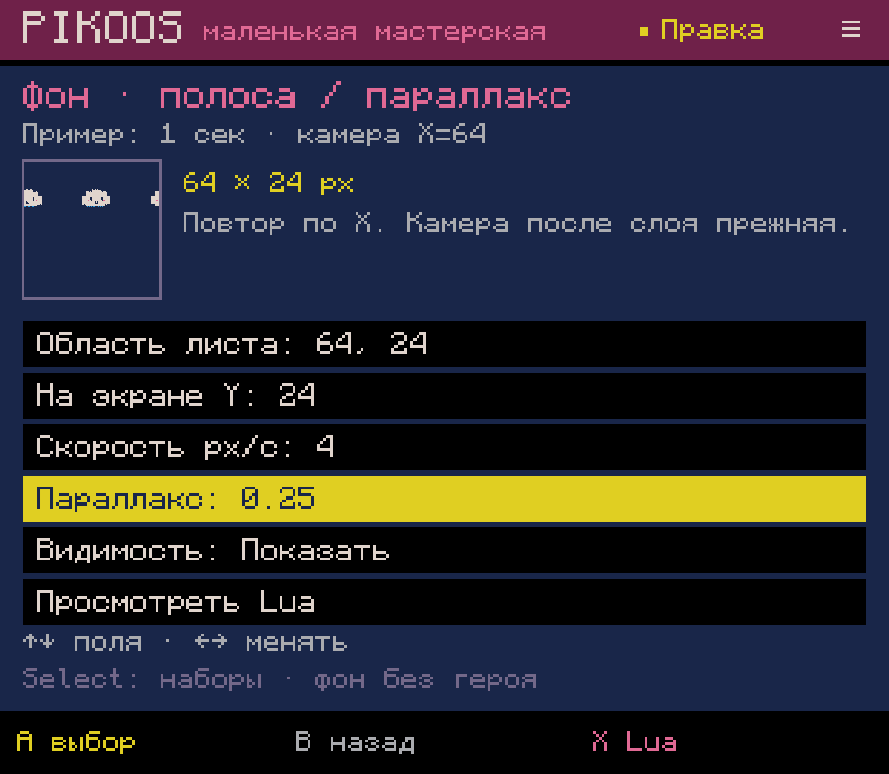
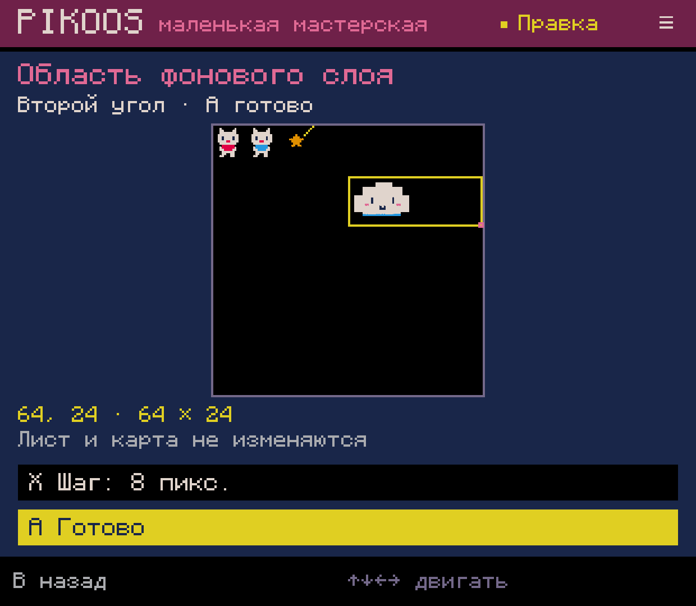
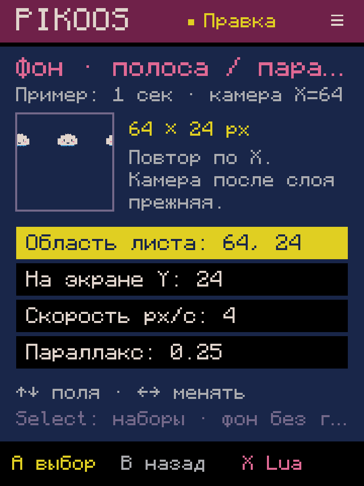
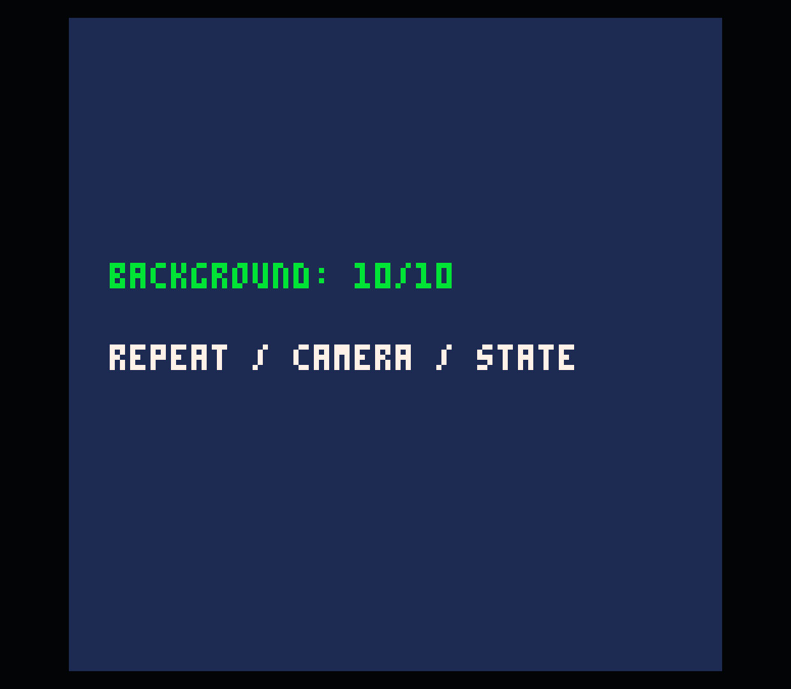
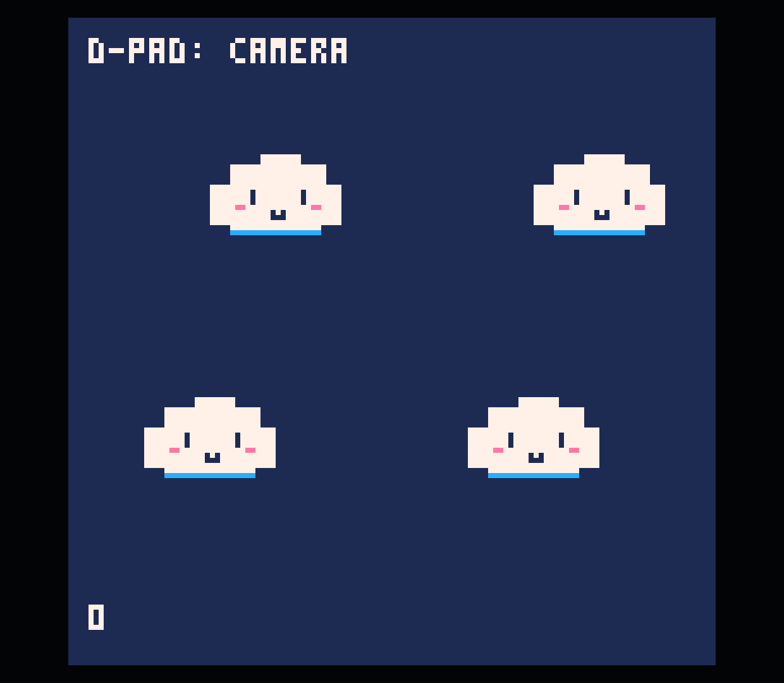
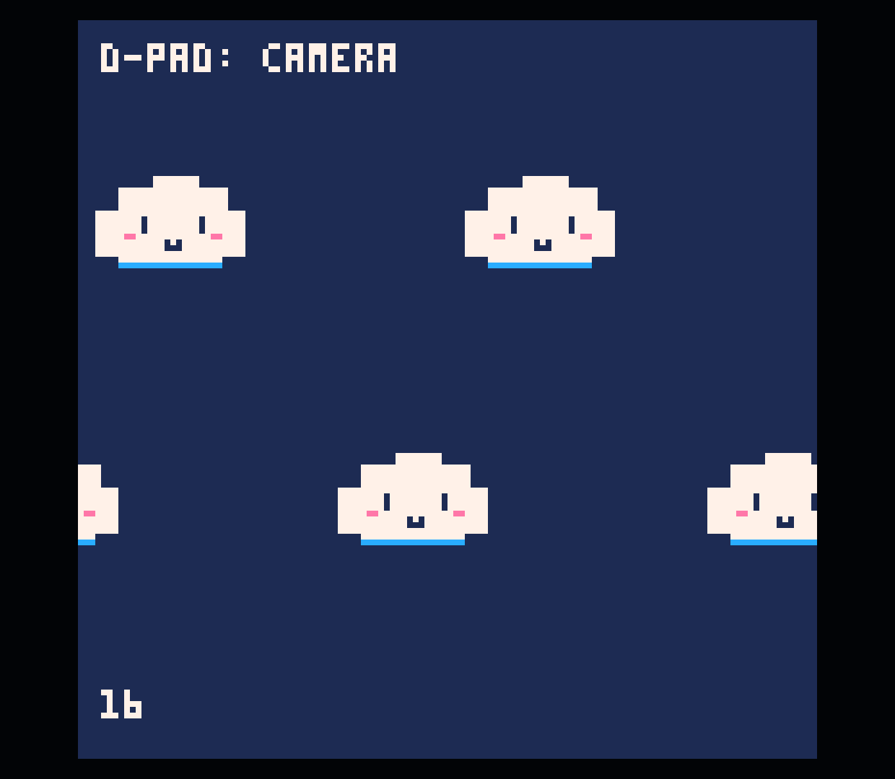

# 0.0.60 — фоновые полосы и параллакс

Первый срез N03.1, 2026-10-04. В каталоге «Камера / фон» доступна форма
«Фон · полоса / параллакс»: область спрайт-листа, положение Y на экране,
скорость в пикселях/секунду, коэффициент параллакса и видимость.
Обязательного героя или жанра нет. Несколько слоёв — несколько обычных блоков Lua.

## Взаимодействие

Крестовина выбирает поле и меняет значение. A на области открывает выбор двух углов;
X меняет шаг 1/8 пикселей. B возвращает к первому углу, затем отменяет выбор.
В форме X открывает Lua, A в просмотре подтверждает; B возвращает к полям.
Select открывает наборы параметров. Область ресурса при применении набора сохраняется
своей. L на любой строке неизменённого блока снова открывает настройки.
Просмотр изменений показывает «было/будет», применение создаёт одну запись Undo.

## Совместимость и границы

Полоса повторяется только по горизонтали. Источник — прямоугольник 1–128 пикселей
в пределах листа 128×128, включая доступную для чтения общую память gfx/map.
Выбор ничего не перерисовывает в листе или карте. Скорость целая −32…32; положительная
двигает вправо. Параллакс 0 привязывает к экрану, 1 — к миру; доступны также
0.25, 0.5, 0.75. Y — экранная координата −127…127. По умолчанию слой видим.

Вставлять нужно в `_draw` после очистки экрана и установки мировой камеры.
Каждый блок временно сбрасывает камеру через `camera()`, использует её прежний X
для параллакса и восстанавливает X/Y. Позже нарисованный слой оказывается сверху.
`sspr`, `time`, `flr`, обычные локальные переменные и цикл — весь механизм;
особой секции, метаданных или API PIKOOS для игры нет.
Остаток времени берётся до умножения, чтобы не переполнить 16.16 PICO-8.
Палитра, прозрачность и clip наследуются из текущего состояния и не меняются.
Миниатюра формы — обозначенный пример при времени 1 секунда и камере X=64,
со стандартной палитрой и прозрачным цветом 0, а не живая эмуляция игры.

Форма распознаёт точную структуру своего рецепта, сохраняя отступы и переводы строк.
Правка формулы вручную размыкает привязку; обычный редактор Lua остаётся доступен.
Переопределённые camera/sspr/time/flr, includes и изменённое окружение отклоняются
консервативно. Это ограничения инструмента, а не PICO-8.
Журнал v12 оборачивает существующий журнал только для активного выбора области.
Старые журналы остаются читаемыми.

Правила сверены с [официальным руководством PICO-8](https://www.lexaloffle.com/dl/docs/pico-8_manual.html#SSPR).
Возвращаемые координаты `camera()` отдельно подтверждены официальным runtime 0.2.7.

## Проверки

Полная сборка прошла; **BackgroundLayerTest: 71 проверка**. Проверены LF/CRLF/CR,
границы листа и значений, сохранность неизвестных секций и соседнего Lua, повторные
формы, no-op, Undo/Redo, восстановление, контроллерный путь, блокировка фоновых команд,
ручная правка, shadowed API, несколько слоёв и перенос параметров без области.

Отдельный [проверочный картридж](runtime-checks.p8) получил **10/10** в официальном
PICO-8: ширины 1/3/7/16/128, отрицательные скорости, крайние координаты и время,
сравнение всех 128 пикселей строки с ожидаемыми значениями, скрытый слой,
восстановление камеры, сохранение palette/palt/clip. В вычислительных случаях clock
подставлен детерминированно; проверка состояния использует исходный рецепт.

На Retroid через события контроллера ADB:

1. Создана копия 25 из копии 1. Через экранную клавиатуру введён небольшой `_draw`
   и управление камерой; затем через новый инструмент выбрана область 64,24 / 64×24.
2. Выбор второго угла восстановлен после force-stop. Добавлены два слоя:
   Y=24, скорость 4, параллакс 0.25; Y=72, скорость −8, параллакс 0.75.
3. Undo удалил ровно второй блок, Redo восстановил точный исходник. Save/Test
   запустил оба слоя; последовательные снимки показали независимое движение,
   Right сдвинул камеру, HUD остался экранным.
4. L внутри первого блока открыл его параметры. На 720×960 изменена видимость,
   просмотр восстановлен после force-stop, отмена оставила исходник прежним.
   Родной размер 1240×1080 возвращён.

Все **42 прежних файла** проектов и библиотеки сохранились побайтно. Добавлен только
`remix-0025/game.p8`; все секции вне Lua совпадают с исходной копией 1.
[Сохранность](preservation.json), [сборка](build.log), [APK/устройство](verification.json),
[исходный ресурс](before.p8), [итог](tested.p8).
Звук 0; Release нет. ADB и технические проверки не заменяют физическую UX-приёмку.

## Дальше

N03.2: список известных фоновых слоёв, открытие параметров без поиска строки,
безопасная смена порядка с просмотром и отменой. Затем вертикальные/map-варианты
и связь с анимацией. N03 и общий M2 остаются частичными.
