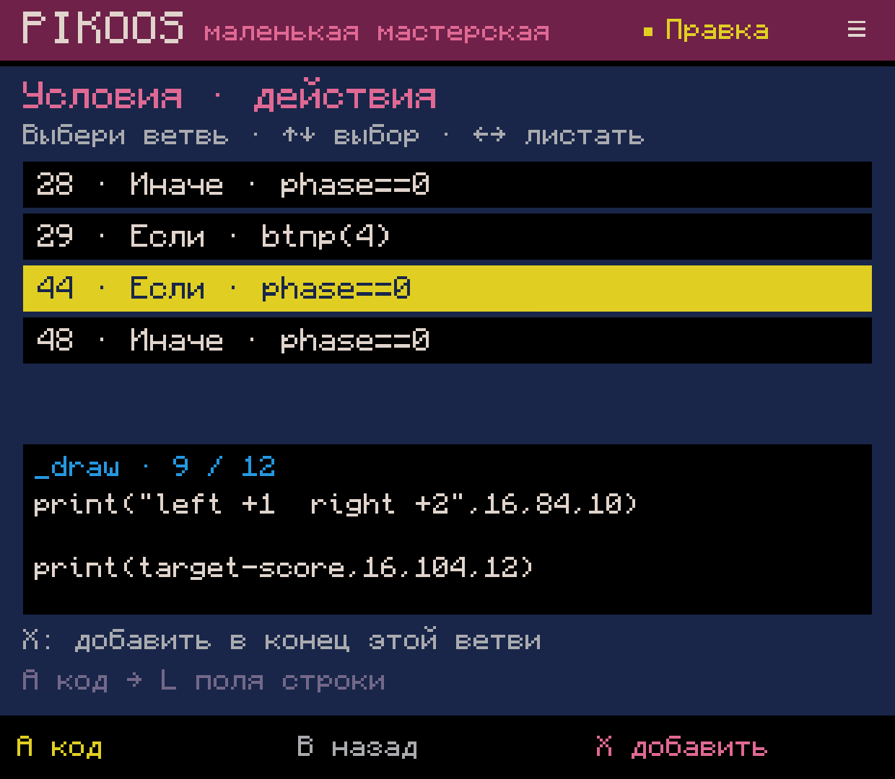
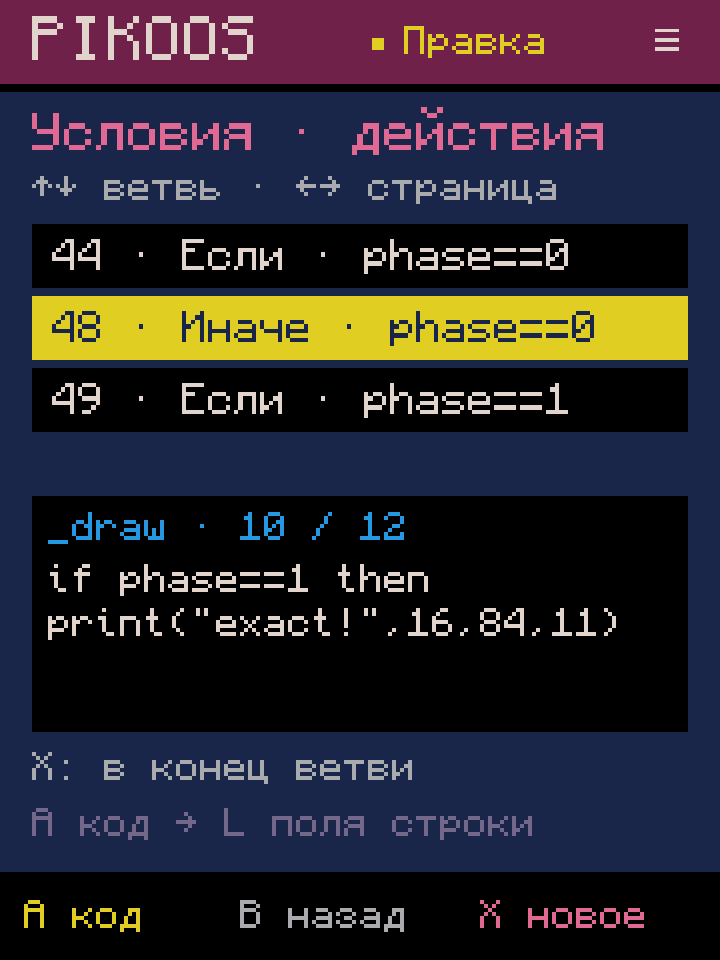
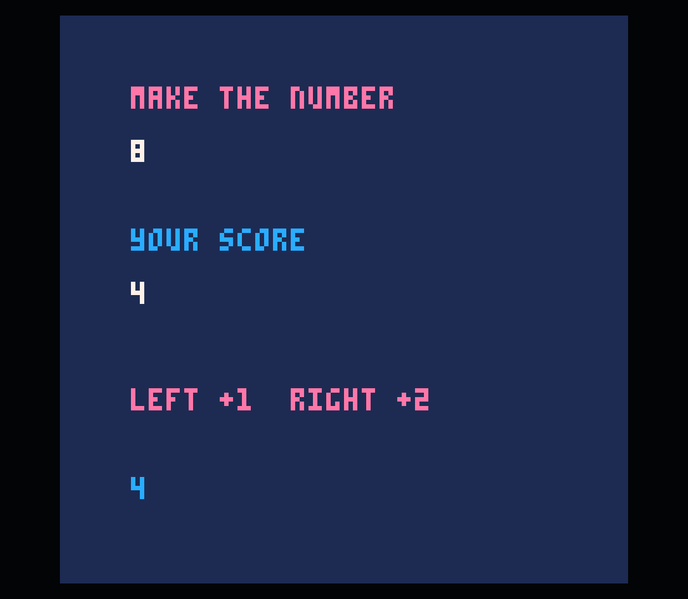
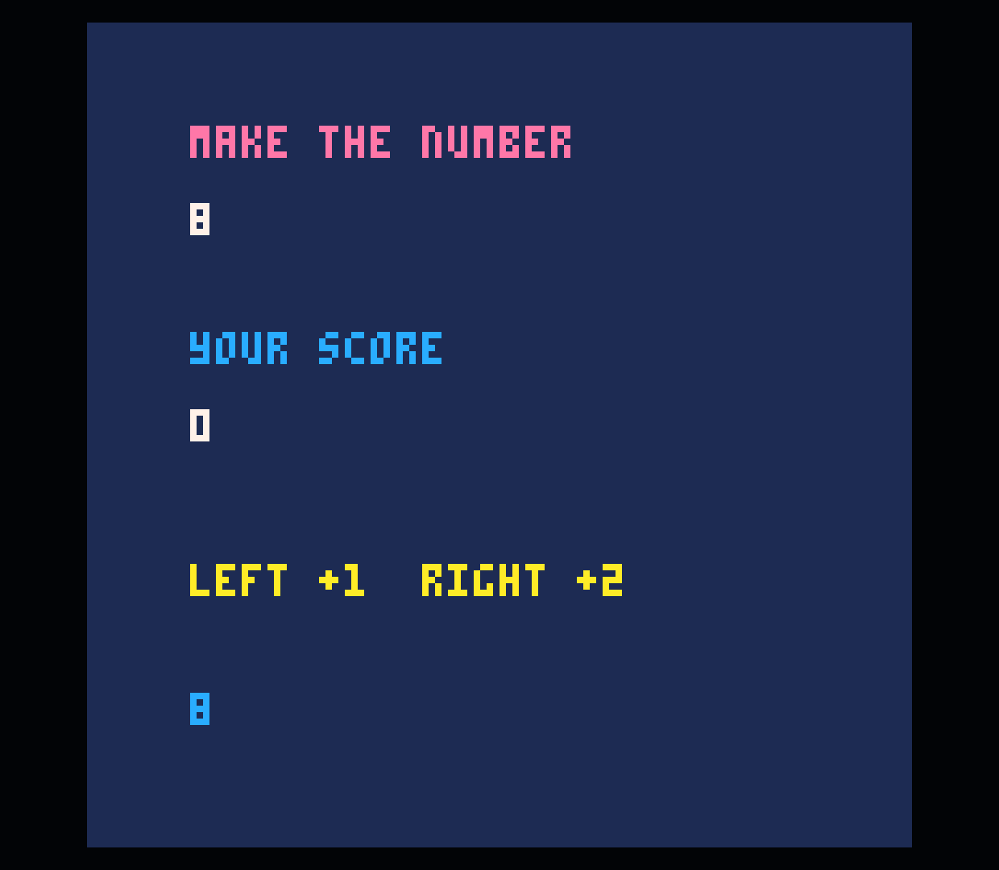

# 0.0.55 — действия в выбранной ветви условия

Первый срез M02.2, Android, 2026-10-04. Общий инструмент поверх обычного Lua,
доступный из любого проекта. Герой, карта, движение и жанровой шаблон не нужны.

## Путь пользователя

Код → X → «Правила» → **«Условия · действия»**. Тот же вход есть в меню правок
Select. Инструмент можно добавить в общее избранное, как другие пункты каталога.

- ↑/↓ выбирают ветвь, ←/→ листают по пять. Видны условие, номер строки,
  функция (`_update`, `_draw` или другая) и начало существующих действий.
- **A код** открывает первое действие выбранной ветви. Далее L открывает его
  обычную форму параметров; произвольные действия остаются доступны в Lua.
- **X добавить** открывает каталог для вставки в конец именно этой ветви.
  Поля показывают выбранную ветвь. Только подтверждение добавляет Lua, с отступом,
  одной операцией Undo/Redo и без изменения остальных ветвей.
- B в каталоге возвращает к выбранной ветви без правок; B в списке закрывает его.
  Start во время выбора или предложения не сохраняет и не запускает проект.
- Список, выбор и незавершённая форма переживают перезапуск/обновление приложения.

## Обычный Lua и границы

Ориентир — [Lua syntax primer официального мануала PICO-8 0.2.7](https://www.lexaloffle.com/dl/docs/pico-8_manual.html#_Lua_Syntax_Primer).
Вставка не вводит меток, внешних компонентов или привязок времени исполнения.
`LuaBranches` находится в portable core и строит консервативный список по тексту
черновика, с маскированием строк и комментариев. Это не полный Lua-парсер.

В этом срезе доступны завершённые многострочные `if/elseif/else/end` с заголовком
на одной строке, внутри обычных именованных функций, циклов и вложенных блоков.
Завершённые однострочные функции/блоки учитываются для баланса, но их внутренние
ветви пока не выводятся. `#include`, сокращённый `if` без `then/end`, анонимные
многострочные функции и неоднозначная/незавершённая структура дают объяснение
и оставляют весь исходник обычному редактору. Это ограничения инструмента PikoNest,
не ограничения допустимого PICO-8-картриджа.

Ветвь с прямым `return`, `break` или `goto` не принимает автоматическую вставку
в конец: пользователь открывает код и выбирает место до выхода. Определения
функций не вставляются в ветвь автоматически. Визуальные мастера `sspr`/анимации
пока требуют входа через код; простая форма `spr`, обычные вызовы, переменные,
условия и другие текстовые формы доступны непосредственно в ветви.

Просмотр показывает начало действий, а не полный список редактируемых команд.
Выбор отдельного действия, изменение порядка и безопасное удаление ещё впереди;
M02.2 остаётся частичным. Сохранённые наборы параметров — отдельный B01.2.

## Проверки

Полная сборка и существующий набор тестов прошли. `LuaBranchesTest`: **83 проверки**,
включая вложенные ветви, разные окончания строк, точную отмену/повтор, восстановление
журнала, отмену предложения и отказ при неоднозначных границах или прямом выходе из ветви.

## Проверка на устройстве

Через UI создана **«Копия 21» (`remix-0021`)** из числовой игры «Чистый лист 7».
Через новый список выбрана ветвь `phase==0` внутри `_draw`, добавлен
`print(target-score,16,104,12)`. Готовый исходник не загружался в проект извне.

- Поля пережили force-stop и обновление тестового APK. Start в предложении
  не записал его; подтверждение, точная отмена и повтор проверены через UI.
- Официальный пользовательский PICO-8 0.2.7 показал остаток 8 → 4. После победы
  остаток исчез, и отрисовалась другая ветвь с приглашением к сбросу.
- Через A в списке открыто существующее действие, через L изменён цвет надписи
  14→10. Повторный Test показал жёлтую надпись и сохранил новый счётчик.
- Список восстановился с выбранной `else`-ветвью на 720×960. Отмена предложения
  вернула к той же ветви без изменения исходника. Native 1240×1080 возвращён.
- Все **37 прежних файлов проектов и библиотеки** сохранились побайтно.
  Добавлен только cart копии 21. [Сохранность](preservation.json).

[Исходная игра](baseline.p8), [проверенный результат](tested.p8),
[сборка и хеши](verification.json), [журнал сборки](build-final.log).

Проверки выполнялись контроллерными событиями ADB. Физическая эргономика и
пользовательская приёмка остаются за владельцем. Звук консоли остаётся выключен.
APK установлен для разработки; GitHub Release не создавался.
