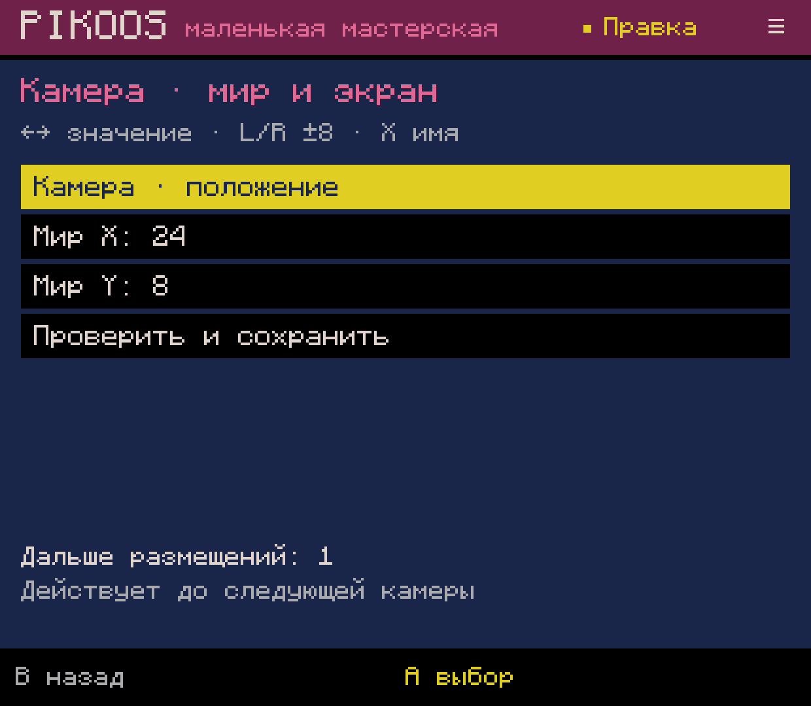
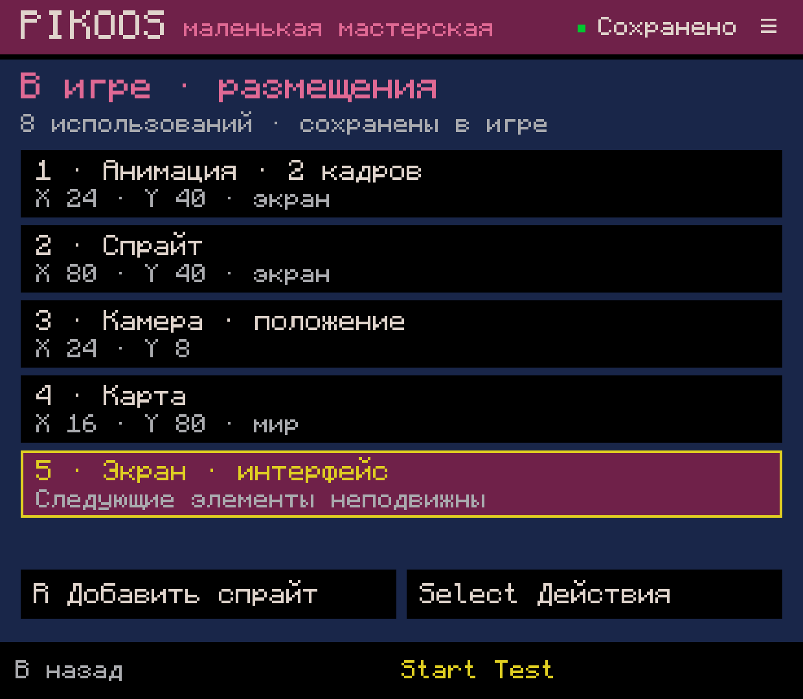
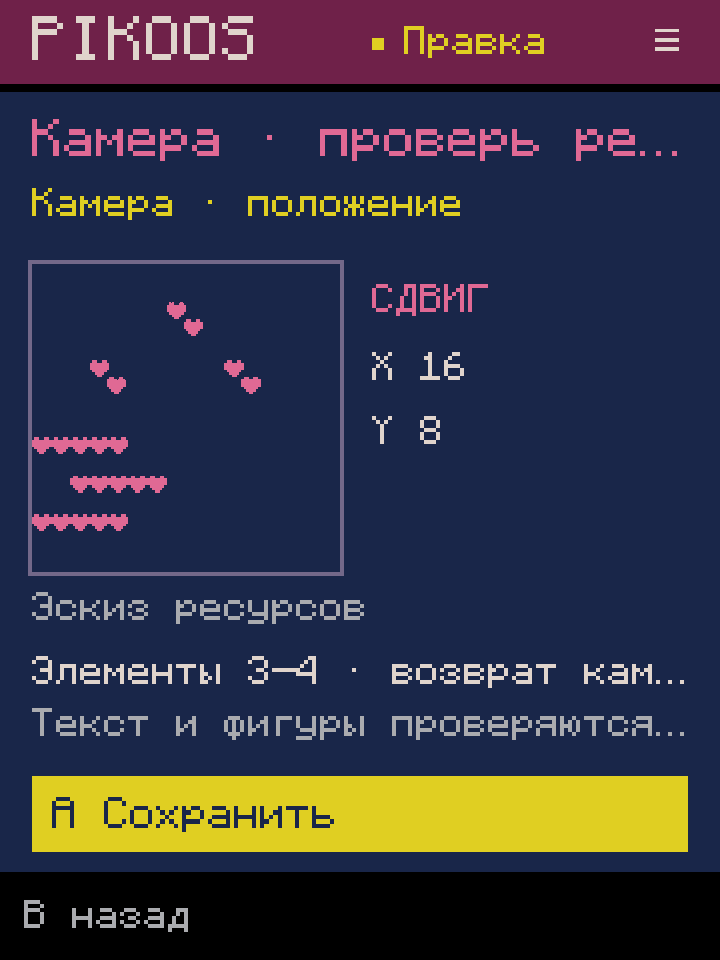
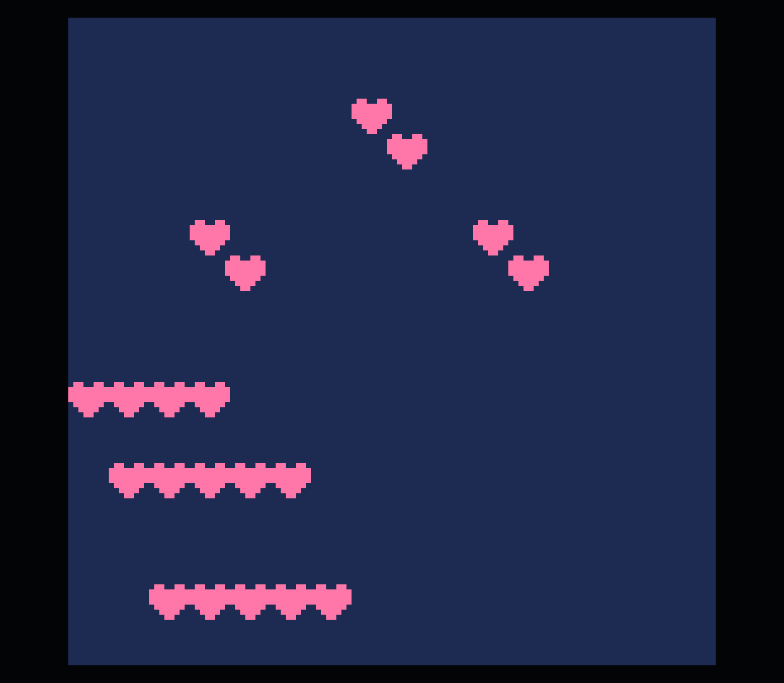

# Камера из мастерской — Android lab 0.0.65

Проверено 2026-10-04 на Retroid Pocket Classic. N02.3/G04 подключает уже
существующие формы камеры к общему списку размещений. Это технические
свидетельства ограниченного пути, не приёмка всей N02/M2.

## Путь пользователя

Мастерская → Select → «Размещения в игре» → выбрать спрайт, анимацию или карту → Select:

- «Камера для размещений»: положение, слежение за точкой или комнаты; выбрать
  последний элемент диапазона. Перед диапазоном вставляется камера, после —
  возврат к прежней. Эти две команды сохраняются и отменяются одной операцией.
- «Экран с выбранного места»: обычный `camera()` перед выбранным размещением.
  Следующая отрисовка использует экранные координаты до следующей камеры.
- A на строке камеры открывает её текущую настройку. Можно изменить режим,
  координаты/границы и снова сохранить без поиска исходника.
- «Убрать использование» на камере удаляет выбранную команду с сохранением
  комментария. Следующая отрисовка наследует предыдущую камеру. Парный возврат
  отдельно не удаляется: это самостоятельная обычная команда, видимая в списке.

↑↓ выбирают поле, ←→ меняют значение, L/R — шаг 8. X в координатах выбирает
число/доступное имя проекта. Последняя строка открывает подтверждение; A сохраняет,
B возвращается или отменяет. После сохранения Y/R2 — Undo/Redo, Start — Test.
Незаконченная форма не запускается обходным сочетанием кнопок.

Список помечает ресурсы «мир»/«экран» и показывает команды камеры в порядке
отрисовки. Копирование ресурса внутри камеры вставляет копию рядом, до следующего
переключения, сохраняя его систему координат. Пиксели и тайлы остаются общими.

## Совместимость и границы

Руководство пользовательского PICO-8 0.2.7, `CAMERA([X,Y])`: смещение отрисовки
на −x/−y; без аргументов — возврат к экрану. Используются обычные `camera`,
`mid`, `max`, `flr` и существующие формы N02.1–2. Нет скрытого объекта камеры,
собственного runtime API, обязательной метадаты или нового формата картриджа.

- Поддерживается известная плоская `_draw`, включая распознанные анимации.
  Произвольные вложенные блоки сохраняются и отклоняются этим редактором.
- Камера влияет на все следующие команды рисования, включая текст/фигуры между
  выбранными размещениями. Интерфейс сообщает об этом. Диапазон нельзя протянуть
  через другую камеру; её нужно изменить отдельно.
- Возврат после диапазона допускается для прежней камеры с вычислимой постоянной
  точкой. Если прежняя камера зависит от выражения/игры, операция отклоняется:
  повторное вычисление могло бы вызвать побочный эффект или вернуть другую точку.
  Повторная форма такой камеры и явный переход к экрану остаются доступны.
- Preview — эскиз ресурсов и первого кадра анимации. Текст, фигуры, время и
  произвольный Lua он не исполняет. Динамические координаты требуют Test; вместо
  ложного положения показано объяснение. Форма не создаёт движение объекта.
- Слежение/комнаты и выбор имён подключены к существующим формам, но общего
  связывания игровых объектов/состояний/событий пока нет. Плавность ещё не сделана.
- Undo хранится в памяти; recovery черновика не закрывает постоянную историю P04.
  После cold start/resize вход остаётся через Play → Workshop (долг Q02).
- На compact длинные пояснения сокращаются многоточием; название действия,
  численные параметры и подтверждение доступны. Физическую эргономику и итоговый
  UX принимает владелец отдельно; ADB-кнопки её не заменяют.

## Проверки

- `CameraUsesTest`: **76** проверок. LF/CRLF/CR, точные изменения и комментарии,
  сохранность ресурсов, диапазон/возврат, отказ пересечь камеру или переоценить
  динамическую прежнюю точку, повторная форма, follow/rooms, имена проекта,
  удаление и копии в той же камере, no-op, испорченный/устаревший журнал,
  чтение старого журнала, ошибка записи, Cancel, атомарная Undo/Redo и Test.
- Полный build/test suite прошёл. APK **0.0.65** установлен локально;
  GitHub Release не создавался, звук не включался.
- ADB-кнопками создана отдельная копия `remix-0028` → `remix-0029`. Для двух
  карт добавлена камера `(16,8)` с возвратом. До подтверждения cart не изменился;
  после force-stop на 720×960 восстановлено подтверждение. Undo удалил обе
  вставленные команды, Redo вернул их побайтно.
- Повторной формой X изменён на 24. Копия первой карты с X=24 осталась в той же
  камере; удаление копии побайтно вернуло предыдущее состояние. Перед второй
  картой вставлен reset; проверены отмена удаления, удаление и Undo.
- Итог: верхняя карта рисуется с камерой `(24,8)`, общая карта — в экранных
  координатах `(16,112)`. Анимации `(24,40)`/`(56,16)` и статический спрайт
  `(80,40)` сохраняют прежнее положение. Все ресурсные секции побайтно сохранены.
- Официальный **PICO-8 0.2.7 / Runtime Test 8**: восемь кадров, все **16 384**
  пикселя каждого совпали с независимым расчётом порядка отрисовки и камеры.
  Наблюдались оба кадра анимации, последовательность `1,2,1,2,1,1,2,1`.
  Это проверка содержания/координат, не измерение плавности или точных длительностей.
- Test/возврат пройден. Все **47 прежних файлов** проектов/библиотеки сохранены;
  добавлена одна копия, всего 48. [Итог и хэши](verification.json),
  [обычный итоговый cart](final.p8).

## Скриншоты

Повторная форма:

Порядок мира и экрана:

Предпросмотр после восстановления на маленьком экране:

Официальный runtime — верхняя карта сдвинута, нижняя оставлена в экранных координатах:

Далее — включить существующие фоновые слои в общий путь N03/G04 без выбора строки
Lua, затем связать мир, фон, ввод, состояние и события в M2. Новые наборы не добавляем.
