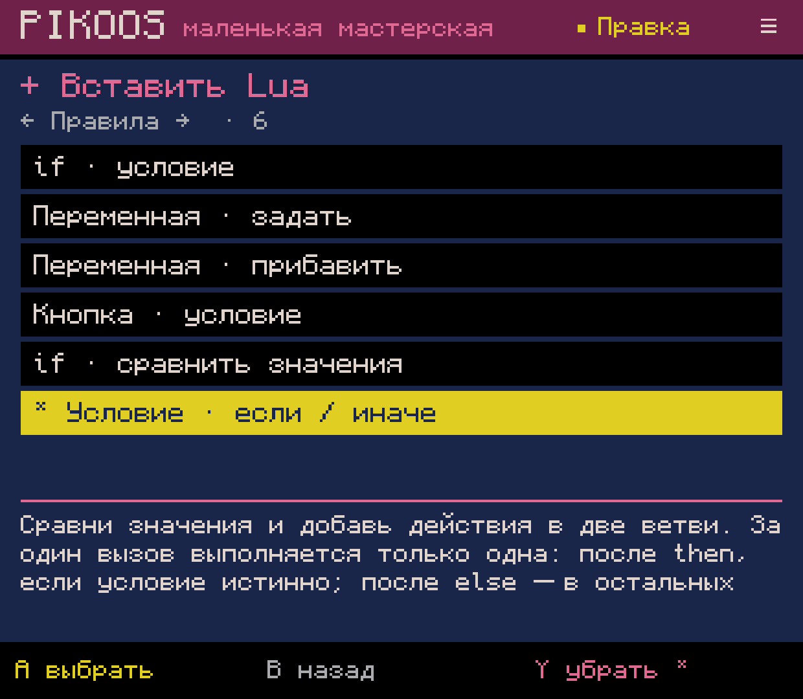
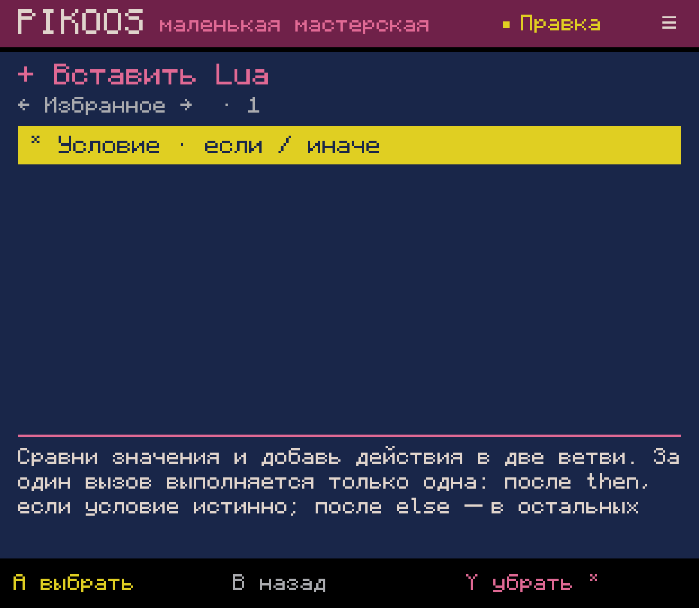
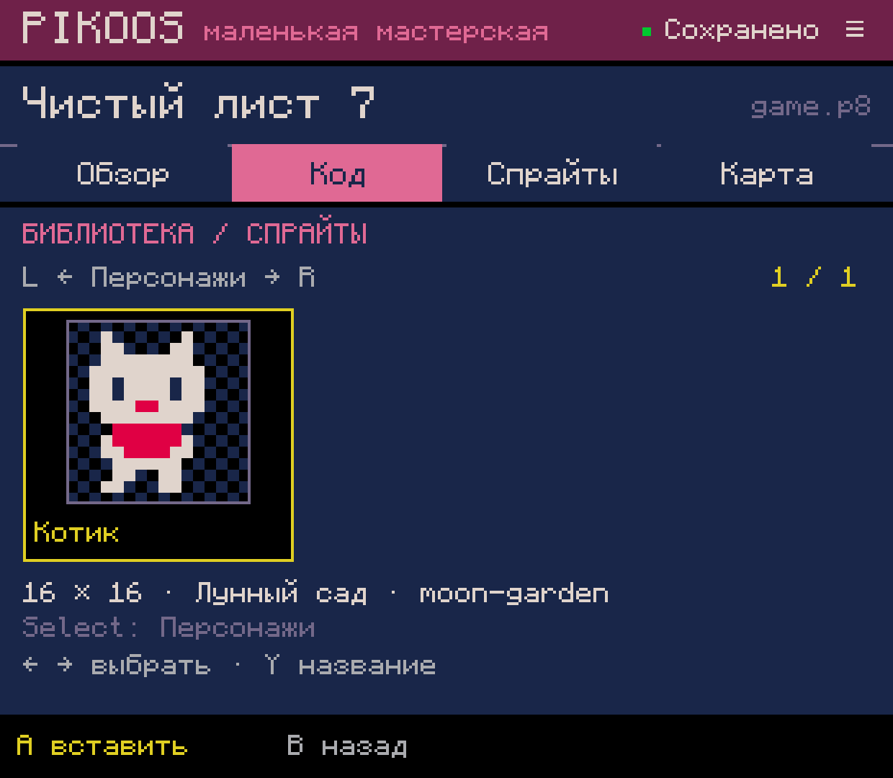
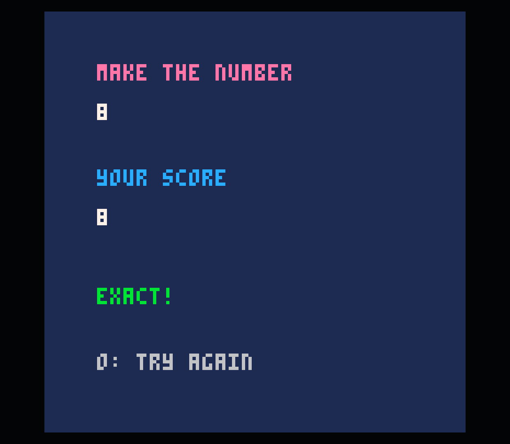

# 0.0.54 — категории, избранные инструменты и общие условия

Android lab, 2026-10-04. Это ограниченные B01.1/M02.1, не завершение библиотек
всех типов, редактора событий или полного авторского цикла. APK установлен на
Retroid Pocket Classic для разработки; GitHub Release не создавался.

## Пользовательский результат

- В библиотеке спрайтов L/R переключают категории. Select назначает категорию,
  Confirm сохраняет, Cancel отменяет. В новом сохранении категория выбирается
  через Y; имя по-прежнему через X. Старые ресурсы читаются без перезаписи.
- Каталог Lua/параметрических инструментов разделён на правила, структуру Lua,
  рисование, карту/стены, движение, анимацию и камеру. «Все» сохраняет полный
  доступ, «Избранное» содержит выбранные через Y инструменты. ←/→ и L/R меняют
  разделы, ↑/↓ выбирают. Избранное общее для проектов и переживает перезапуск.
- Новая форма «Условие · если / иначе» задаёт левое выражение, сравнение и правое
  выражение; показывает весь обычный Lua, затем вставляет обе ветви одной правкой.
  Курсор переходит под `then`. L на заголовке открывает существующую форму
  сравнения; правка заголовка сохраняет тела обеих ветвей.

Категория спрайта описывает назначение для поиска, а не обязательный класс
игрового объекта. Ни жанр, ни шаблон не закрывают инструменты. Модель каталога и
категории живут в portable core; Android хранит настройки/файлы за адаптером.
Наборы значений параметров, избранные ресурсы и избранное в других панелях ещё
предстоят (B01.2). Музыка/SFX пока не имеют своей готовой библиотеки.

На узком экране: [избранное](catalogue-final-state.png),
[пустая категория](empty-category-compact.png).

## Сквозная проверка без героя и движения

На устройстве через UI создан **«Чистый лист 7» (`blank-0007`)**. Контроллерными
событиями ADB через формы редактора собрана числовая игра:

1. `_init` задаёт `score`, `phase`, `target`.
2. В фазе 0 влево прибавляет 1, вправо — 2.
3. Достижение цели выбирает ровно одну ветвь: точное совпадение — победа,
   превышение — проигрыш. После результата ввод больше не меняет счёт.
4. Кнопка O вызывает `_init`, снова открывая ввод. `_draw` показывает состояние.

Авторство картриджа — через интерфейс, без загрузки готового Lua в проект.
Проверены цель 7, победа 7, проигрыш 8, блокировка после результата и reset.
Затем значение цели изменено через форму 7→8, Undo вернул 7, Redo — 8;
официальный пользовательский PICO-8 **0.2.7 / Runtime Test 8** подтвердил новую
победу на 8. [Итоговый обычный картридж](tested.p8).

Использованы реальные `if/then/else/end`, переменные, `btnp`, `_init/_update/_draw`,
как описано в [мануале PICO-8](https://www.lexaloffle.com/dl/docs/pico-8_manual.html#_Lua_Syntax_Primer).
Никаких скрытых компонентов или API PIKOOS в игре нет. Расположение действий
в ветвях пока выбирается курсором Lua; это явный UX-долг M02.2, а не готовый
визуальный редактор правил.

## Проверки и сохранность

- Полная сборка и все подключённые тесты прошли. **CatalogueTest: 113** проверки:
  окончания строк/восстановление/одна отмена, правка заголовка и сохранение ветвей,
  отказ внедрения посторонних строк, стабильные ID избранного, пустые разделы,
  категории v1/v2, cancel/ошибка записи/повтор, отфильтрованная последняя запись.
  [Журнал сборки](build-final.log).
- На Retroid: незавершённый preview if/else пережил force-stop; Start в предложении
  не вставил его и не запустил игру. Confirm вставил после восстановления.
- Избранное проверено после перезапуска и в другом проекте (`blank-0006`),
  включая удаление последнего инструмента и повторное добавление. Его cart цел.
- Три существующих спрайта через UI распределены: «Звезда» → объекты,
  «Котик» → персонажи, «Огонёк» → тайлы. Категории/фильтрация, отмена
  незавершённого выбора после восстановления и пустой раздел проверены.
- Проверены native 1240×1080 и compact 720×960. Названия категорий и действия
  укорочены на узком экране без уменьшения размера шрифта. Native размер возвращён.
- Все **33 прежних файла проектов** сохранены побайтно. У **3 записей библиотеки**
  изменены только версия формата и добавленная категория; UUID, имя, источник,
  source hash, координаты, размеры и пиксели совпадают. Добавлен только новый
  `blank-0007/game.p8`. [Сохранность](preservation.json), [сборка и хеши](verification.json).
- Системный звук остаётся выключен. Это ADB-проверки на устройстве, не физическая
  приёмка контроллера или одобрение нового UX владельцем.

Дополнительно сверены сами PNG: preview до force-stop, сразу после восстановления
и после навигационного события побайтно совпадают. Первое впечатление о чёрном
экране при повторном просмотре снимка не подтверждается исходными кадрами;
отдельный дефект приложения на этом основании не заведён.

Дальше: M02.2 (место/действия в ветвях) и B01.2 (повторное применение
параметров). Общие инструменты звука, эффектов и прочие пункты ROADMAP остаются
отдельными незавершёнными этапами.
