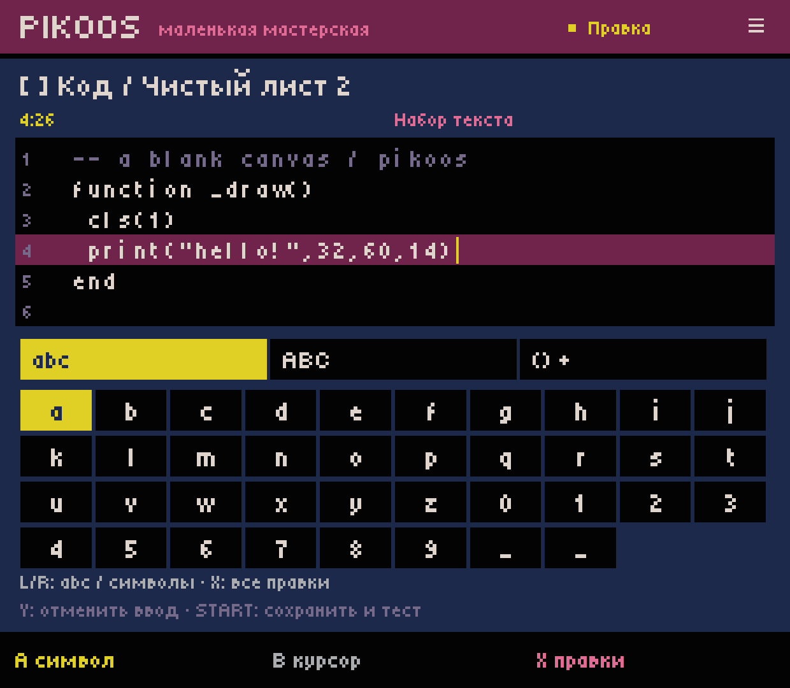
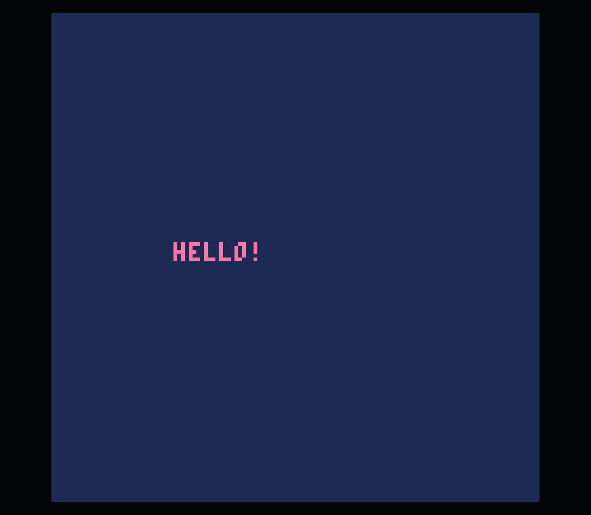

# Android 0.0.31 — first general Lua editing slice

2026-10-03. Host 0.0.31, existing Runtime Test 4, Retroid Pocket Classic / Android 14,
official user-supplied PICO-8 0.2.7. Local development APK only; no GitHub release.
Architecture: [bounded A01/A02 decision](../../EDITOR_FOUNDATION.md).

Final local APK SHA256:
`378965E2BC2546D78B522B37AAF2F3D60812A3E7043998B25A2F537EAAD5D6C8`.
This final build was reinstalled and the corrected cart launched again.

## What changed

Code → A opens a literal Lua draft in blank, imported and template carts.
The D-pad moves the caret. A opens character entry; B returns to the caret.
X opens a scrollable command menu: selection, cut/copy/paste, new line/space/tab,
deletion, draft undo/redo, line ends, save, test and explicit discard.
L/R cycles lowercase/uppercase/symbol pages; the menu also offers this action,
so shoulders are optional. Y undoes draft input. Start saves before Test.
Optional keyboard supports ASCII text, navigation, deletion, Ctrl+A/C/X/V/Z/Y/S.
Clipboard is internal to this draft, not the Android system clipboard.

## Checks and device evidence

- Full host build and existing portable regression suite pass; `LuaEditorTest`
  adds 119 checks for byte preservation, mixed line endings, Unicode boundaries,
  selection/clipboard, recovery, failed save, stale draft, section injection,
  saved runtime input and whole-cart history.
- Existing project/library files were backed up locally before the in-place APK
  update. A separate new `blank-0002` project was created through the shelf.
- Entered `print("hello!",32,60,14)` using D-pad/A/L/R character entry and the
  New line menu command. No source file was written externally to author the code.
  ADB generated button events: this proves the route, not physical ergonomics.
- Before applying, the canonical file still contained the original blank cart.
  Home → force-stop → relaunch → Workshop restored the text and keyboard selection.
- Start saved and launched the exact authored cart; official PICO-8 displayed HELLO!.
- Ctrl+Q exited the runtime and restored the Code viewer. The wrapper Back menu
  opens settings; Start on this draw-only cart did not show a usable Shutdown menu
  in this run. Controller-only runtime exit for this case remains a runtime/UI gap.
- On return, project Undo removed the complete saved insertion; Redo restored it.
- Optional keyboard input and Ctrl+Z were exercised. Undo removes one inserted
  character per step: undoing two typed hyphens once left one hyphen and produced
  [a real line-4 syntax error](runtime-error.png). Returned, deleted it using the
  controller menu, and relaunched successfully. Error text was read in PICO-8;
  PikoNest does not yet capture/navigate that diagnostic automatically.
- [Compact menu](compact-menu.png) and [horizontal caret scroll](compact-scroll.png)
  were checked at a 720×960 rendered override (360×480 logical viewport), alongside
  the usual 1240×1080 display. Override reset afterward. These are layout checks
  on the same physical device, not a second-device acceptance test.

## Limits and next work

This is C01.1, not the completed M1/ACC-01 game-creation milestone. A single printed
message does not prove input/game state/win/restart, diagnostics or export acceptance.
Core save-failure tests are not a power-loss test on device. Recovery does not keep
undo stacks across process death. Newline/selection commands are usable but require
too many steps for sustained coding; C02/C03 should provide structural insertion
and contextual completion next, with controller UX review.

Existing UTF-8 survives; invalid UTF-8 Lua is read-only with an explicit explanation.
P8SCII entry/display, editor syntax analysis, code tabs/include editing, persistent
history, system clipboard and general IME are unfinished. Lab draft size is bounded
to 2 MiB; this is not advertised as a PICO-8 limit. Device media mute is preserved.
