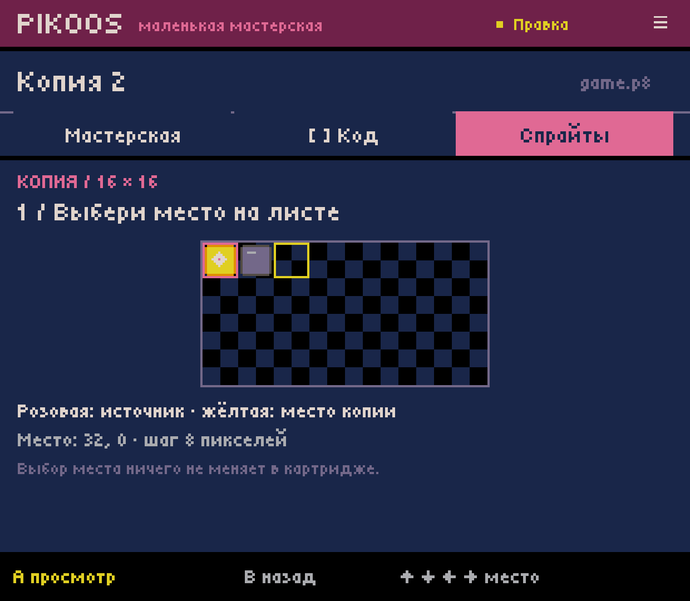
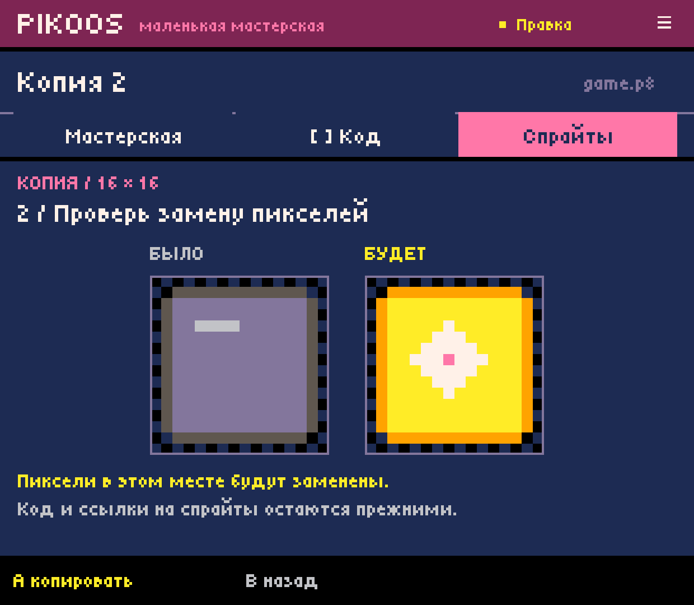
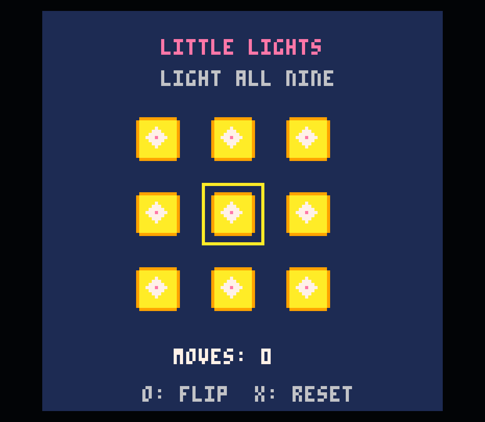
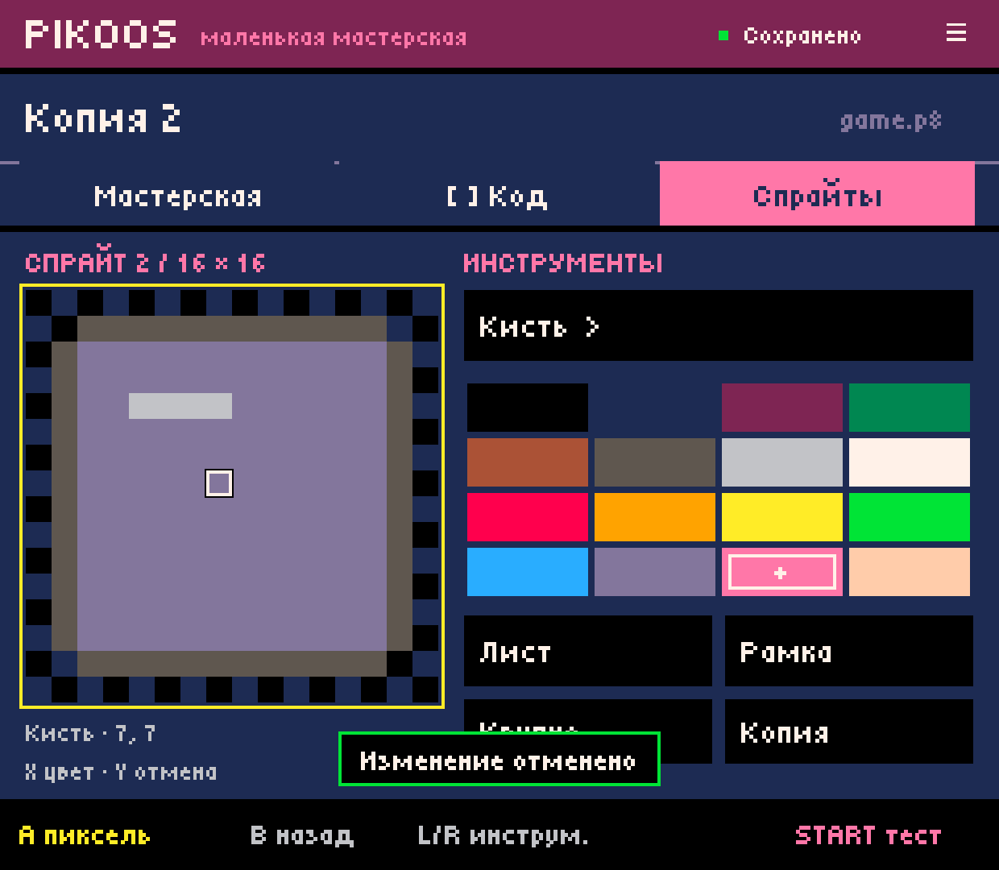
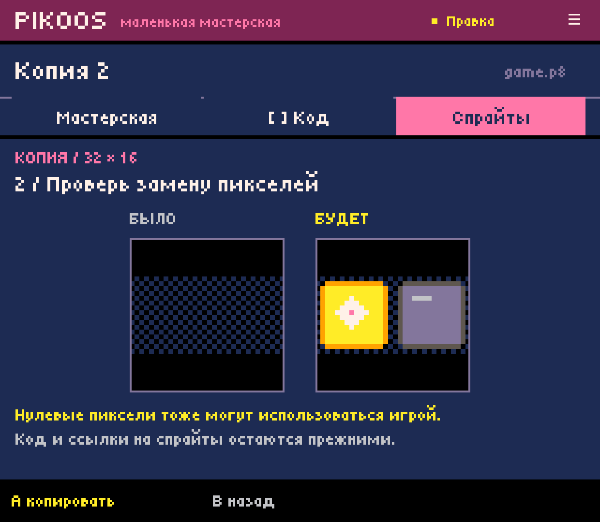
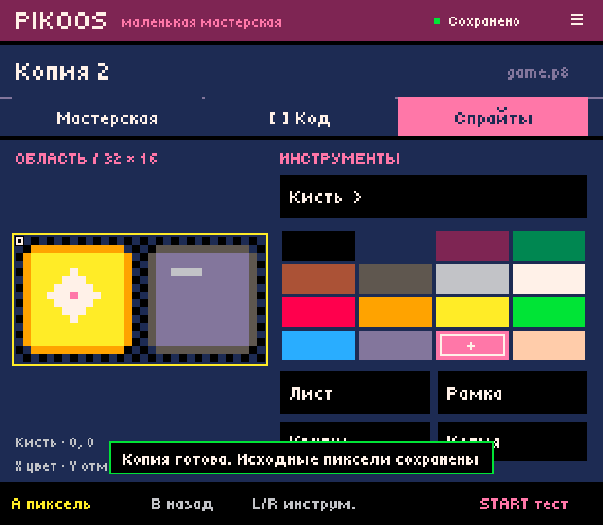

# Android 0.0.10 — copying resources in every project

2026-10-03. Actual Retroid Pocket Classic captures, 1240×1080. This slice
implements the owner's rule: templates supply content, never lock general tools
to genres. Existing Moon Garden parameter bindings remain context-specific.

## Delivered

- The same copy action in Moon Garden, a blank cart with drawn pixels and Lights.
- Source can be a shortcut sprite or a rectangular region, including 32×16 and
  larger. Destination is explicitly chosen in the upper 128×64, in 8-pixel steps.
- D-pad placement, Confirm for before/after, Confirm again for durable replacement.
  Touch selects placement; the footer confirms. Cancel backs out without a write.
- Occupied destinations are allowed with preview. Overlap with source is blocked
  to preserve it. Zero-valued pixels are not claimed to be unused by Lua.
- Only destination pixels change. No implicit role assignment or code rewriting.
- Failed save retains the preview for retry; successful copy is one undo step.
- Background process death restores placement without saving. Preview must be
  reviewed again. Undo history itself is still in-memory, as in previous slices.

## Device checks

Updated in place with `adb install -r`; installed versionCode 10 / version 0.0.10.
Used semantic button key events, without touch, for the complete workflow.
Created `remix-0002` from the user's existing `puzzle-0001` for these checks.

1. Copied the lit 16×16 sprite onto the occupied unlit sprite. The preview showed
   the replacement. Before commit, the canonical cart remained byte-exact.
2. Sent the app to Home, killed its background process and verified `pidof` was
   empty. Cold start restored destination `(16,0)` in placement, requiring preview
   again. The file hash remained unchanged.
3. Committed and ran the cart in the user's official PICO-8 runtime wrapper.
   Both logical cell states now displayed the same lit sprite, demonstrating pixel
   replacement without changing game rules. This was a deliberate test; returned
   and undid it, restoring the exact cart hash.
4. Selected a 32×16 region containing both sprites, reached Copy from canvas
   navigation, previewed, committed into `(32,0)`, then undid byte-exactly.
5. All five pre-existing project hashes matched the baseline after testing.
   `remix-0002` remains as an independent, unmodified copy of the puzzle.

Before/after Undo SHA256 for `remix-0002`:
`994fa36116ea6384017b5b48f43596775563471f47cb6f59827da0b95684c296`.
Occupied-copy SHA256:
`785162e4445c82d60b87d7368c5e12dbf6211f648556669bf413d44dbd925683`.

## Verification

`experiments/android-host/build.ps1` passed all nine lab/core suites and APK
signature verification. New CopyWorkflowTest checks blank, Lights and Moon Garden
with CRLF/unknown bytes, 24×24 rectangle copying, occupied targets, overlap/bounds,
modal input, failed save/retry, draft restoration, exact undo and untouched Lua,
other sections and graphics outside the destination, including the map-shared half.

Final installed APK SHA256:
`c3216dda6fdcb68c2694b5aea9b2ccf9cb4562c2f4bdaa4cdfd5c4cb919ea812`.

No physical-controller remapping or multi-device acceptance was added. General
Lua editing, arbitrary cart import, lower shared gfx/map-half editing, animation,
map/audio/effects tools and cross-project asset insertion remain future work;
they must follow the same template-independent availability rule.

## Captures

