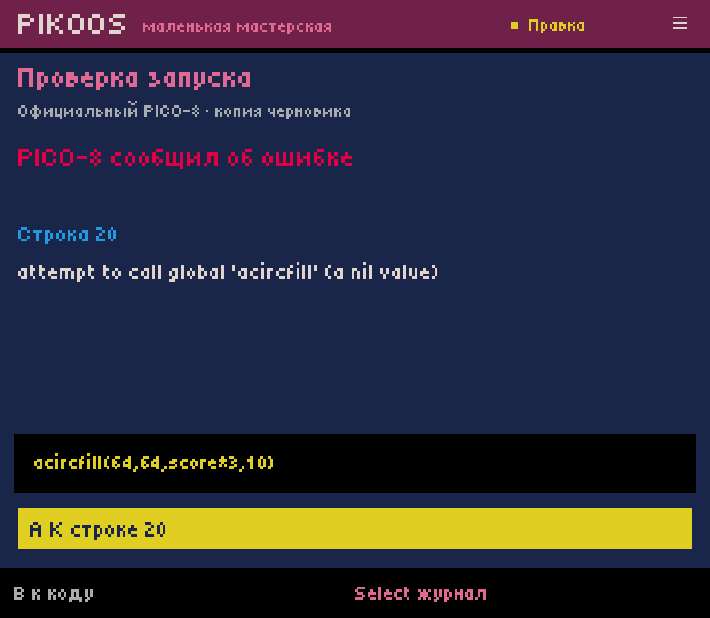
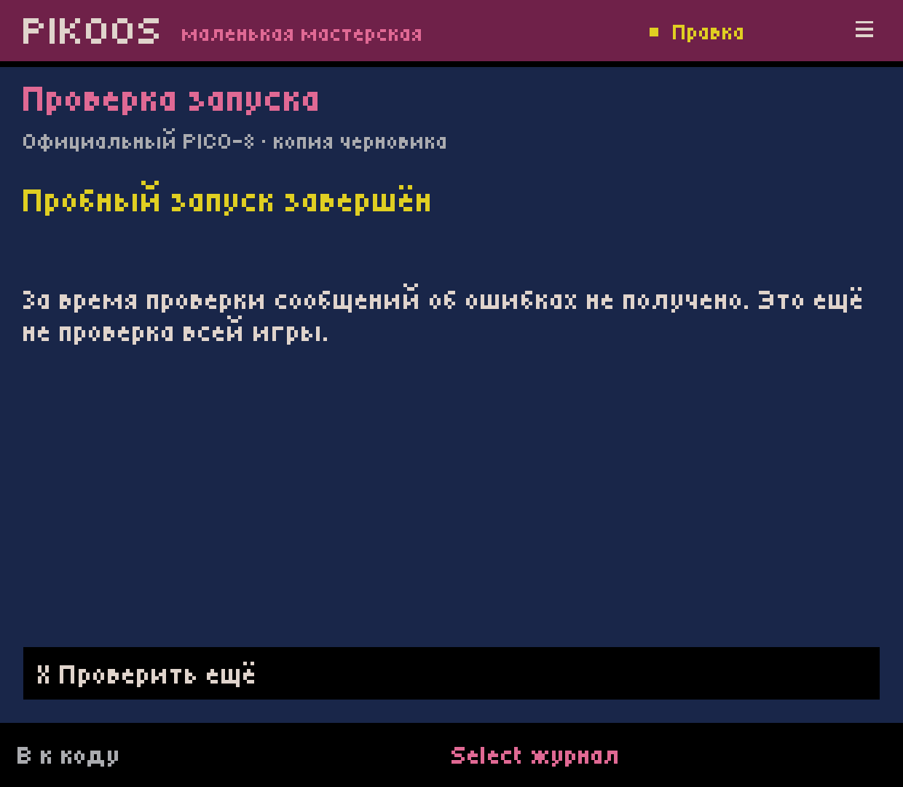
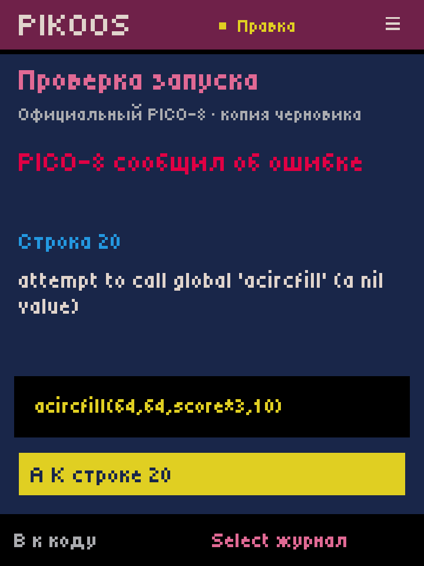

# C06.1 — short official-runtime draft trial

2026-10-03, branch `main`, starting source `8f9396a`. Host **0.0.36 / code 36**,
Runtime Test **1.6.6-pikoos.5 / code 5**, user-supplied PICO-8 **0.2.7 ARM64**.
Retroid Pocket Classic / Android 14. Local development installs only; no GitHub
APK release, no proprietary runtime in the repository or built APKs.

## User path

Code cursor → L2 (or Select menu → Check launch) → review → A.
The official runtime executes a copy of the current draft for up to four seconds,
without controller input or audio and with separate home/root. It does not save
the project. A recognized error shows its original text; A jumps to its verified
source line, Y can undo the deliberate edit, and L2/A repeats the trial. Select
opens the original bounded log; X repeats from results; B returns or cancels.
Normal Start/Test still launches the full interactive game.

## Runtime research and boundaries

The [official manual](https://www.lexaloffle.com/dl/docs/pico-8_manual.html)
documents `-x filename` as experimental headless execution. On this device/version,
`-x` produced `syntax error line 20 (tab 0)` or `runtime error line 20 tab 0`, the
source excerpt and an error message. A syntax-error process needed a timeout;
the tested runtime-error process exited itself. A valid callback-driven game kept
running until timeout. `-export` accepted the intentionally invalid fixture and
is not used as syntax validation. The inspected ordinary `-run` output/logs did
not expose that fixture's on-screen syntax error.

This is a four-second execution observation, not proof that all game paths work.
Only tab 0 with an exact source excerpt and unchanged draft enables automatic
jump. `#include` is refused in this slice; other tabs can report an error without
a jump. Missing, unfamiliar or truncated evidence stays unknown. Game `printh`
can enter the textual log; this is not a trusted compiler protocol. No custom Lua
or runtime API is added. Full interactive diagnostics and version coverage remain
C06/R04/R06 work.

## Verification

- Full host build/test script passed; the final targeted suite passed **29 RuntimeDiagnostic checks**:
  source mapping, CR/LF, cancellation, unknown/truncated output, stale draft,
  review-before-execution, no save, modal input, jump/back/undo and include refusal.
  Existing insertion (157), symbol (46), call (124), navigation (62), editor (122)
  and storage/runtime/resource checks also passed.
- Runtime adapter built; sparse-pack verification passed for all 262 entries.
  Upstream classes.dex/Godot payloads retain the prior interactive implementation.
- Through editor controller events, inserted an invalid token for syntax error,
  then a nonexistent `acircfill` call for runtime error. Both reported line 20;
  A selected that line. Undo and repeat yielded no error messages during the trial.
  The final installed APK pair was retested for the runtime-error/fix cycle.
- Pending cancellation returned safely. Actual host force-stop during a trial,
  then restart, recovered the draft and cursor. Trial processes ended and their
  directories were cleaned. Results themselves are transient, not recovery data.
- Native screenshot size 1240×1080 and compact override 720×960 (360×480 logical)
  were inspected. Native display size was restored. These are ADB controller-event
  checks, not owner acceptance of physical controls or a multi-device matrix.
- Final normal Start/Test rendered the game, then Ctrl+Q returned. Full-game
  controller-only exit remains R03/Q02; short-trial cancellation does not close it.
- All **22 project/library files** were byte-identical to the pre-task backup
  after the final diagnostic and interactive trial. Deliberate errors were undone.
  The saved score cart remains 396 bytes, SHA-256
  `d0ec0f5eb25c1e3e1e5da0d89e58b46c54817257f91136b47b1df3feab6fb792`.
- Media stream remained muted. No active `pico8_64` or diagnostic session directory
  remained after final return.

The adapter requires an already prepared wrapper. Signature permission, fixed
read-only URI, 2 MiB input bound, request nonce and snapshot hash constrain transport.
Private trial home/work isolate ordinary trial saves; this is not a general sandbox.
Android timeout owns the process group, with one-second kill grace; a seven-second
wait guard retains files if process closure is not established. Only the newly
created session tree is deleted, without following symlinks. Interrupted sessions
are retained with a quota of eight; cleanup UI and clean-device setup remain open.

## Reproduction and artifacts

Build using `experiments/android-host/build.ps1` and
`experiments/runtime-restart/build.ps1`, install both local APKs with `adb install -r`.
The device's previously imported purchased runtime is retained.

| Artifact | Bytes | SHA-256 |
| --- | ---: | --- |
| Host APK | 221980 | `B431D734B26D31C43BEC917139394D741C56E6C12F4F3601D6B1D63666A3525B` |
| Runtime Test APK | 50798596 | `DEB13690DF729D5942DAE184B0E9B02F53D70DD26AC9D5880C858CC18BECF111` |

[Syntax error](syntax.png) · [Cancellation](cancelled.png) ·
[Interactive game](play.png) · [Preserved cart](score-game.p8) ·
[Intentional unsaved error copy](runtime-error-copy.p8).

Next: R03/Q02 explicit controller exit/return, then full ACC-01. C06 remains partial;
the short trial is useful evidence within that cycle, not completion of M1.
