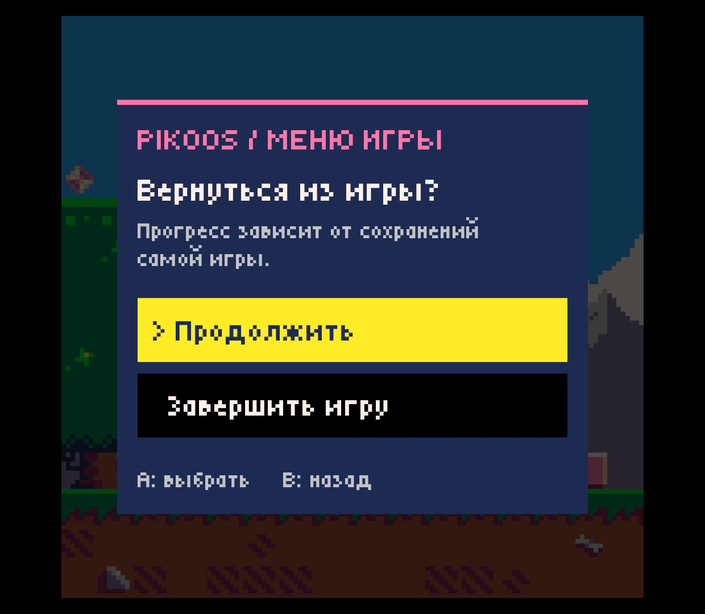
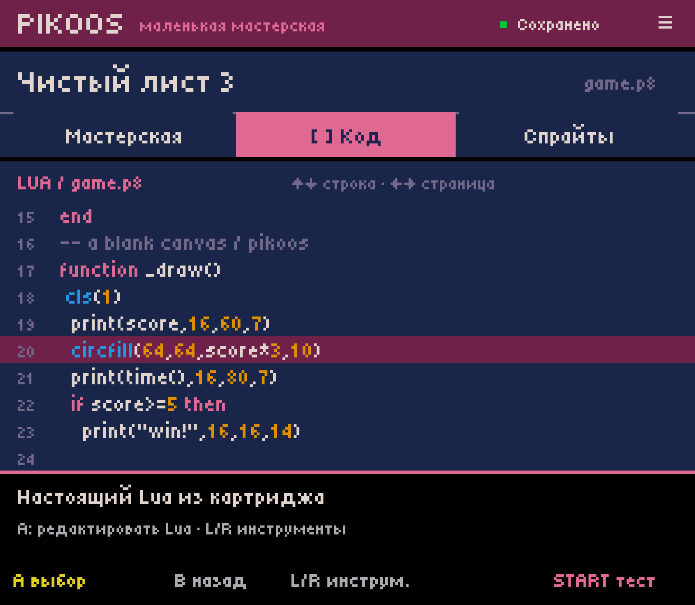
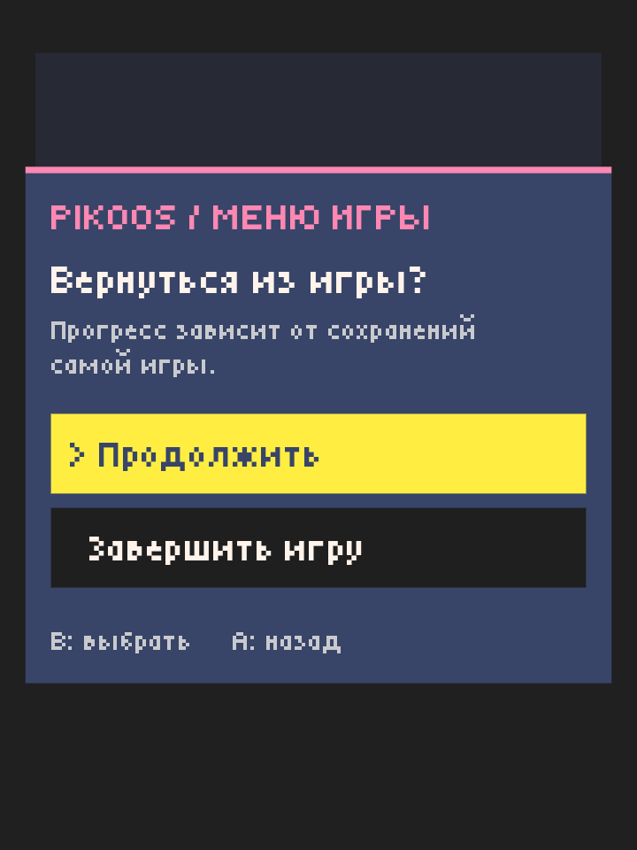
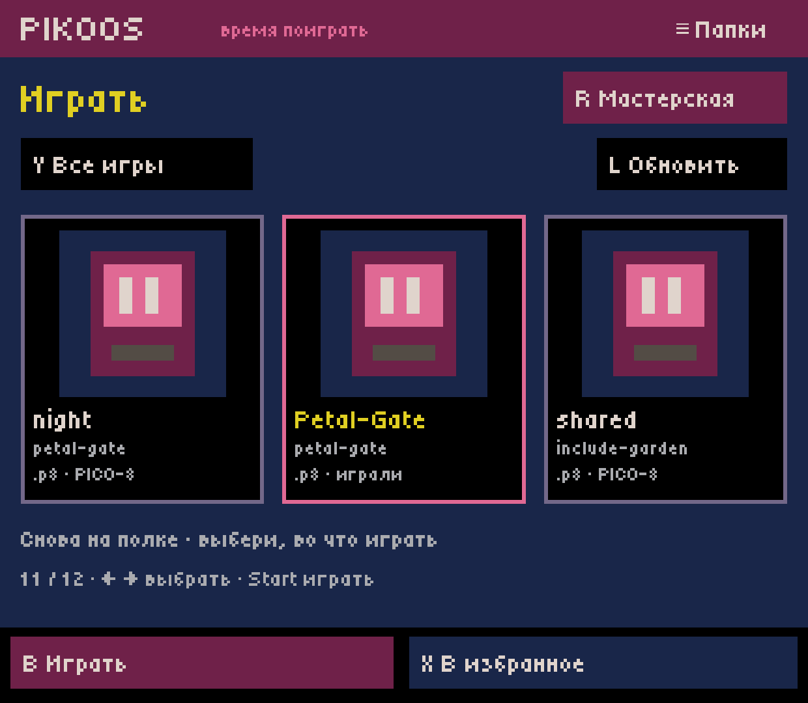
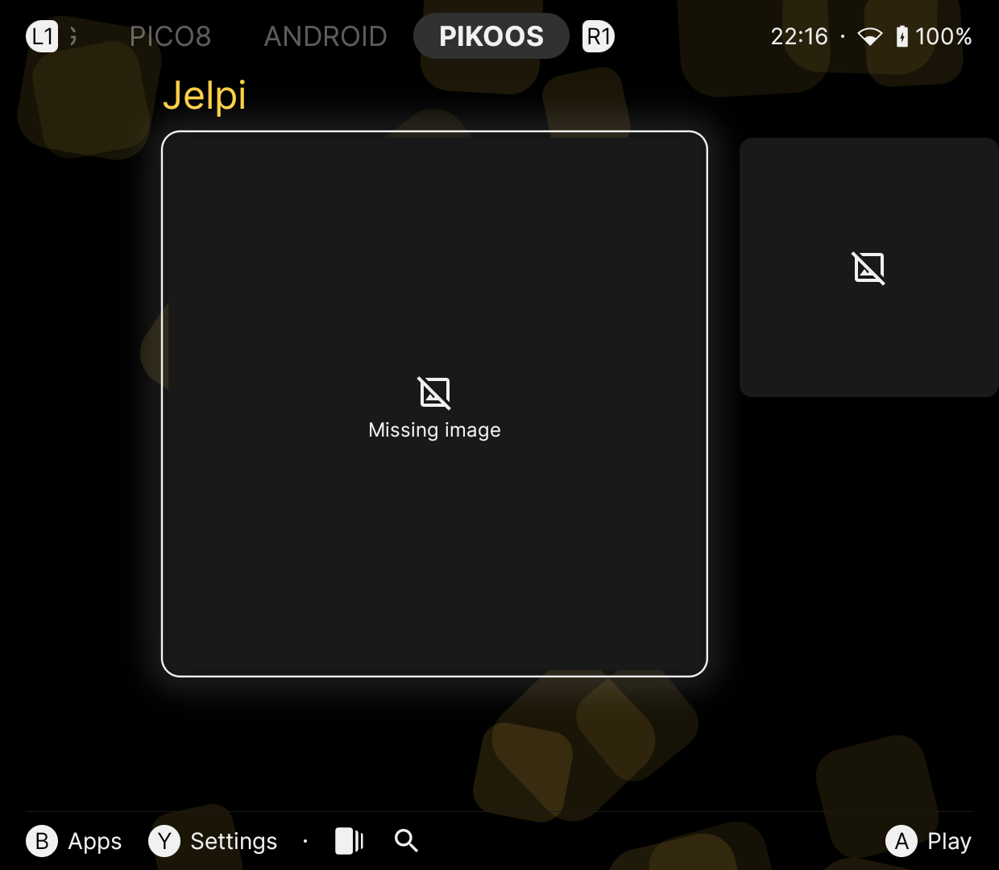
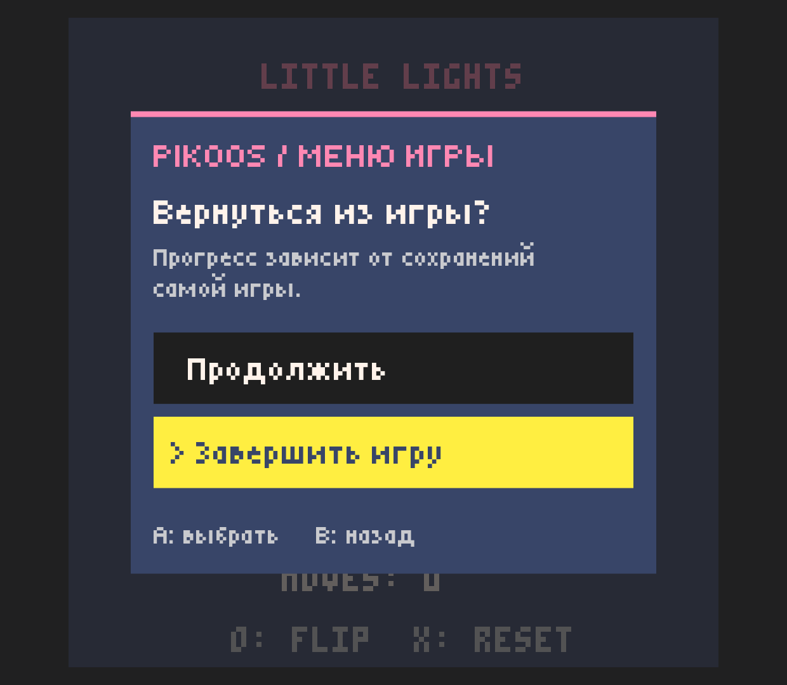
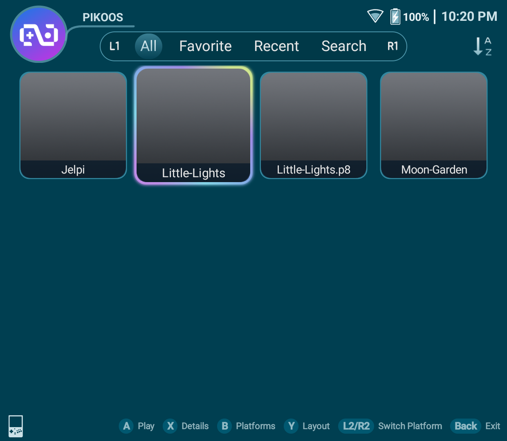

# Меню игры и обычное завершение — 0.0.37

2026-10-03, Retroid Pocket Classic / Android 14. Host 0.0.37, отдельный
Runtime Test `1.6.6-pikoos.6`, база исходников `8885e7b`. Локальные debug APK
собраны и установлены поверх данных. GitHub APK release/prerelease не выпускался.
Это ограниченный R03.1/Q02, не приёмка всего runtime или полного авторского цикла.

## Поведение

В Test/Play и запусках через PIKOOS из внешнего лаунчера Select/Android Back
открывает меню в палитре PICO-8. Начальный фокус — «Продолжить». Вверх/вниз
или вертикальная ось меняет выбор; A подтверждает, B отменяет, с учётом настройки
перестановки A/B мастерской. Есть touch и Enter/Escape.

«Завершить игру» показывает ожидание и передаёт обычный Ctrl+Q в существующий
ввод официального PICO-8. Дальнейшее закрытие выполняет штатный монитор процесса
оболочки. Здесь нет принудительного завершения Activity или убийства процесса.
Если Activity остаётся открыта четыре секунды, появляется возможность продолжить
или повторить. Это не подтверждение победы, сохранения или успешного прохождения.
При уходе Activity в фон отложенная команда отменяется и не повторяется на resume.

## Реализация и границы

- `RuntimeMenu` — переносимая модель намерения/фокуса без Android API.
- `RuntimeControls` — Android-адаптер: `Application.ActivityLifecycleCallbacks`,
  делегирование `Window.Callback`, собственный Canvas/Dialog и шрифт Tiny5.
- Host явно включает меню через `pikoos.controls`; параметры A/B сохраняются
  для жизни Activity, даже если MAIN resume не содержит этих extras.
- Старые/direct wrapper/setup/probe запуски не включают этот режим. Select в нём
  заменяет upstream shortcut; обычный игровой ввод и L1 настроек остаются upstream.
- Повтор удерживаемой кнопки не подтверждает выбор; подтверждение не протекает
  в игру после закрытия меню. Полный remapping и физическая эргономика ещё Q02.
- PICO-8 runtime импортирован владельцем. Его бинарники в APK/репозиторий не добавлены.
  Код/данные картриджей этим меню не изменяются. Новый публичный API обычным играм не нужен.

Опорные первичные источники: [PICO-8 manual, Ctrl-Q](https://www.lexaloffle.com/dl/docs/pico-8_manual.html),
[Android Window.Callback](https://developer.android.com/reference/android/view/Window.Callback),
[Activity lifecycle callbacks](https://developer.android.com/reference/android/app/Application.ActivityLifecycleCallbacks).
Исследован pinned upstream `Macs75/pico8-android` на
`562662e35727ae7706fe97fed3390db249a35263`: `video_streamer.gd` и монитор `pico_pid`
в `run_pico_cmd.gd`. Godot gameplay scripts этим срезом не патчатся.

## Проверки на устройстве

Ввод выполнен событиями ADB и наблюдаемыми touch-действиями, не руками владельца.
Владелец сообщил, что сейчас физические кнопки проверить не может; этот барьер открыт.

| Путь | Наблюдение |
| --- | --- |
| Test → Select → отмена/«Продолжить» | Игра продолжается, PID сохраняется; игровой счёт меняется после обычного ввода |
| Test → Back/Select → вниз → A | Официальный процесс завершается; мастерская возвращается на прежнюю строку 20; повторный запуск работает |
| Play → Petal-Gate → меню → выход | Возврат на полку с тем же выбранным multicart-проектом |
| Beacon → Jelpi → меню → выход | Возврат в Beacon, Jelpi остаётся выбранным; процесса PICO-8 нет |
| Retroid Launcher → Little-Lights → меню → выход | Возврат в Retroid Launcher, Little-Lights остаётся выбранным; процесса PICO-8 нет |
| Переставленные A/B, компактный экран | Подсказки B/A соответствуют действиям; B завершает игру; меню помещается в 720×960 |
| Home → resume | Игра сохраняет PID, меню снова работает; обнаружено ограничение адреса возврата ниже |

После проверок все **22 файла** проектов/библиотеки побайтно совпали с исходным
backup. Размер экрана возвращён к физическому 1080×1240 (ландшафтные снимки
1240×1080), соглашение A/B восстановлено. Media stream остаётся muted.

Полная host-сборка с существующими core-тестами прошла; новые 11 проверок модели
включают безопасный фокус, отмену, retry и отмену отложенного выхода при background.
Runtime-сборка прошла проверку 262 sparse payload entries. Искусственное зависание
живого PICO-8 ради timeout и crash recovery на устройстве здесь не проверялись.

## Открыто: R03.2 — адрес возврата после Home

В финальной сборке: Test из мастерской → Select → Home → пауза → прямой MAIN
resume `GodotAppLauncher` через ADB → Select → выход. PID игры сохранился при
resume и исчез после выхода, но Android показал последний Retroid Launcher,
а не мастерскую. Повторный обычный Test → выход вернул мастерскую правильно.
Следовательно, порядок Android-задач пока не гарантирует исходный адрес возврата.
Этот тест не доказывает поведение всех вариантов Recents/resume.

Следующий срез должен явно сохранить/восстановить адрес возврата и проверить,
что посещение мастерской при живой игре не принимается за завершение сеанса.
Затем — сквозная ACC-01. Не закрывать R03/Q02 по удачным обычным возвратам.

## Снимки

## Артефакты

Локальные файлы в `.local/artifacts/`, не GitHub release assets:

| APK | Байты | SHA-256 |
| --- | ---: | --- |
| `pikoos-runtime-lab.apk` | 221980 | `710606e0f091de2410a305cfb53cb062c88819334863f5a9ff4383a54e8ec6d1` |
| `pikoos-runtime-test.apk` | 50851988 | `22d8cd34a651f18b8c1bcbae5105969179f7b8f355b9d094c4bbffdbee09858f` |
