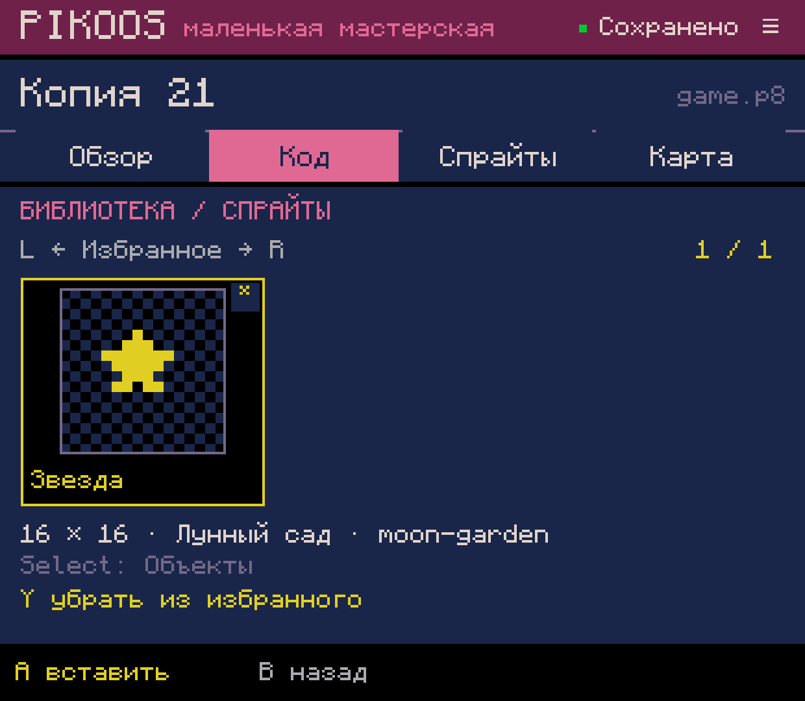
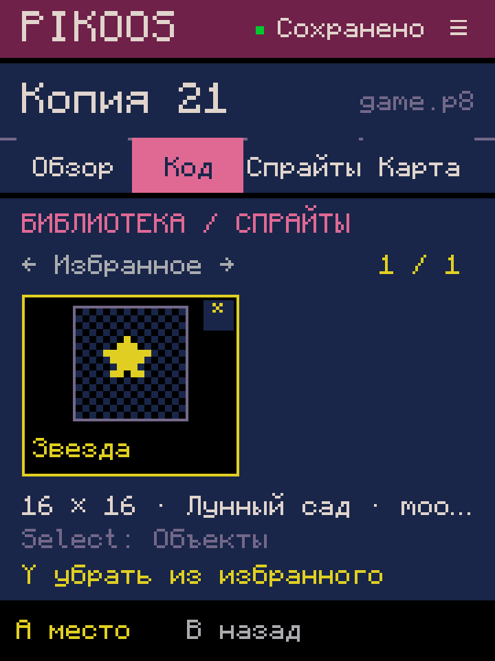
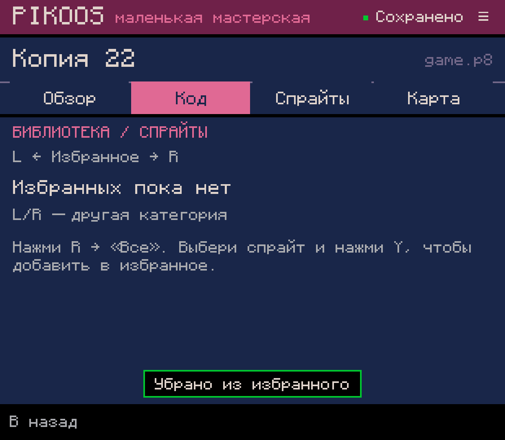
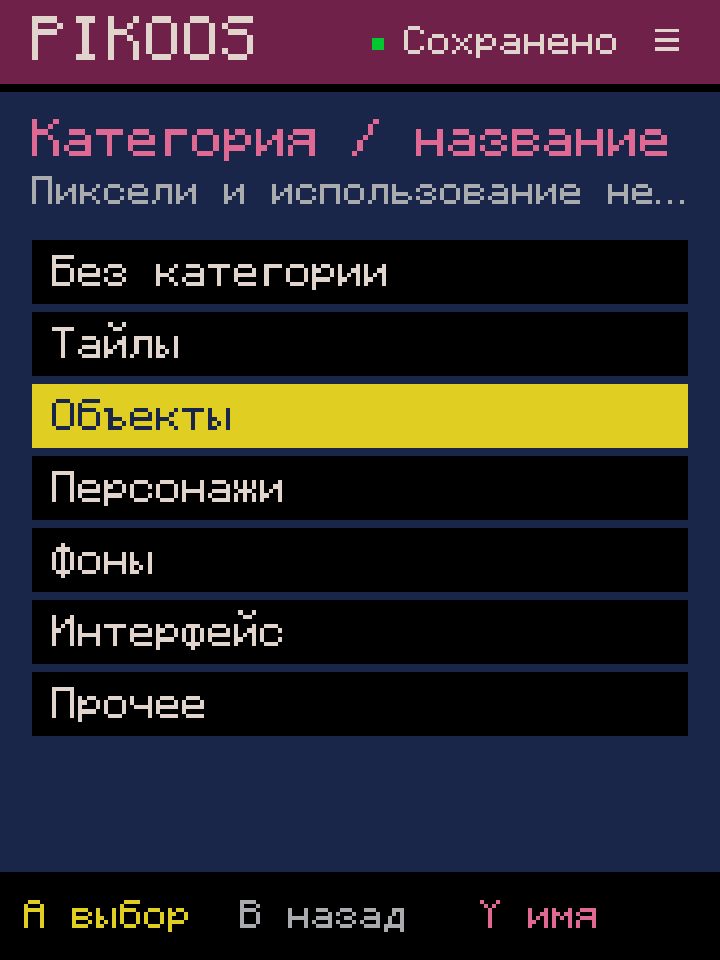

# 0.0.57 — избранные спрайты

Срез B01.2, 2026-10-04. Общая библиотека спрайтов получила отметки избранного,
доступные из любого проекта. Жанр, герой и наличие спрайта в текущем cart не нужны.

## Управление

- **Y** в библиотеке добавляет/убирает выбранный спрайт из избранного.
- **L/R** переключают категории. Из «Все» один L открывает «Избранное»;
  из «Избранного» R возвращает «Все». Существующие номера категорий сохранены.
- **Select** открывает свойства: категория по-прежнему выбирается крестовиной/A,
  **Y** открывает название. Это новый путь переименования вместо прежнего Y в библиотеке.
- **A** начинает обычный выбор места для вставки; B отменяет размещение и возвращает
  к тому же фильтру. Звёздочка не меняет способ вставки или зависимости cart.

У каждой избранной карточки есть отдельная отметка в углу. Снятие отметки в
«Избранном» выбирает оставшуюся карточку; после последней показывается пустой
список с объяснением. Метаданные записываются до изменения видимого состояния;
ошибка не рисует ложного успеха. Категория и название сохраняют отметку.

## Данные и границы

`SpriteAsset` в portable core сохраняет favorite вместе с независимыми пикселями
и происхождением ресурса. `.pksp` v3 обозначает избранный ресурс и содержит категорию;
v1/v2 читаются как неотмеченные и не мигрируют при чтении. Снятие отметки возвращает
старое v1/v2-представление побайтно, если остальные данные не менялись.
Существующее атомарное хранилище проверяет ожидаемые исходные байты перед записью.
Прочитанный ранее снимок не может затереть чужое переименование/категорию.

Это метаданные мастерской. `.p8`, пиксели, номера спрайтов, флаги и Lua не меняются.
Правила ресурсов сверены с [официальным мануалом PICO-8](https://www.lexaloffle.com/dl/docs/pico-8_manual.html#SPR).
Нового runtime-кода нет; повторный запуск игры не нужен для проверки самой отметки.

## Проверки

Полная сборка прошла. **AssetFavoritesTest: 58 проверок**: совместимость v1/v2,
v3 round-trip, все категории, точное снятие отметки, сохранность пикселей/источника,
rename/category, пустой фильтр, ошибка записи/повтор, устаревшие данные, другой проект,
обычная вставка и отмена. Существующие тесты переименования проверяют новый путь Select → Y.

На Retroid через события контроллера ADB:

1. В копии 22 отмечены «Звезда» и «Котик», проверен список двух избранных.
2. Обе отметки сняты — показан безопасный пустой список.
3. «Звезда» снова отмечена; Select → Y открыл её название, B отменил без записи.
4. В копии 21 видна та же избранная «Звезда»; выбор места вставки отменён.
5. После force-stop восстановлены фильтр и выбранный ресурс; проверены 1240×1080
   и 720×960. На компактном экране подписи нижних действий разведены. Родной размер возвращён.

Побайтовая сверка 40 файлов: 39 полностью прежние, включая все картриджи,
набор параметров и остальные ресурсы;
только у «Звезды» v2 изменился на v3. Категория, название, источник, размеры и
пиксели этой записи совпадают. [Сохранность](preservation.json),
[сборка и APK](verification.json), [журнал тестов](build-final.log).

Звук 0. GitHub APK Release не создавался. Физическую эргономику оценивает владелец;
ADB-проверка не заменяет пользовательскую приёмку.

## Дальше

B01.2 остаётся частичным: пользовательские коллекции, управление наборами
(rename/delete/recover), единое избранное остальных редакторов и внешняя папка
библиотеки ещё нужны. Следующий срез — M02.2: выбирать и редактировать отдельные
действия внутри ветви условия, затем безопасное удаление/перестановка.
