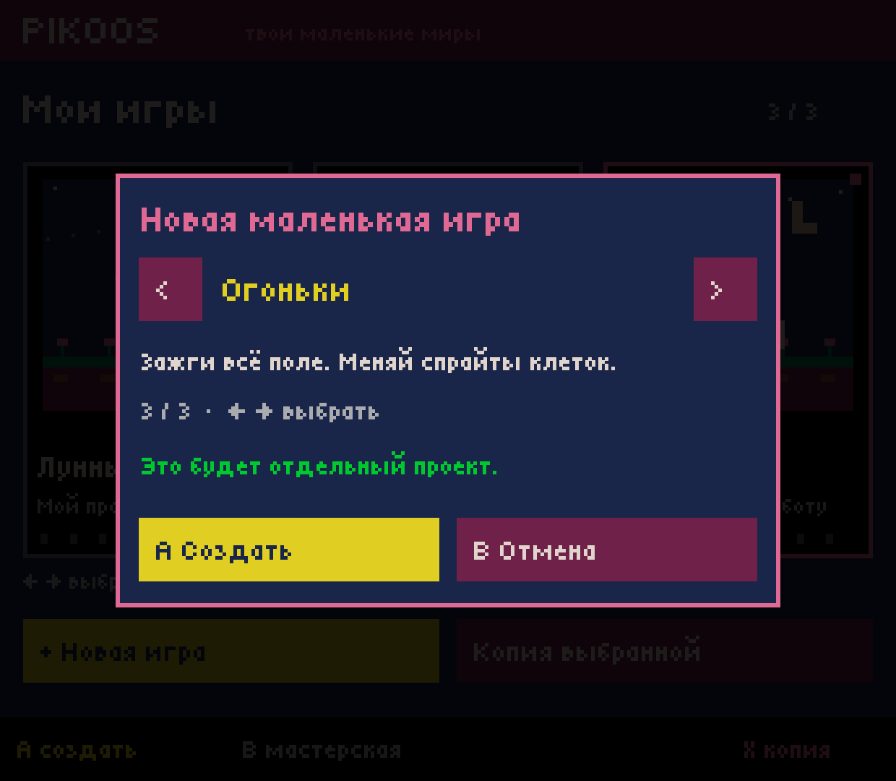
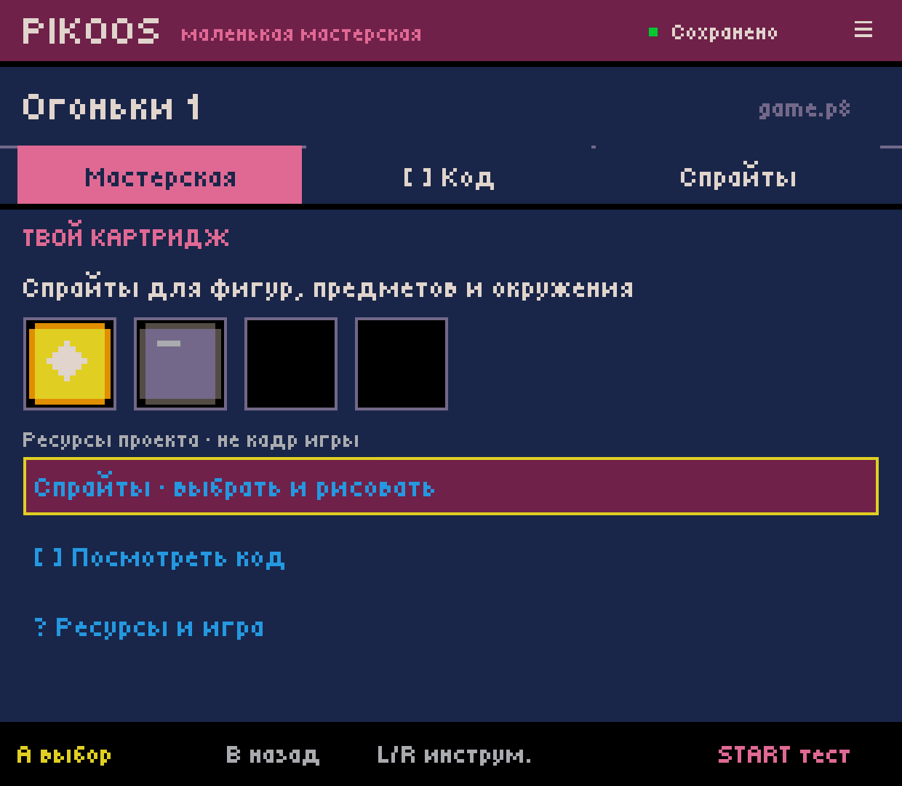
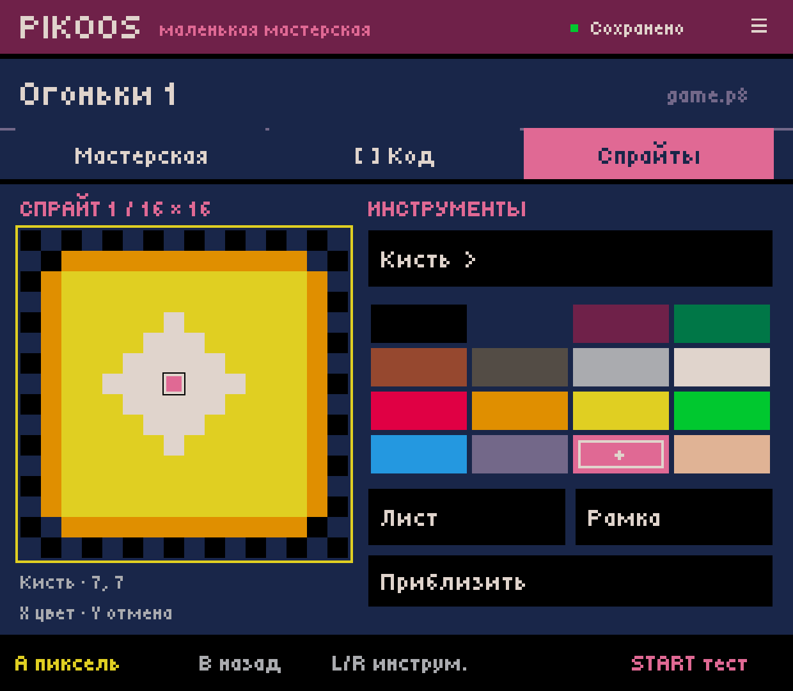
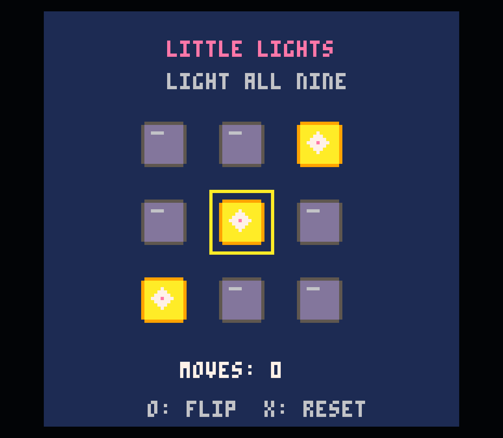
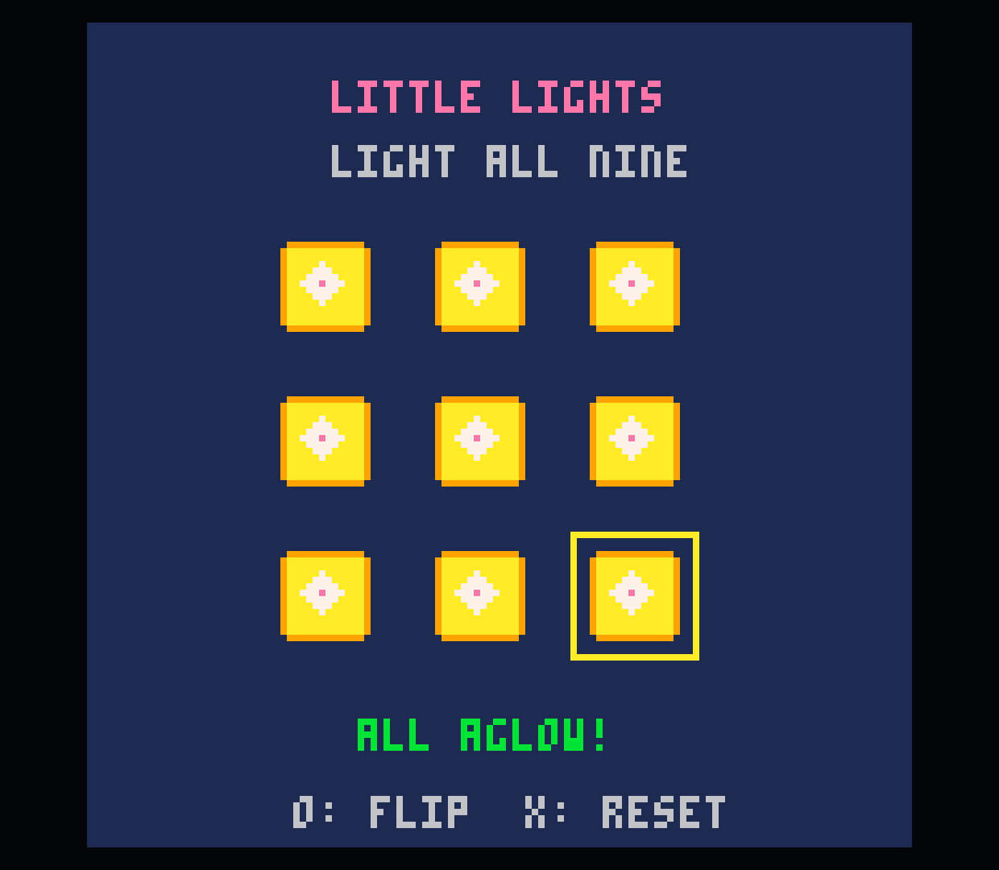

# Проекты без героя — Android 0.0.9

Проверено 2026-10-03 на Retroid Pocket Classic. Это расширение работающего стенда,
а не завершённый редактор произвольных объектов или жанровых механик.

## Что работает

- В «Новой игре» доступны «Лунный сад», «Чистый лист» и «Огоньки».
  Направления выбирают основу, Confirm создаёт отдельный проект, Cancel отменяет.
- Пустой картридж и головоломка открываются без героя, скорости и прыжка.
  Их мастерская предлагает ресурсы, просмотр Lua и краткое объяснение связи
  спрайта с кодом. Миниатюры — ресурсы, не имитация текущей игровой сцены.
- Спрайты, прямоугольные области, инструменты рисования и Undo работают без
  привязки к герою. При отсутствии `__gfx__` первая эффективная правка добавляет
  только графику; Undo возвращает исходный файл, включая отсутствие секции.
- Moon Garden остаётся с прежними параметрами и назначением героя через
  необязательный `MoonGardenBinding`. Если привязка не распознана, доступ к
  поддерживаемым ресурсам сохраняется, неизвестный Lua не перегенерируется.

## Проверка

Штатная сборка прошла: LabCartridge, Workshop (799), SpriteWorkflow (2806),
LibraryWorkflow (28), DrawingWorkflow (4269), RegionWorkflow (16422),
HeroBinding (41), новый HeroFreeTest (100 проверок). Новая проверка покрывает
пустой/отсутствующий gfx и Lua, CRLF/неизвестные секции, отказ сохранения,
байтовое Undo, независимую копию, навигацию и отсутствие добавленного героя.
Предыдущие тесты отказа открытия при неизвестном коде героя заменены проверками
сохранности файла и отказа именно небезопасного назначения героя.

APK установлен через `adb install -r`, данные приложения сохранены.
Итоговый SHA-256 APK:
`f4cebc86882915557b4ea5597c6ce5aebb0076d938dc229894d08ff32b0b0c3b`.

Через контроллерные действия ADB создан `puzzle-0001`, в спрайте включённой
клетки пиксель (7,7) изменён с 7 на 14. Изменение видно во всех включённых
клетках официально запущенного картриджа. Начальное поле решено двумя ходами
(верхний левый и нижний правый углы), получено `ALL AGLOW!`. Для runtime
использована инъекция клавиатурных стрелок/Z/X с коротким удержанием; это не
новая ручная приёмка физических кнопок владельцем.

Первый вариант тестовой игры занял имя API `flip` и упал при исполнении.
В исправленном исходнике используется `toggle_cell`; исправлен также только
Lua созданного тестового проекта, его нарисованный пиксель сохранён. Снимки
official-game/win получены после исправления. Сразу после установки первый
Start не дал наблюдаемого игрового кадра; повторный запуск прошёл. Причина
первого случая не установлена, надёжность внешнего wrapper этим не доказана.

В `blank-0001` нарисован пиксель, затем Undo восстановил точный исходный
`blank.p8`. Картридж запущен в официальном runtime и показал предусмотренный
пустой фон. Пока runtime был открыт, фоновый процесс PikoNest завершён через
`am kill`; после выхода runtime редактор восстановился новым процессом
(PID 21300 → 21944), с проектом, вкладкой, режимом CANVAS и курсором (7,7).
История Undo остаётся в памяти процесса, её сохранение этим не заявляется.

Контрольные суммы после проверки:

| Проект | SHA-256 `game.p8` |
|---|---|
| moon-garden, прежний | e9c5161d8c52d9dc3648ff018c336ca0a85a219c369a375958e9f0ab7682f59b |
| garden-0001, прежний | df4bf0636f39d1621983eb4561056b7a12547a07d4c3c95aad950b343a920d8c |
| remix-0001, прежний | e0ea70bce657dd98155be51d32dd2beafb9922a562457e3bfa686371b8c9c64d |
| blank-0001 | 8f3f4d36e5b172732836b21204fddd5aa8255704ec81129d9658934613ab6a39 |
| puzzle-0001, с розовым пикселем | 994fa36116ea6384017b5b48f43596775563471f47cb6f59827da0b95684c296 |

Все три прежних проекта совпадают с состоянием до обновления.

## Границы

«Чистый лист» — пустая основа: нарисованный спрайт сам не появляется в игре.
Свободное редактирование Lua, механики пазла/тетриса, общий объектный редактор,
импорт произвольных файлов и межпроектная библиотека ресурсов ещё не готовы.
Автоматическое размещение New/Copy осталось только у известного платформера;
для других картриджей доступно явное выделение/редактирование области. Копия
целого проекта работает для обоих путей. Быстрые карточки 16×16 и выбор верхних
128×64 — прежние ограничения UI, не ограничения PICO-8.

[Частицы и визуальные эффекты](../../VISUAL_EFFECTS.md) исследованы и описаны
как будущий инструмент; эффектов в этом выпуске не добавлено.
