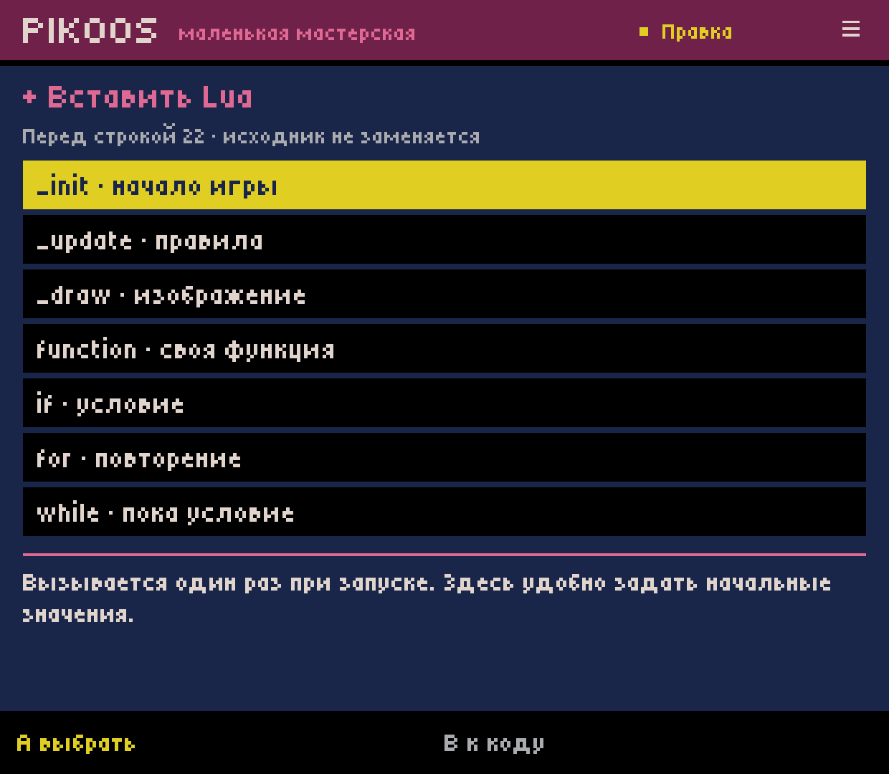
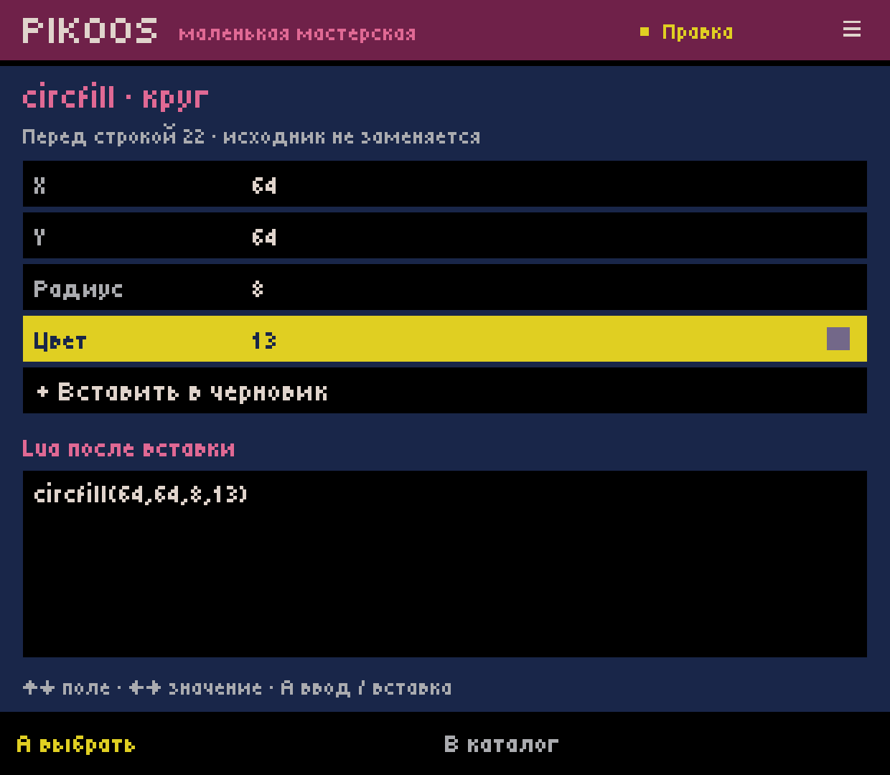
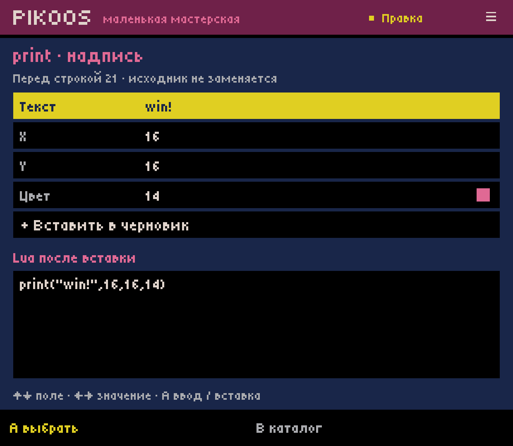
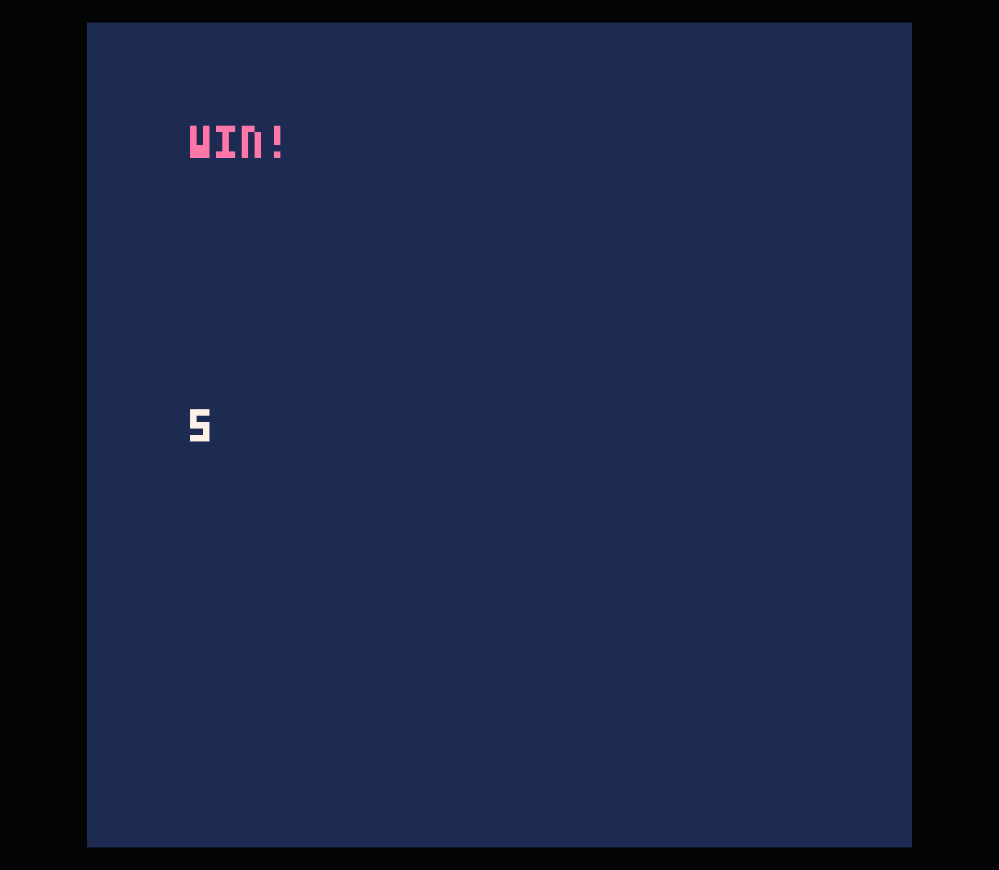
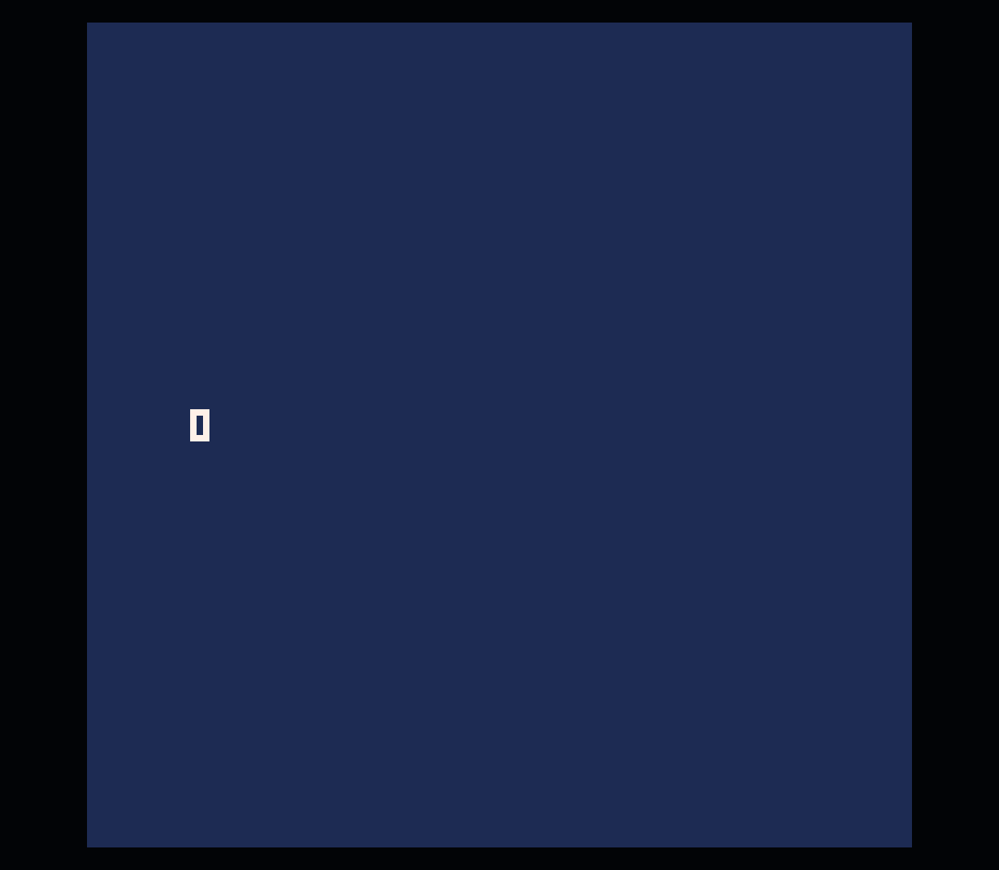
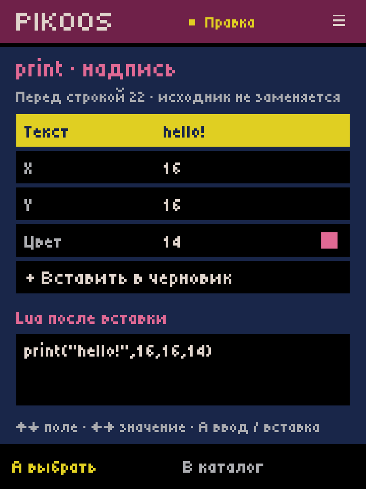
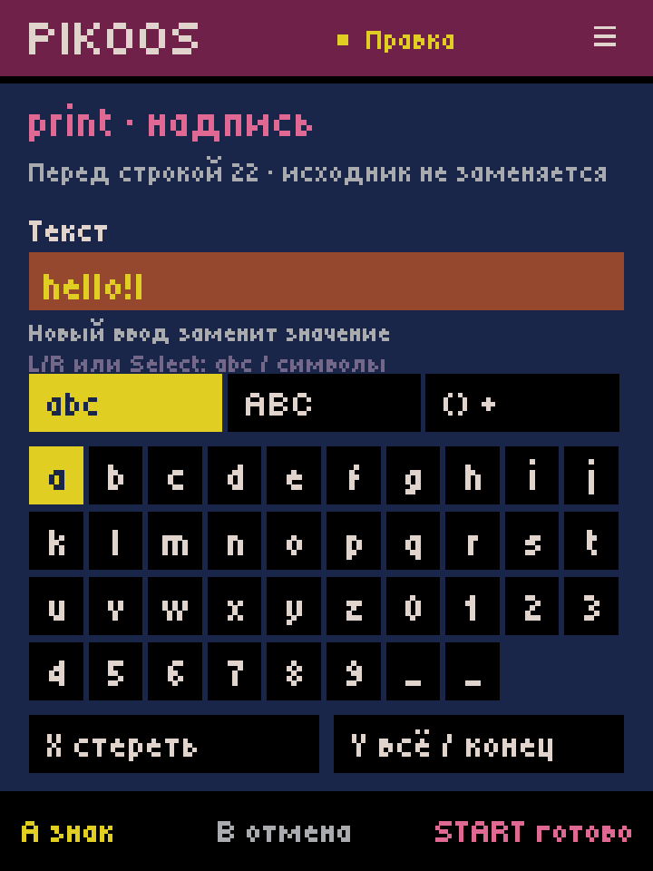

# Controller Lua insertion — Android lab 0.0.32

2026-10-03. C02.1 continues the [literal editor](../android-code-31/README.md).
This is a checked development slice, not closure of C02, M1 or ACC-01 and not owner
acceptance of controller ergonomics. No APK release/prerelease was created.

## User path

Open a project's Code tool, A to edit, X to insert. The catalogue explains the
selected action in Russian while retaining actual Lua/API names. Choose an entry,
edit its parameters, inspect ordinary Lua, then choose **Вставить в черновик**.

- 17 entries: `_init`, `_update`, `_draw`, named function, `if`, numeric `for`,
  `while`, assignment, increment, `btn`/`btnp` condition, `cls`, value/text `print`,
  `circfill`, `rectfill`, one-tile `spr`, no-argument function call.
- D-pad up/down selects entries/fields; left/right changes integer values, base
  palette colors or button choices. A opens name/expression/string entry.
- Text entry: D-pad + A, X erase, Y replace-all/append, L/R or Select changes the
  character page. Start accepts the field; B cancels it. Optional keyboard works.
- Start does not launch/save while reviewing an insertion. B returns to the
  catalogue, then to the unchanged draft. Select in the cursor opens edit commands.
- Insert before the current line, preserving its indentation and newline style.
  A block puts the caret inside its body. One draft Undo removes the whole insertion.
  Test saves the complete draft using the existing cart transaction.

## Verification

`powershell -NoProfile -ExecutionPolicy Bypass -File experiments/android-host/build.ps1`
passed all portable tests and built/signed the APK. New `LuaInsertTest`: **157 checks**;
existing `LuaEditorTest`: **119 checks**, plus the existing project/storage/runtime/
graphics suites. Tests cover every catalogue entry, CRLF, caret, single undo/redo,
literal duplicate callbacks, string/comment boundaries, field validation/escaping,
controller transitions, cancelled/unfinished proposals, failed save/retry,
unrelated bytes, truncated recovery and reading the 0.0.31 recovery format.

Installed on Retroid Pocket Classic, Android 14: package versionCode 32 / 0.0.32,
existing Runtime Test 4 backend. Local APK SHA256:
`ec4d72c6bb2dfeb092eb7ce59f431d5e57b07fc5504260d065dd18e4dd1d8db1`.
Pre-update project/library/preferences backup remains local under `.local/code-32/`.
Media stream remained muted; no sound testing in this slice.

Device sequence, using controller-style ADB key events in the host:

1. Created **Чистый лист 3**, then added initial state, update callback, two input
   conditions, increment/reset, score display and goal message using the catalogue.
   The source was never edited through shell, file injection or an external editor.
2. Prepared the `win!` text insertion; Home → force-stop → relaunch → Workshop
   restored both the unsaved game and the unfinished parameter proposal. The
   canonical cart still contained the original blank project until explicit Test.
3. Applied the proposal, undid/redid it, then Test saved/launched the official
   user-supplied PICO-8 0.2.7 runtime. Its screen showed score 0.
4. Held keyboard Z events through ADB raised score to 5 and displayed `win!`.
   Keyboard X reset score to 0 and removed the goal message. Instant/held synthetic
   gamepad A events did not change the score in this check. This does not establish
   the physical controller's runtime behavior; that acceptance is still required.
5. Returned using Ctrl+Q. Start did not establish a usable controller-only exit
   during this check; R03/Q02 remain open. Read back [the saved ordinary cart](score-game.p8).
6. Reviewed catalogue/fields/text at native 1240×1080 and simulated 720×960
   (`wm size 960x720`, density 320, logical 360×480). Corrected text-field spacing
   and the existing code viewer's overlapping navigation label. Restored physical
   size 1080×1240 afterward; final installed version is 0.0.32.

Runtime/game and recovery screenshots precede the final spacing-only UI fixes;
catalogue, circle preview, compact text and viewer captures show the final build.
Changing a number/color in the circle proposal was also checked on that build,
then cancelled without changing the saved game. Controller ergonomics and touch
target comfort remain separate owner/device checks, not inferred from screenshots.

## Boundaries and next slice

The catalogue inserts ordinary text; it does not reopen arbitrary existing calls
as forms, infer scope, place callbacks automatically or resolve project symbols.
Duplicate-function detection is conservative lexical masking, not Lua analysis.
Both `_update` variants, nested callbacks, incomplete expressions and semantic
errors still require judgment/official runtime validation. `btnp` has auto-repeat;
this sample deliberately permits the score to continue above five.

Only the sample's callbacks/input/state/print/condition/call path was exercised
in the official runtime this turn. The full catalogue has model tests, not a
claim of exhaustive runtime coverage. Expressions are literal single lines up to
256 characters; arrow stepping is for integers, text entry handles other values.
Long previews may be shortened to fit. `spr` currently exposes one 8×8 tile; larger
ordinary PICO-8 sprite calls remain editable as Lua. No new PICO-8 limit is implied.

Proposal recovery format 2 reads format 1; undo history is still session-only.
No general P8SCII input, syntax diagnosis, full API browser or scope-aware
completion is claimed. Explanations are our own short contextual text based on the
official [0.2.7 manual](https://www.lexaloffle.com/dl/docs/pico-8_manual.html), not a
completed H01 reference/learning system. Standard carts gain no PIKOOS dependency.

Next: C03 context/project-symbol selection, followed by safe editing of existing
parameters and C06/R03 to complete the first authoring acceptance scenario.
