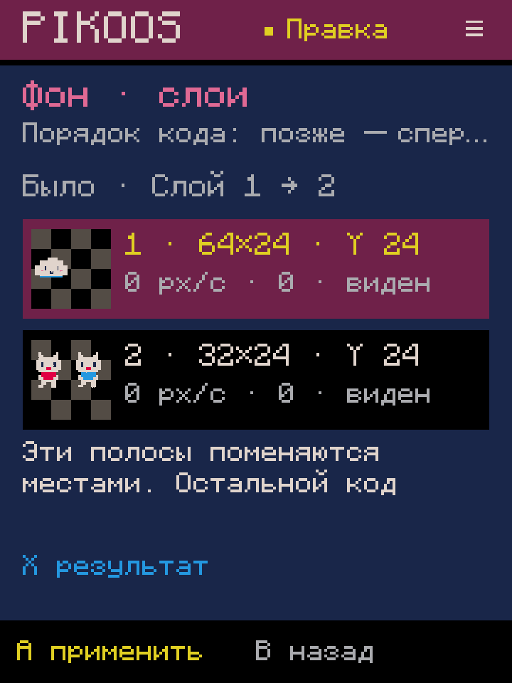
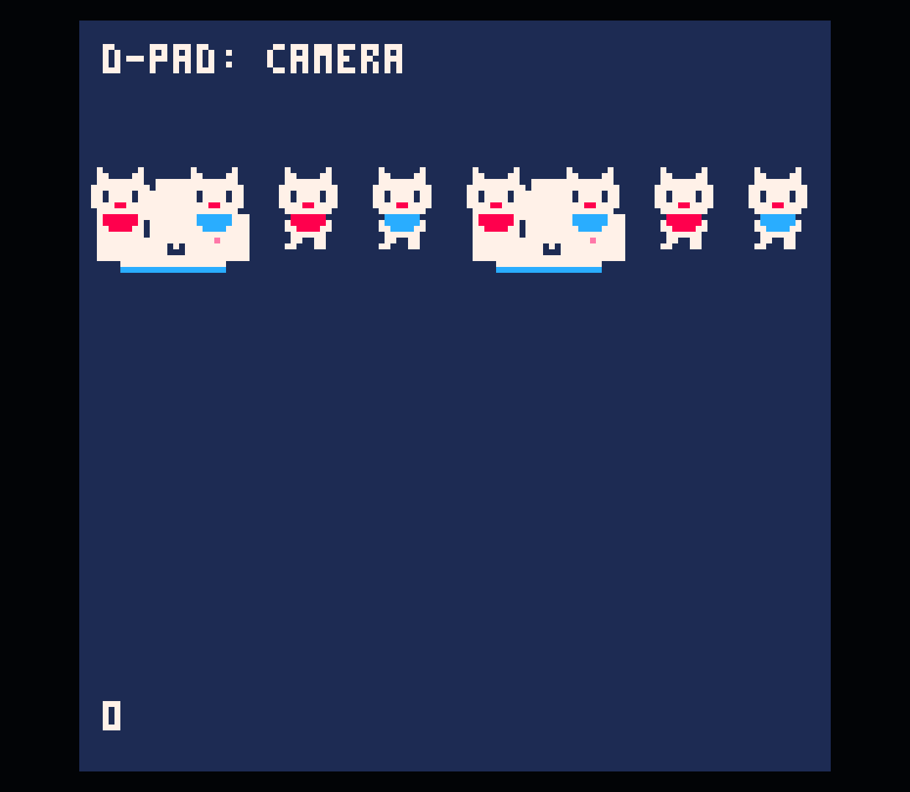
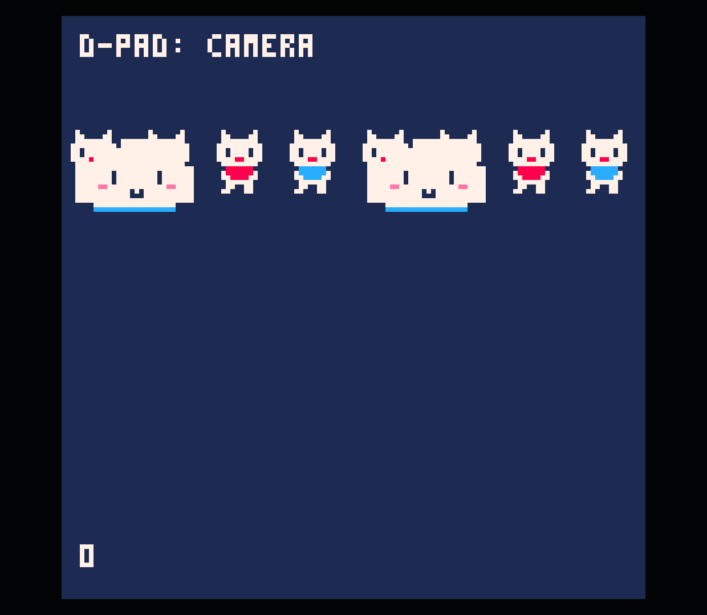

# 0.0.61 — управление фоновыми слоями

Пакет N03.2, 2026-10-04. Вместо отдельных установок для каждой операции проверен
общий сценарий: список → создание/копия → параметры → порядок/удаление → Test.
В каталоге «Камера / фон» появился «Фон · список слоёв»; второй вход —
Select в редакторе Lua → «Фоновые слои».

## Управление

- Крестовина выбирает слой; список показывает миниатюру, размеры, Y, скорость,
  коэффициент параллакса, видимость и строку исходника.
- A открывает параметры. Применение или отмена возвращает к выбранному слою.
- R открывает форму нового слоя после выбранного. В пустом списке вставка будет
  у исходного курсора Lua; подсказка объясняет место в `_draw` после cls/камеры.
- Select: назад, вперёд, дублировать, удалить, добавить новый. Порядок, копия
  и удаление сначала показывают результат. X переключает исходный/новый порядок,
  A подтверждает, B отменяет. Никакой записи от одного открытия меню нет.
- Y/R2 отменяют/повторяют правку прямо из списка. X открывает выбранный блок в Lua.
  После удаления последнего слоя остаются доступными создание и отмена.

Новый слой получает выбранную область листа и обычные начальные параметры.
Дубликат копирует блок Lua и ссылается на те же пиксели: расход памяти gfx не растёт,
параметры копии редактируются независимо. Удаление убирает только выбранный блок
и следующий перевод строки; спрайт-лист и карта не изменяются.

## Сохранность и границы

Переносимый `BackgroundLayers` перечисляет точные распознанные рецепты полос,
а не выводит из произвольного Lua универсальную сцену. Порядок списка — порядок
исходника; блоки в разных функциях или условиях могут исполняться по-разному.
Перестановка разрешена только между соседними известными полосами с пробельным
промежутком. Через другой код, границу ветви/функции или отдельный комментарий
перенос отклоняется с объяснением и доступным переходом в Lua.

Предложение содержит исходник и результат; перед записью проверяется их актуальность.
Блоки переносятся целиком, с локальными переменными, отступами и переводами строк;
весь остальной текст сохраняется. Выделение следует за перенесённым/новым слоем.
Одна операция — одна запись текущей Undo-истории. История пока не сохраняется между
запусками: восстановление предложения и постоянная история — разные возможности.

Журнал v13 сохраняет список, выбор, меню, сторону просмотра и возврат из формы,
включая вложенный выбор области v12. Предложение пересчитывается из сохранённого
исходника. Старые журналы читаются; повреждённые состояния отклоняются.
В модальных формах/просмотрах Test, ввод текста и фоновые команды не применяются.

Для слоя в самом конце Lua без завершающего перевода строки кнопка создания
просит добавить строку в исходнике; дублирование и удаление такого блока доступны.
Ручная правка формулы, includes и shadowed API сохраняют ограничения N03.1.
Вертикальные/map-фоны, связь с анимацией и перенос через произвольный Lua ещё не готовы.

Данные/семантика опираются на [официальное руководство PICO-8 0.2.7](https://www.lexaloffle.com/dl/docs/pico-8_manual.html#SSPR):
это прежние `sspr`-блоки стандартного картриджа, без особого движка или секций.

## Проверки пакета

**BackgroundLayersTest: 95 проверок**; полная сборка прошла. Покрыты LF/CRLF/CR,
блоки разной длины, порядок в обе стороны, копия/удаление/последний слой,
первый и новый слой, выбор после операций, формы и вложенное восстановление,
комментарии/строки/ручные формулы, API shadowing, устаревшее предложение,
повреждённый журнал, контроллерные входы, модальные ограничения и точный Undo/Redo.

На Retroid через контроллерные события ADB:

1. Через полку создана копия 26 из копии 25. Из списка добавлен новый слой,
   проверены точные Undo/Redo и удаление обратно к двум исходным блокам.
2. Из списка открыты обе формы. Для видимого перекрытия облака и коты размещены
   на одном Y; скорость и параллакс выставлены в 0. Графика не перерисовывалась.
3. Слой дублирован. Просмотр удаления восстановлен на 720×960 после force-stop;
   отмена сохранила три слоя, повторное подтверждение вернуло точные два блока.
4. Save/Test показал котов поверх облаков. Затем из списка изменён порядок,
   исходник/результат просмотрены на компактном экране; Undo/Redo дали точные строки.
   Второй Test показал облака поверх котов. HUD остался прежним.
5. На компактном экране обнаружено пересечение нижних подсказок A/B; исправлено.
   Итоговая сборка установлена, исправленный просмотр проверен. Родной размер возвращён.

Все **43 прежних файла** проектов/библиотеки сохранены побайтно. Добавлен только
`remix-0026/game.p8`; его секции вне Lua совпадают с копией 25.
[Сохранность](preservation.json), [итоговый cart](tested.p8),
[сборка](build-final.log), [APK и устройство](verification.json).
Звук выключен. GitHub Release нет. ADB не заменяет физическую UX-приёмку владельца.

## Далее

Следующий пакет N03.3: движение и повторение по двум осям, затем связь с анимацией
с сохранением списка и операций над слоями. Map-фоны и остальной M2/M3 остаются
в общем плане. Полный продукт не объявлен завершённым.
