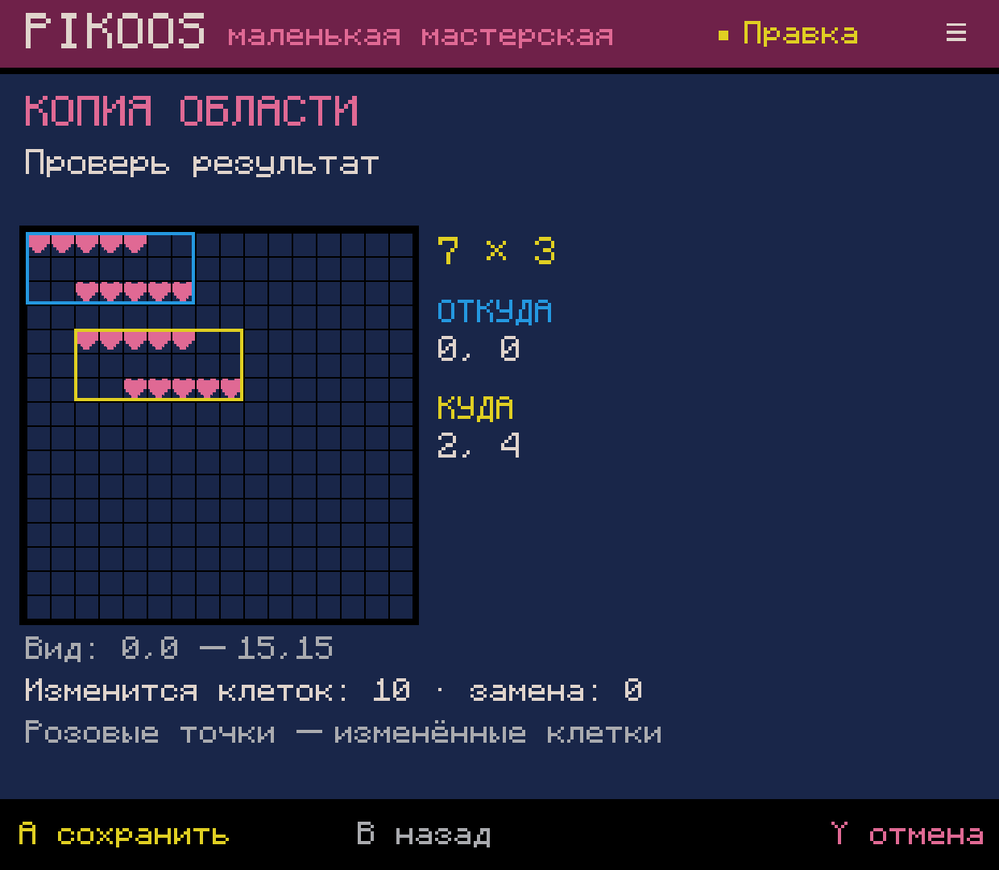
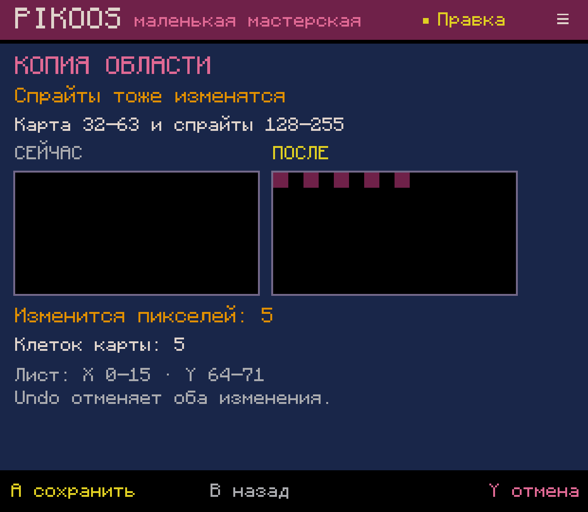
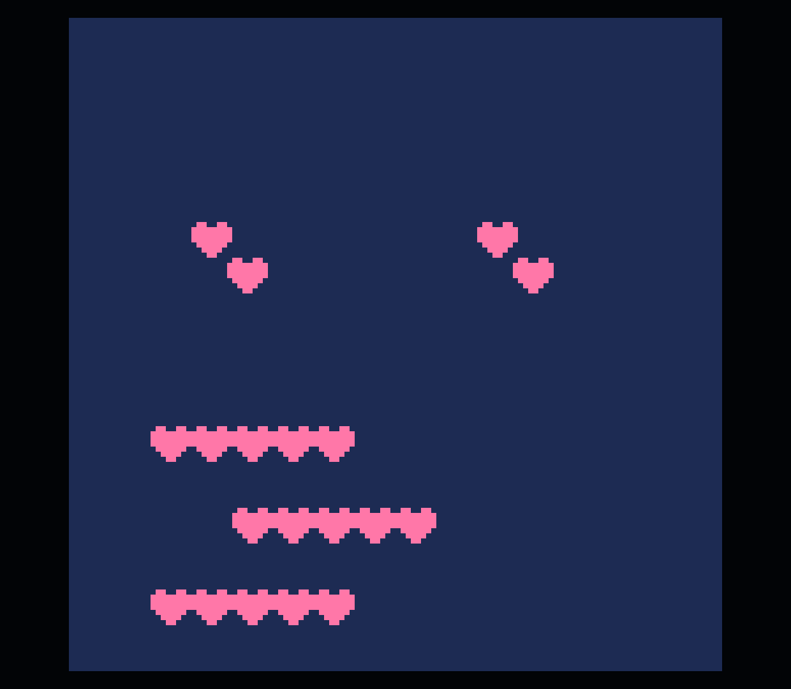

# Области карты — Android lab 0.0.63

Проверено 2026-10-04 на Retroid Pocket Classic. Это технические свидетельства
G03.4 и части G01, не приёмка всей карты/M2 или физической эргономики.

## Пользовательский путь

Карта → L2 → «Копировать / Перенести / Очистить область». Первый угол — текущая
клетка. Крестовина выбирает второй угол, A — место назначения (для очистки сразу
обзор), ещё A — результат, затем явное сохранение. L/R перемещают на 8 клеток по
X, L2/R2 — по Y. B возвращает шаг, Y отменяет весь черновик. Touch задаёт клетку,
но не является необходимым. Start и смена инструмента не обходят предложение.

Голубая рамка — источник, жёлтая — назначение, розовые точки — изменяемые клетки.
Копируются и нулевые клетки. Перенос сначала запоминает источник, очищает его,
потом вставляет снимок, поэтому перекрытие не размывает данные. Счётчик «замена»
показывает ненулевые клетки назначения, которые получат другое значение.

Строки карты 32–63 используют нижние пиксели спрайт-листа. Если операция реально
меняет эти байты, появляется отдельный экран «Спрайты тоже изменятся» с увеличенным
фрагментом, координатами и числом пикселей. Только следующая A сохраняет правку.
Нулевой участок не объявляется свободным: он также может использоваться игрой.
Обе секции сохраняются одним cart/одной операцией истории; Undo восстанавливает
исходные байты, включая отсутствие ранее несуществовавших секций.

## Основание и проверки

- Руководство из пользовательского официального PICO-8 0.2.7: Map Editor/Map,
  стандартная карта 128×64, Base RAM Memory Layout `0x1000 GFX2/MAP2`.
  Это стандартная раскладка, не произвольная карта после remapping RAM.
- `MapRegionTest`: 69 проверок — разный регистр hex, LF/CRLF и отсутствие последнего
  newline, отсутствующие секции, nibble order и крайние байты, перекрытие/нули,
  полная карта и обратное выделение, 24 сравнения с независимой моделью всех
  8192 клеток, версии журнала/устаревший cart, ошибка записи, одна Undo/Redo,
  отсутствие записи до подтверждения. Весь существующий build/test suite прошёл.
- ADB-события кнопок: новая копия `blank-0008` → `remix-0027`; копия пяти тайлов
  из `(0,0)` в `(0,2)`, Undo/Redo; перенос `(0,2)..(4,2)` в `(2,2)` с перекрытием;
  очистка/отмена/Undo; копия исходных пяти тайлов в `(0,32)` через shared-review.
  Force-stop и переоткрытие восстанавливают область; resize и обновление APK
  сохраняют экран подтверждения. После холодного старта нужно войти в Workshop
  с полки Play — известный долг Q02, а не потеря черновика.
- Правка shared-памяти изменила ровно пять пикселей: `(0,64), (2,64), (4,64),
  (6,64), (8,64)` стали цветом 2. Остальные пиксели сохранены. Undo/Redo подтверждены
  сравнением файлов. Проверено 256 точек экранов «сейчас/после»; при проверке
  исправлено повторное использование одного bitmap для обеих картинок Android.
- Через формы размещений без Lua изменён размер обычной карты на 8×4, добавлено
  использование нижней области 5×1. [Итоговый обычный cart](final.p8) запущен
  пользовательским официальным PICO-8 0.2.7 / Runtime Test 8; все 16 384 точки
  игрового кадра совпали с независимым чтением `.p8`. Возврат в редактор пройден.
- Все **45 прежних файлов** проектов/библиотеки сохранены побайтно; добавлен один
  проект, всего 46 файлов. Хэши и машинный итог — [verification.json](verification.json).

APK установлен локально, GitHub Release не создавался. Звук не включался.

## Экраны итоговой сборки

Предпросмотр копии 7×3; после снимка предложение отменено, исходник не менялся:

Общая память, до сохранения. Для этой карты пурпурные пиксели — байты тайла 2,
а не новая картинка сердечка:

[Небольшой экран 720×960](shared-compact-final.png). Второстепенные длинные подписи
могут сокращаться; действие, подтверждение, счётчики и сравнение остаются видимыми.

Официальный PICO-8: исходный ряд, перенесённый ряд и ряд из общей памяти:

## Открытые границы

- Shared-доступ в этом пакете — только операции областей карты. Кисть,
  прямоугольник/заливка карты остаются в 128×32; рисование нижних спрайтов пока
  ограничено. Не выдаём это за ограничение самого PICO-8.
- Нет межпроектного буфера карты, автоматического переноса зависимостей и анализа
  динамических ссылок из Lua; загружаемые/переназначенные RAM-карты не моделируются.
- История Undo хранится в памяти; восстановление предложения не заменяет P04.
- ADB использует абстрактный контроллерный путь, но не подтверждает ощущения от
  физических кнопок. Полная игра с правилами и закрытие M2 не заявляются.

Далее N01/G04: найти существующую анимацию из инструмента, изменить/скопировать/
удалить и связать с использованием спрайта. Затем общий вход камеры N02,
связный M2 и базовые звук/музыка/эффекты; расширение готовых шаблонов позже.
