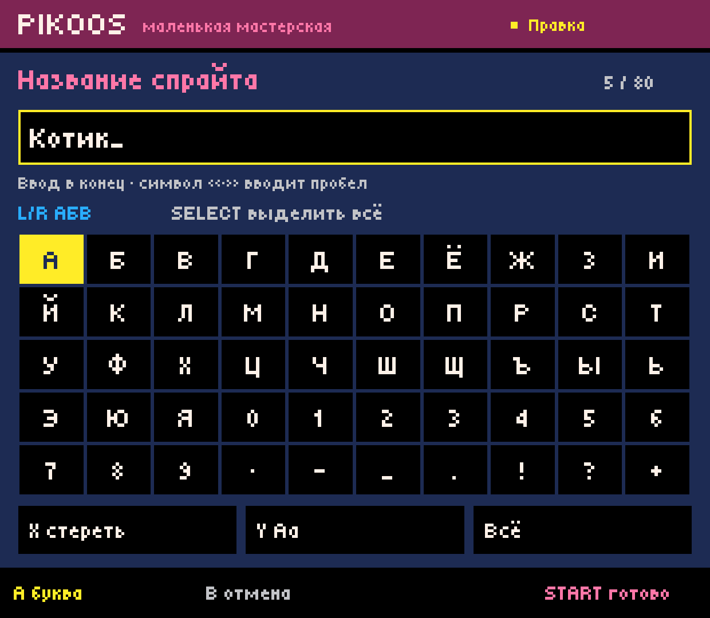
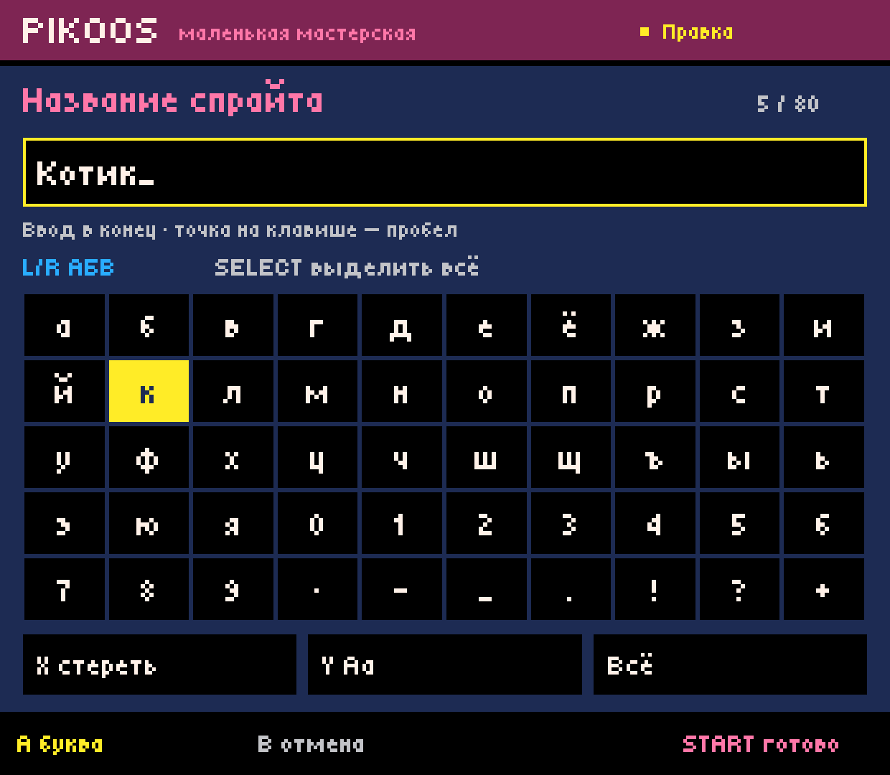
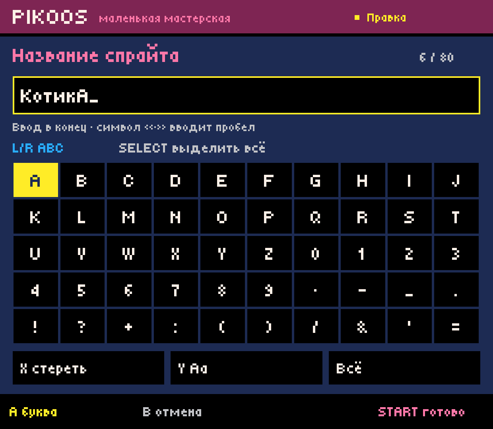
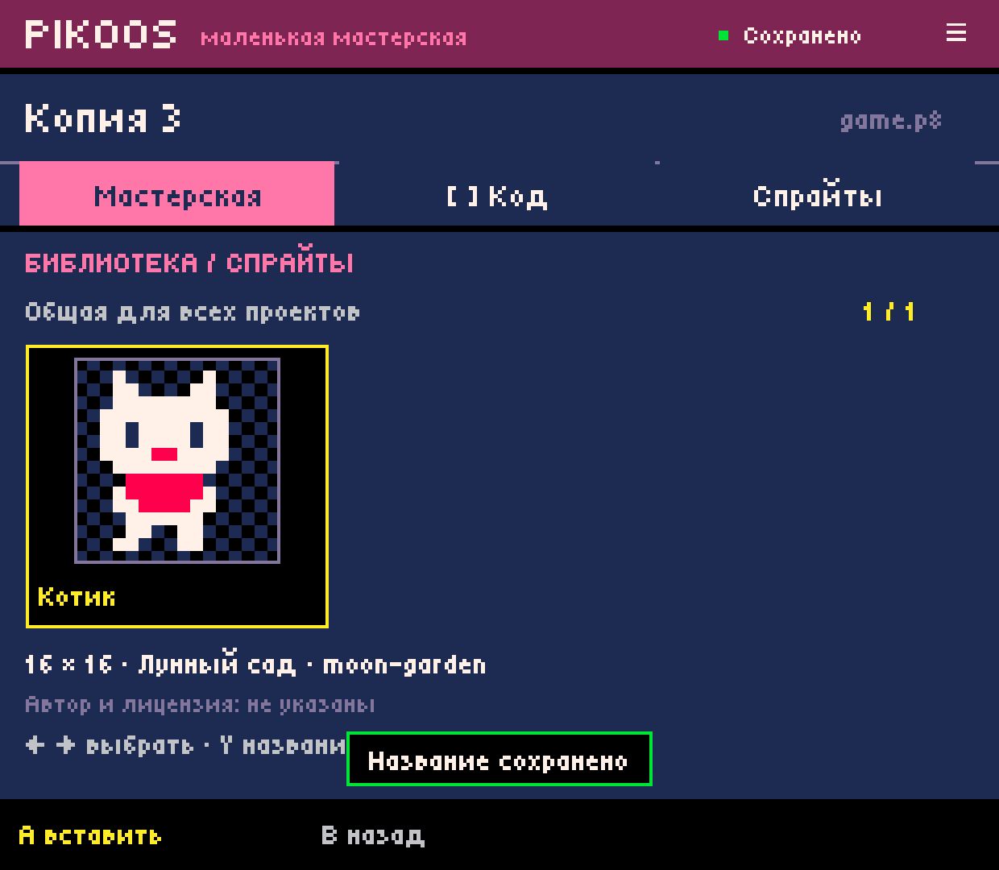
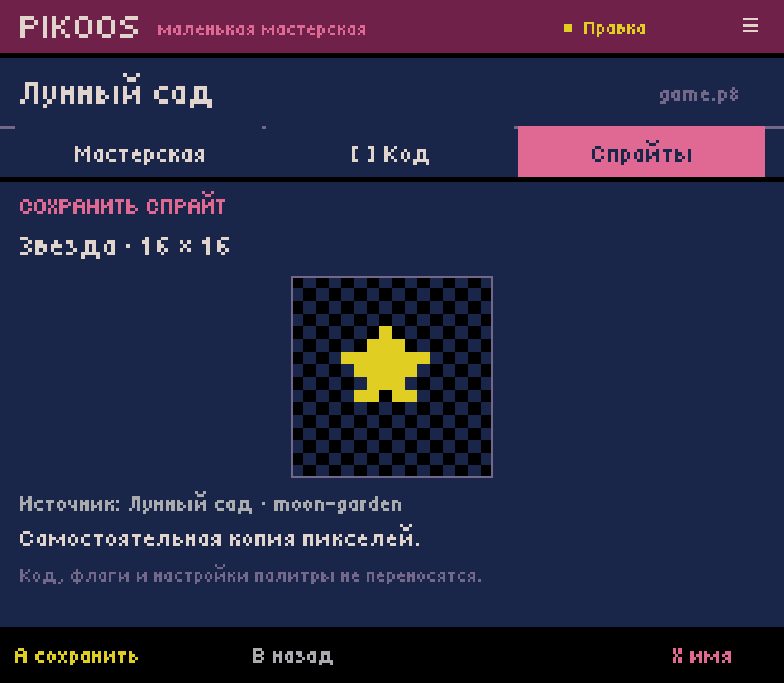
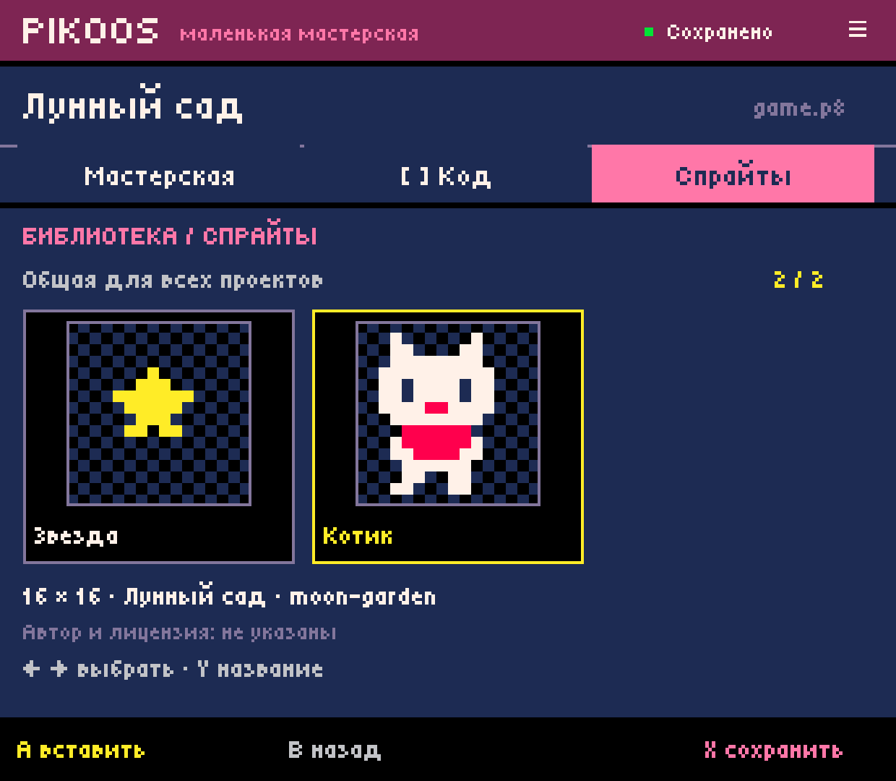

# Android 0.0.12 — sprite names with a controller

2026-10-03. Actual Retroid Pocket Classic captures, 1240×1080.

## Delivered

- Y in the shared sprite library renames the selected record.
- X on a new export preview edits its automatic name before the record is saved.
- Full-screen pixel alphabet grid: D-pad chooses, Confirm types, X erases,
  Y changes case, L/R switches Russian/Latin, Select toggles select-all/end input,
  Start finishes, Cancel discards. Touch operates the same controls.
- Initially all text is selected; first character replaces the suggested name.
  Empty/whitespace-only titles cannot commit. Limit: 80 UTF-16 code units, matching
  the existing record format. This is a metadata limit, not a PICO-8 code limit.
- Draft text, selected key, language, case and selection survive process death.
- Existing records retain their UUID, source metadata, dimensions and pixels.
  Rename does not change project bytes, insertions, or cartridge undo history.
- Catalogue selection follows UUID through sorting, refresh and cold start.
  Retrying an export already present on disk cannot duplicate its row in memory.

## Device verification

Updated in place to 0.0.12 / versionCode 12. Used controller-equivalent button
events without a physical or software text keyboard.

1. Edited a temporary name then cancelled; the original record SHA256 remained
   `1d028c963d98231f0a3e0a7efe61008733871a3fba4f52195327f1357e60be8b`.
2. Entered `Котик`, including case change, with D-pad and face buttons.
3. Sent the app to Home, killed its background process and checked `pidof` was
   empty. Cold start restored the exact name draft and focused key. Stored record
   was still unchanged until Start committed it.
4. Read the record before/after from the device: its binary prefix and suffix
   around the length-prefixed title were identical. Only `Спрайт 1` → `Котик`
   changed; ID, origin, hash, dimensions, coordinates and pixels were preserved.
5. Selected Moon Garden's star sprite, entered `Звезда` on the new-export preview.
   Completing the name returned to preview while the library still had one file.
   Confirm then created the second record. Both named resources remain available.
6. All seven existing `game.p8` files retained their exact previous hashes,
   including the cat puzzle from the preceding slice. No runtime execution was
   needed for this metadata-only change; no new runtime acceptance is claimed.
7. Switched to Latin and appended `A` to `Котик`, erased it and cancelled;
   the stored name stayed `Котик`. The complete path used semantic button events.

## Automated verification

`experiments/android-host/build.ps1` passes eleven suites, Android compilation
and signature verification. `AssetNamingTest` covers both alphabets, case,
selection replacement, backspace without breaking surrogate pairs, length/empty
validation, cancel, unchanged-name no-op, failed storage/retry, stale snapshots,
identity across reordering, independent draft restoration, metadata-only writes,
new-export naming without premature storage, and completed-export retry deduping.

Final installed APK SHA256:
`afac993b1b3bf592ad96a4d90761a6210e4c94ac2714126430dd84227c247ce6`.

Storage uses the existing v1 `.pksp` records without migration. The rename adapter
compares current bytes with the expected record and writes atomically; a stale
record is rejected. Errors return to the draft for retry or cancellation. General
cursor positioning and Android/physical text-keyboard integration are not part of
this bounded name editor. External library folders, tags, deletion and versions
remain future work.

## Captures

