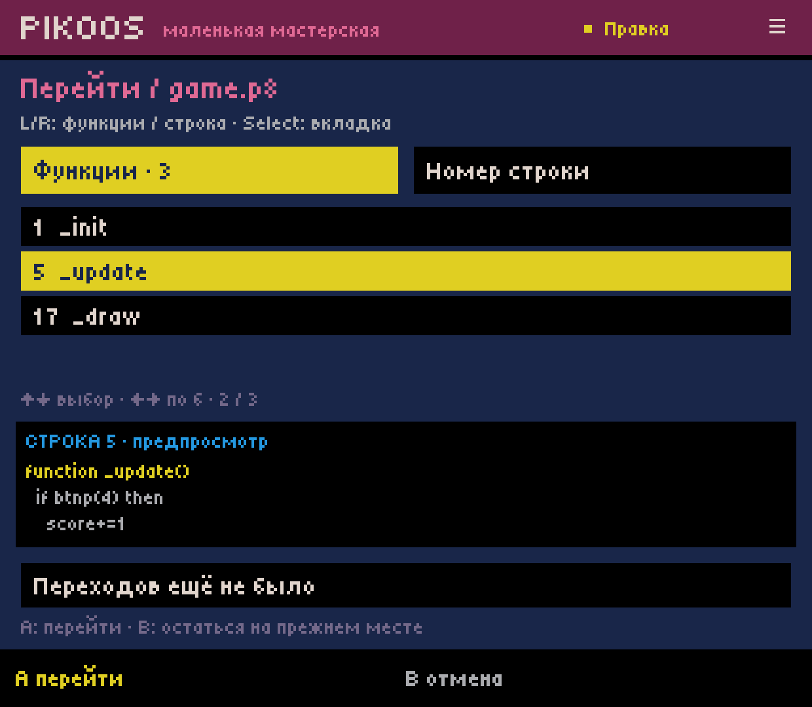
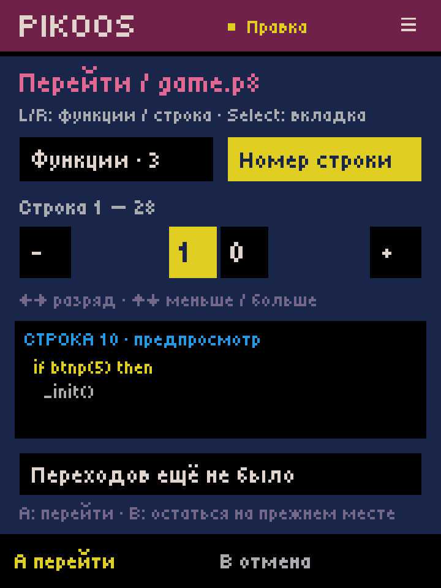
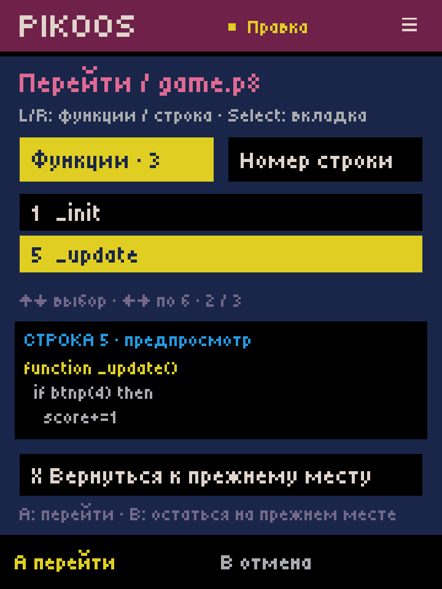

# Lua navigation — Android lab 0.0.35

2026-10-03. Bounded C03.2 continues the general editor. C03, C06, M1 and ACC-01
remain open. No GitHub APK release/prerelease was created.

## User path

Code → A edit → **R: перейти**. L/R or Select switches Functions / Line number.
Functions are listed in source order, with line numbers and a source preview.
Up/down selects a function; left/right moves six entries. In the number picker,
left/right selects a decimal place and up/down decreases/increases the number,
clamped to the current Lua body. A jumps, B cancels without moving the cursor.
X returns to the previous location, including selection. Select-menu alternatives
provide both navigation and return without shoulder buttons. Touch selects a
destination for preview; a separate confirmation performs the jump.

Navigation neither writes the cartridge nor enters edit undo history. Start,
editing commands and text input are trapped while the chooser is open. The draft
stores up to 32 return locations; they recover with an unfinished picker after
process death. Locations follow the unchanged prefix/suffix of subsequent edits;
a location inside a replaced range moves to its start. This is positional tracking,
not semantic tracking across arbitrary refactoring. Closing the draft ends this history.

## Boundary

The portable lexical outline uses the current unsaved Lua body. It includes
named declarations with parameters, local declarations, dotted/colon method names,
simple function assignments and repeated names as separate destinations. It masks
quoted/long strings and line/long comments. It can navigate an unfinished named
signature; appearance in this list does not certify valid syntax or visibility.

Anonymous callbacks, computed table keys, non-ASCII identifiers, include files,
cross-file definition lookup and scope resolution are not implemented here.
The 100,000-token scan guard explicitly labels a partial outline. Line navigation
remains available. This limit belongs to the editor, not PICO-8.
Syntax direction checked against the official [PICO-8 0.2.7 manual](https://www.lexaloffle.com/dl/docs/pico-8_manual.html).
No runtime API or generated Lua is introduced by navigation.

## Verification

- Full `experiments/android-host/build.ps1` passed, including 62 navigation checks,
  122 literal-editor checks, 157 insertion, 46 symbol and 124 existing-call checks,
  plus the prior portable/runtime/storage/resource regression suites.
- Navigation tests cover LF/CRLF/CR, masked declarations, duplicates, local/method
  declarations, unsaved source, empty/partial outline, line clamping, cancel,
  exact cartridge preservation, return selection, changes/undo, Unicode boundaries,
  bounded history, version-5 recovery and rejection of invalid state. Prior draft
  recovery fixtures for earlier versions still pass.
- Retroid Pocket Classic Android 14: host 0.0.35 installed over 0.0.34, backed up
  projects/library/preferences first. No runtime backend update.
- ADB controller events exercised R → `_update` → A → R/X return to 20:1,
  line 10 selection/jump, modal Start, B cancel, and pending line-picker recovery
  after force-stop/relaunch. This is not physical-controller ergonomics acceptance.
- Screens inspected at native 1240×1080 and overridden 720×960 (logical 360×480).
  The size override was reset. This does not establish another-device compatibility.
- Exact device readback `score-game.p8` matched both the pre-install backup and
  `android-parameters-34/score-game.p8`: 396 bytes, SHA256
  `d0ec0f5eb25c1e3e1e5da0d89e58b46c54817257f91136b47b1df3feab6fb792`.
- STREAM_MUSIC remained muted with streamVolume 0. Official runtime gameplay was
  not rerun for this cursor-only change; the preceding slice contains that evidence.

Next: C06 error → source line → fix → Test, starting with the actual diagnostic
capabilities of the official runtime. Controller-only runtime exit/return R03/Q02
remains an explicit acceptance gap. English-first localization and later language
selection are tracked separately as Q07/Q08.

Local APK: `.local/artifacts/pikoos-runtime-lab.apk`, 217884 bytes, SHA256
`e4b9ed6e14cbc659bff780ebac719068306f68ba9bc5835e06ad778adfc6f3d8`.
The final build is installed on the Retroid; the APK remains untracked/local.
