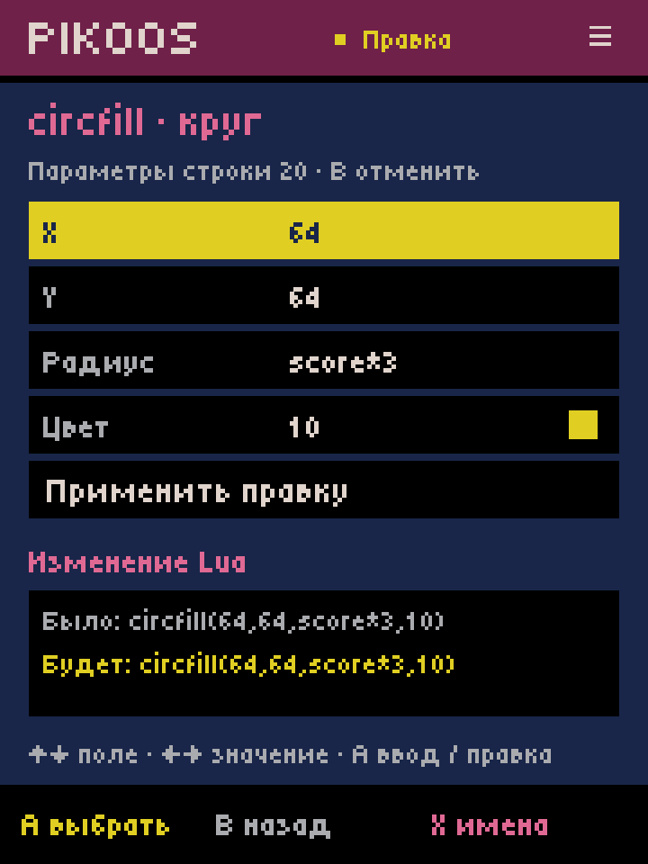
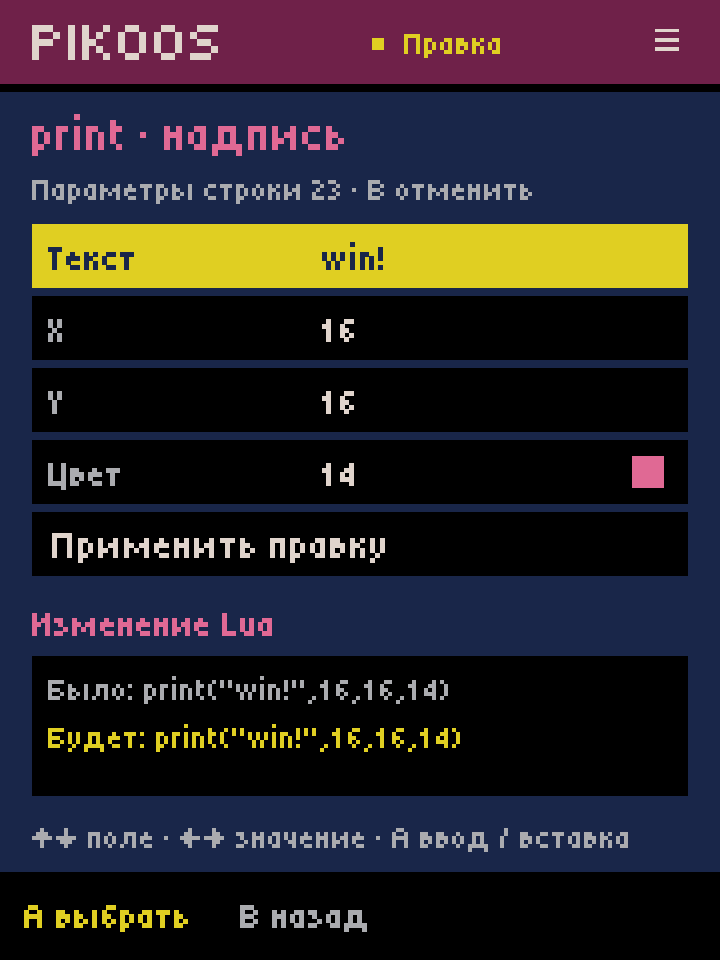
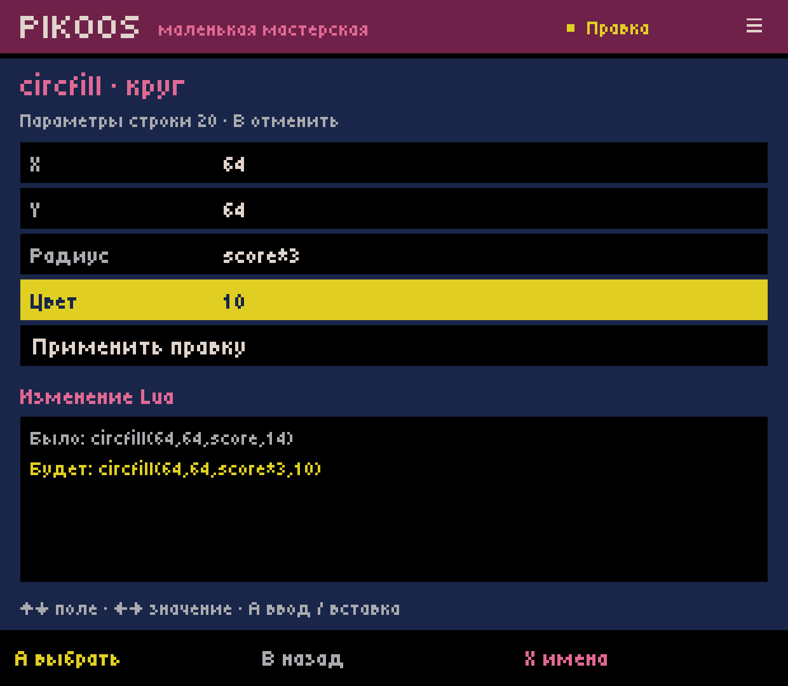
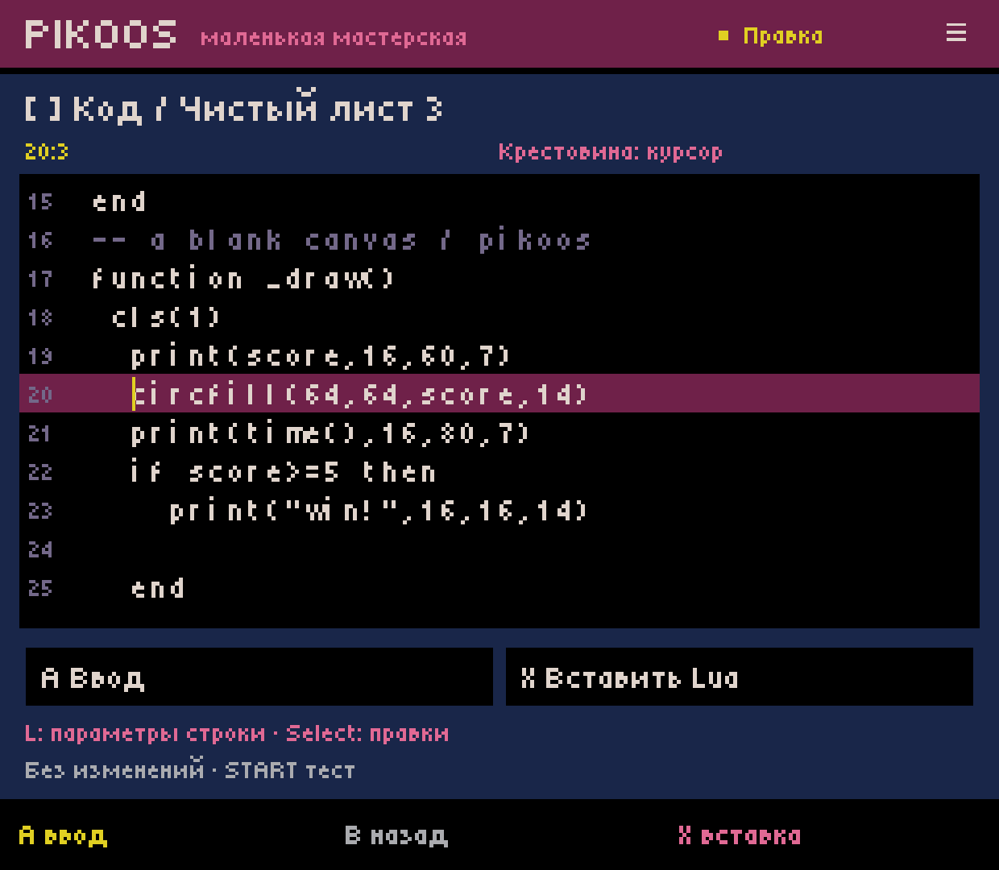
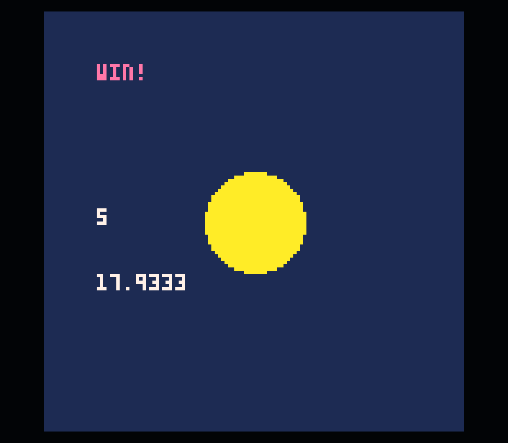
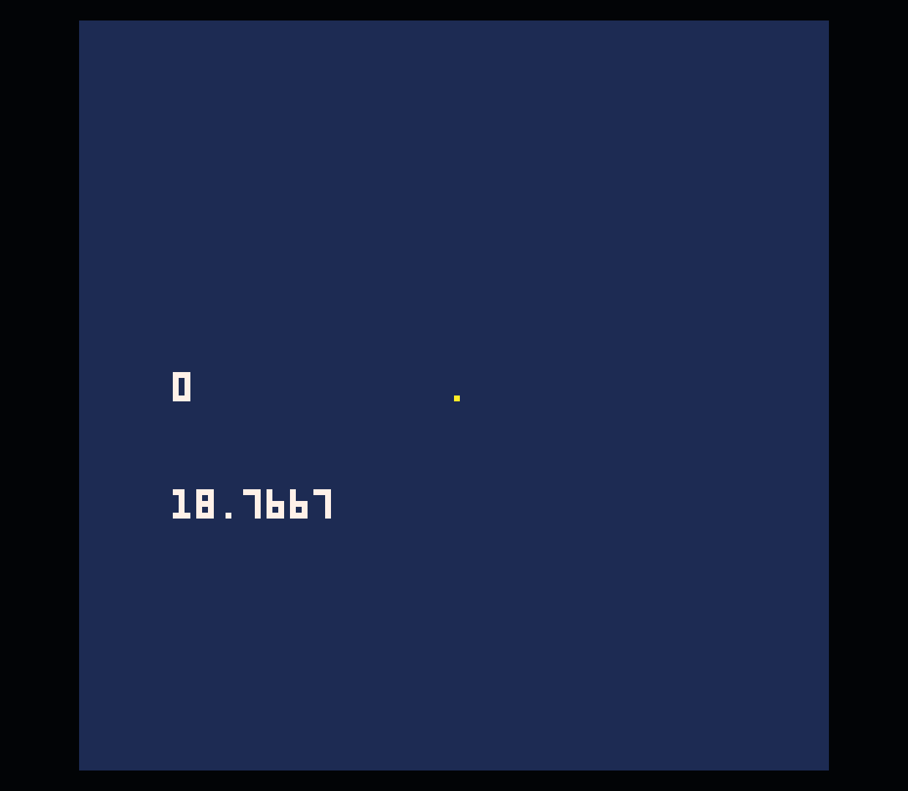
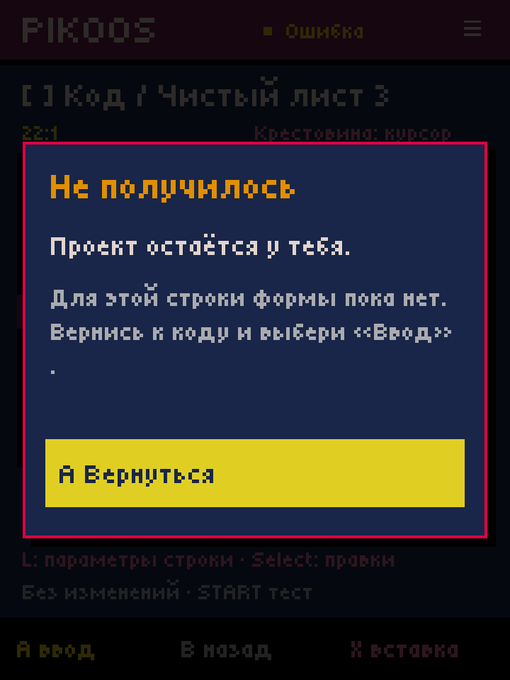

# Existing call parameters — Android lab 0.0.34

2026-10-03. Bounded C02.2 continues [name/API choices](../android-symbols-33/README.md).
This adds editing of existing source, not just insertion. C02, M1 and ACC-01 remain
open; no GitHub APK release/prerelease was created.

## User path

Code → A edit → move to a supported call's line → **L: параметры строки**.
The same action is available through Select → **Параметры вызова в строке**,
so a shoulder button is not required. Touch can select the visible shortcut.

The form loads current arguments, including hand-edited expressions. Arrows change
numbers/base colors; A opens text input; X chooses names/API for expression fields.
Preview shows **Было / Будет**. Apply changes the draft, B cancels the entire form,
and one Undo reverses all changed fields together. Start does not launch from the
form; Test from the code cursor explicitly saves before launching.

## Supported boundary and source preservation

| Call | Supported explicit argument count |
| --- | --- |
| `cls` | 1 |
| `print` | 4: value/text, X, Y, color |
| `circfill` | 4 |
| `rectfill` | 5 |
| `spr` | 3 |

The call must occupy one line as a standalone statement; indentation, spaces,
an optional trailing semicolon and trailing comments are retained. Nested calls,
table/index expressions and strings containing commas/brackets do not split into
extra arguments. Only changed argument spans are replaced; all other bytes in the
draft remain untouched. Applying unchanged values creates no undo entry and does
not normalize quotes, numeric spelling or spacing. No annotations/bindings are
written to the ordinary cartridge.

Simple quoted strings get a text field; changed text is escaped as a Lua literal.
Complex escape sequences, long strings and concatenations remain literal expressions.
Color expressions and non-base color values remain expressions; base integer colors
can still be stepped through the palette. PikoNest does not impose 0–15 as a universal
PICO-8 color-expression limit.

Other valid call arities, optional arguments, wider `spr` calls, multiple statements,
multiline calls, assignments using a return value, block rules and arbitrary functions
remain editable as text. This is an editor-form limitation, not a PICO-8 restriction
or a sprite-size limit. A simple declaration/parameter collision with the API name
or an unindexed context refuses the form; dynamic aliases/metatables/includes are
not resolved. The form is not a compiler, type checker or scope resolver.

New delimiters that escape the single call/change its argument count are refused
before mutation. Source is compared again before applying. Malformed expressions
that retain the same lexical structure still require official runtime validation.
The saved project uses the existing expected-bytes comparison and atomic-write port.

## Verification

Full `experiments/android-host/build.ps1` passed: **124 new call-parameter checks**,
157 insertion checks, 46 symbol checks, 119 literal-editor checks and the existing
storage/runtime/graphics suites. Coverage includes every supported call, LF/CRLF/CR,
exact no-op, whitespace/comments/numeric spellings, nested expressions, strings,
changed-literal escaping, Unicode rejection, unsupported forms, collision rejection,
argument-boundary escapes, stale source, cancel, one undo/redo, recovery, failed save,
unrelated cart sections and reading format-3 insertion drafts. Existing tests also
cover formats 1/2; new parameter state uses format 4 and reconstructs its original
binding from the recovered source rather than trusting stored offsets.

Retroid Pocket Classic / Android 14: final installed package **34 / 0.0.34**, existing
Runtime Test 4 backend. Final local APK SHA256:
`49d45da159bba46f67c11d01d9cf6007dd7e9a210dd47f0d4a24d16017cf2660`.
Project/library/preferences backup is local at `.local/code-34/before-projects.tar`.
Media stream remained muted at volume 0. Screen override was reset to physical
1080×1240 after checking simulated 720×960 (logical 360×480).

Device sequence used controller-style ADB events in the host; source was not edited
through shell or replaced by an injected cart:

1. Opened the existing score game's circle line with L. Through the character
   palette appended `*3` to its existing `score` radius; arrows changed color 14 to 10.
2. Home → force-stop → relaunch → Workshop recovered the changed fields and their
   original binding. The canonical saved cart still contained `score,14` at this point.
3. Applied once, undid once, redid once, then explicitly saved/Tested. Official PICO-8
   0.2.7 showed the larger yellow circle, goal message and running time. Held keyboard
   Z events through ADB increased the score; X reset score/radius. Returned with Ctrl+Q.
4. Read back [the resulting cart](score-game.p8). Byte comparison with the 0.0.33
   evidence cart matched exactly after substituting the two changed arguments:
   `circfill(64,64,score,14)` → `circfill(64,64,score*3,10)`.
5. Reopened via Select's command menu, checked the compact layout and a text-literal
   form, cancelled a coordinate change and cancelled text entry. Their changes were
   absent from the byte comparison. Tried a condition line: the form refused it and
   returned to the same text editor. Shortened its message after finding compact
   truncation, rebuilt/reinstalled, and captured the corrected fallback below.

Circle/recovery/runtime captures precede the final wording-only fixes; compact form
and fallback captures show the final build. The other supported calls have model
checks; not every form was rerun in the official runtime this turn. Physical
controller ergonomics and a controller-only runtime exit still need R03/Q02 acceptance.

API signatures were checked in the official [PICO-8 manual](https://www.lexaloffle.com/dl/docs/pico-8_manual.html).
Next: C03.2, navigation to functions/lines; then diagnostics C06 and return handling
R03/Q02 to complete the first authoring acceptance scenario.
