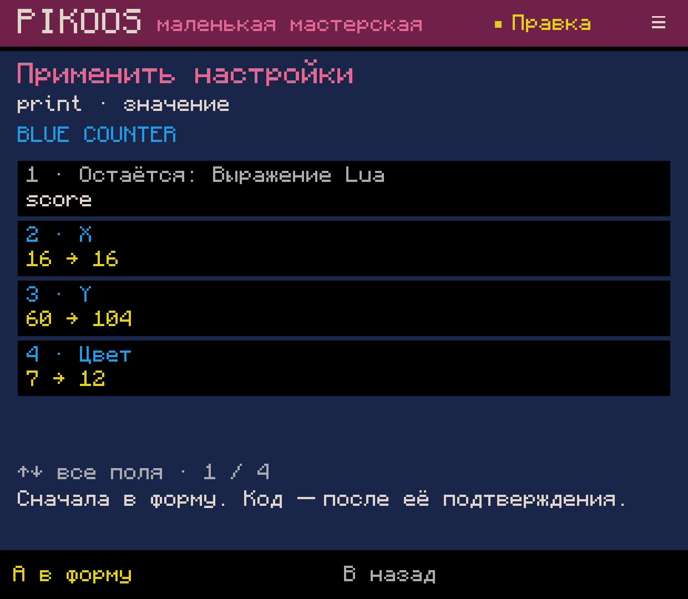
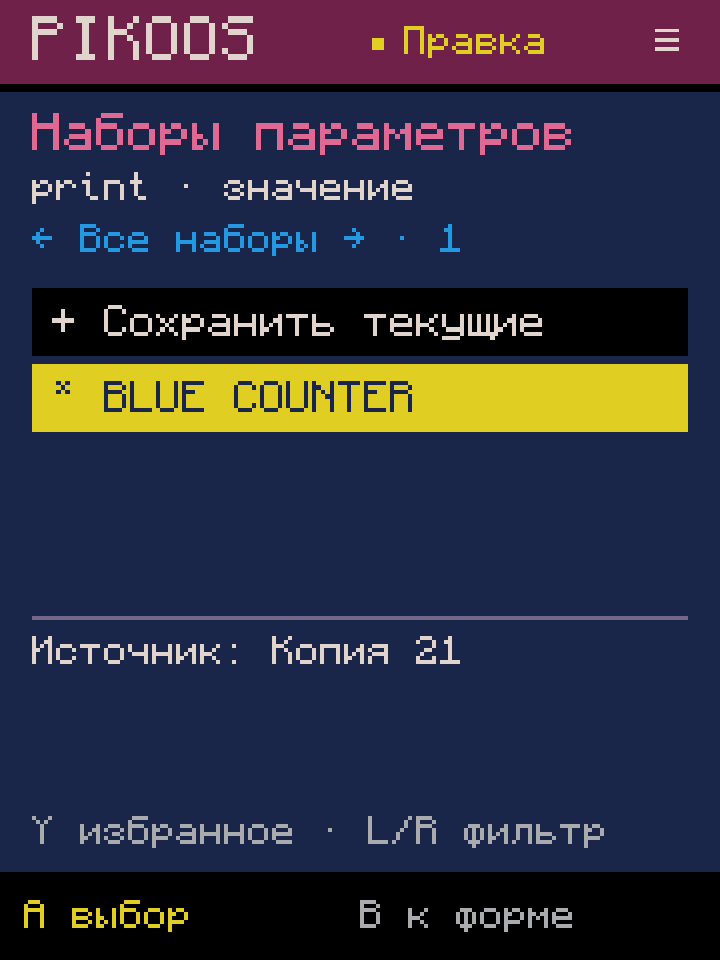
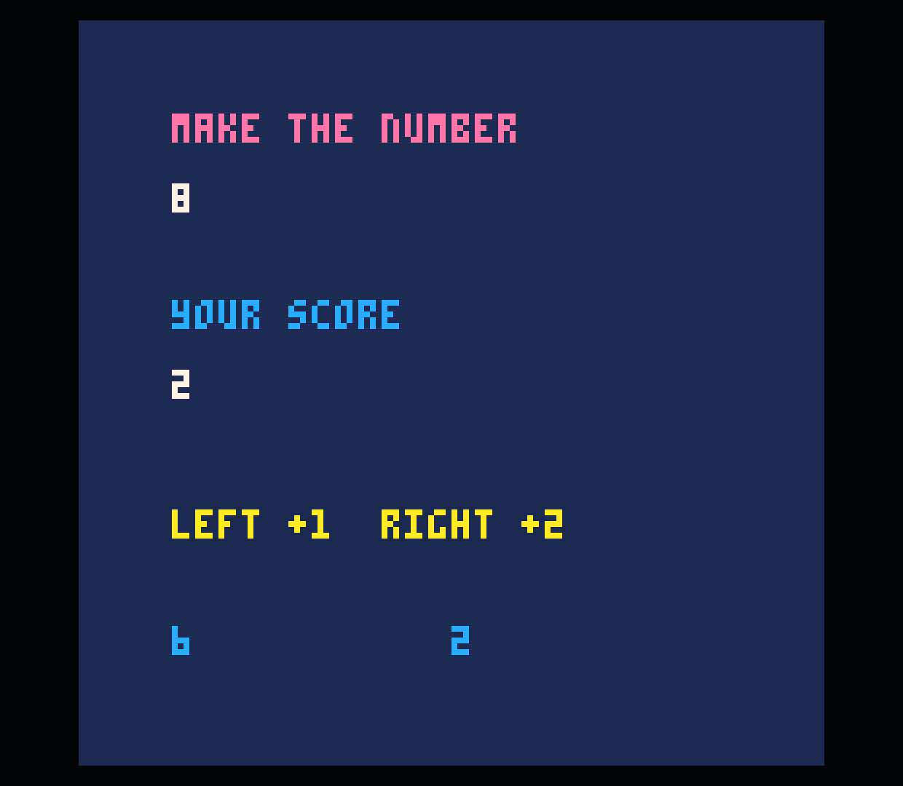

# 0.0.56 — сохраняемые наборы параметров

Первый срез B01.2, Android, 2026-10-04. Наборы доступны в общих формах Lua,
при вставке и при изменении распознанной строки. Жанр и наличие героя не проверяются.

## Путь с контроллера

Форма инструмента → **Select: наборы**. Каталог показывает наборы именно этого
инструмента; это вложенный уровень существующих категорий, без общей простыни.
**A** выбирает набор или «Сохранить текущие», **Y** переключает избранное,
**L/R или ←/→** выбирают все/избранные, **B** возвращает в форму.

Сохранение: имя через существующую русскую/латинскую экранную клавиатуру → Start →
просмотр сохраняемых полей → A. Start в просмотре ничего не записывает.
Набор получает независимый ID и подпись исходного проекта. Повтор после ошибки
записи использует тот же ID; готовый идентичный файл не дублируется.

Применение: просмотр «было → будет» → A загружает поля → обычная форма с Lua-preview
→ отдельное подтверждение изменяет черновик. Просмотр/отмена не меняют форму и Lua.
После загрузки можно скорректировать любое поле. Undo/Redo охватывает обычную
вставку/правку целиком. Адрес выбранной ветви из 0.0.55 сохраняется.

## Что переносится

Первый срез сохраняет независимые значения: десятичные числовые литералы, текст,
цвета из поддерживаемой формы, кнопки, сравнения, размеры и другие выборы формы.
Имена переменных/функций, Lua-выражения, номера спрайтов, координаты исходной области
листа/карты и флаги тайлов не переносятся. Они помечены «Остаётся»/«Не входит в набор».
Если поле назначения содержит выражение вместо литерала, оно тоже сохраняется.
Это консервативная граница PIKOOS, не ограничение PICO-8.

Набор не содержит готового кода или копии cart. Поля заполняют существующий
генератор/редактор обычного Lua. Никакой runtime-зависимости от библиотеки нет.
Ориентир: [официальный мануал PICO-8 0.2.7](https://www.lexaloffle.com/dl/docs/pico-8_manual.html#_Graphics).

`ParameterPreset` и `PresetPanel` находятся в portable core; Android использует
отдельные атомарно записываемые файлы `asset-library/parameters/<uuid>.pkpr`.
Версия, tool ID, количество/типы полей проверяются при чтении. Подписи полей
информационные: перевод интерфейса не должен инвалидировать наборы. Изменение
порядка/смысла полей потребует миграции схемы. Неизвестные/повреждённые файлы остаются
на месте с сообщением об ошибке. Форма и состояние каталога восстанавливаются
отдельно; восстановление проверяет совпадение исходных полей формы.

## Проверки

Полная сборка прошла. `ParameterPresetTest`: **47 проверок** — перенос между формами/проектами, сохранность обеих сторон
привязки, ограничения ресурсов, весь текущий каталог, повреждённые данные,
восстановление имени/предложения, отказ хранилища, избранное, отмена, существующий
вызов и вставка в выбранную ветвь. Полный журнал: [build-final.log](build-final.log).

На консоли через UI сохранён **BLUE COUNTER** из `print(target-score,16,104,12)`
копии 21. Имя пережило force-stop. Через UI создана копия 22; в её активную ветвь
добавлен новый `print(score,64,104,12)`: набор дал Y=104/цвет=12, выражение `score`
сохранилось, X после загрузки вручную изменён на 64. Отмена просмотра оставляла
исходные 16/60/7. На узком 720×960 восстановился просмотр; список и прокрутка
полей доступны с контроллера. Родное разрешение возвращено, звук остаётся 0.

Официальный пользовательский PICO-8 0.2.7 показал новый синий счётчик 0 → 2;
слева независимый остаток изменился 8 → 6. Undo/Redo вернули точные исходники.
Все **38 прежних файлов** проектов/библиотеки сохранились побайтно; добавлены
только картридж копии 22 и один файл набора. В cart добавлена ровно одна строка Lua.

Результаты запуска и побайтовой сохранности: [verification.json](verification.json),
[preservation.json](preservation.json), [исходная игра](baseline.p8), [результат](tested.p8).

ADB-события проверяют контроллерный путь; физическая эргономика и приёмка остаются
за владельцем. APK установлен локально, GitHub Release не создавался.

## Остаётся

B01.2 частичный: нет переименования/удаления/восстановления наборов, пользовательских
коллекций, избранных спрайтов и единого входа в избранное всех редакторов.
Полные зависимости механик и перенос ресурсов относятся к M01/B03.
Визуальные мастера анимации/размещения не получили наборы этим изменением.
Файлы пока app-private; выбранная пользователем папка данных и резервное копирование
остаются P02. Следующий срез — избранные ресурсы в каталоге спрайтов, затем
незакрытые общие инструменты M2/M3 согласно BACKLOG.
