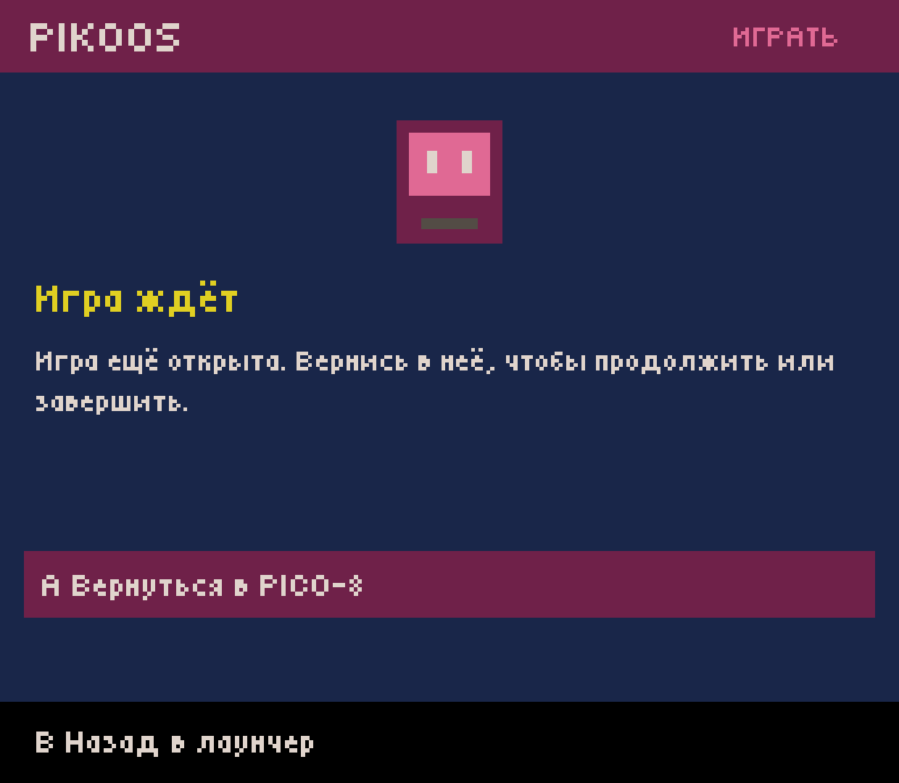
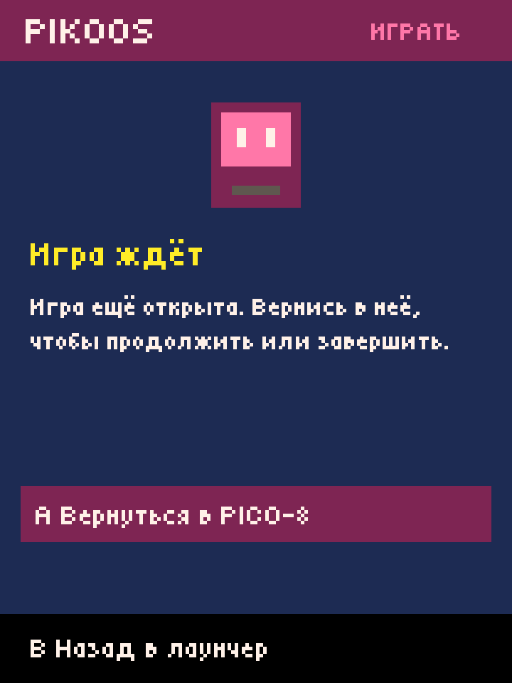
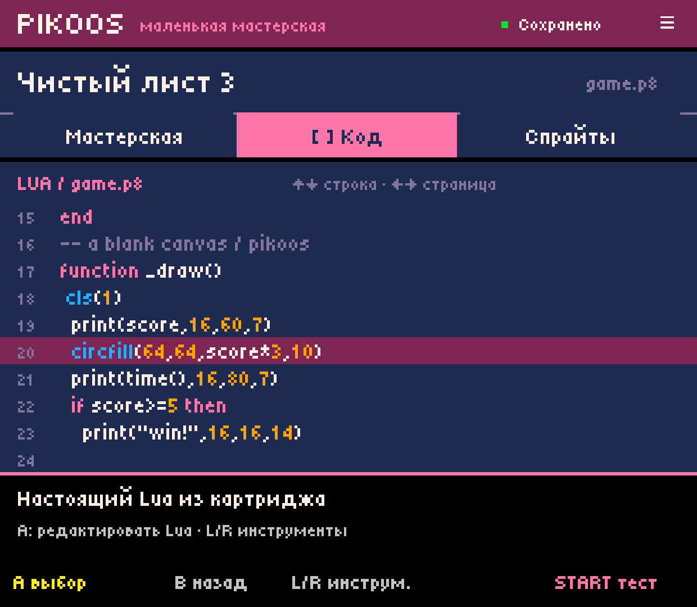
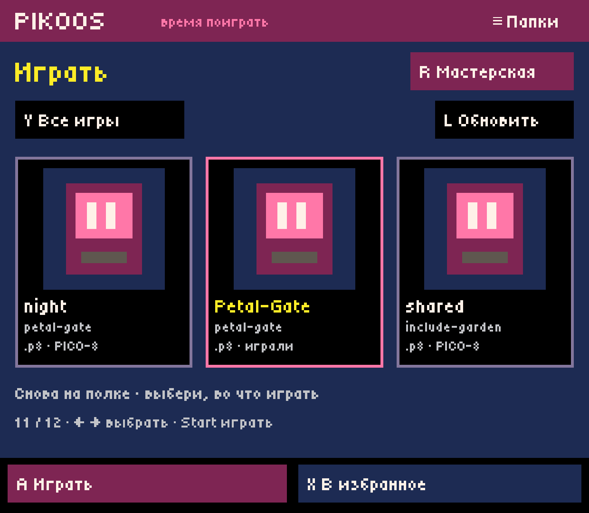
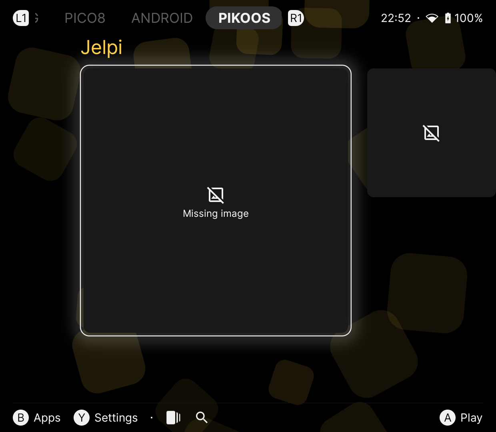
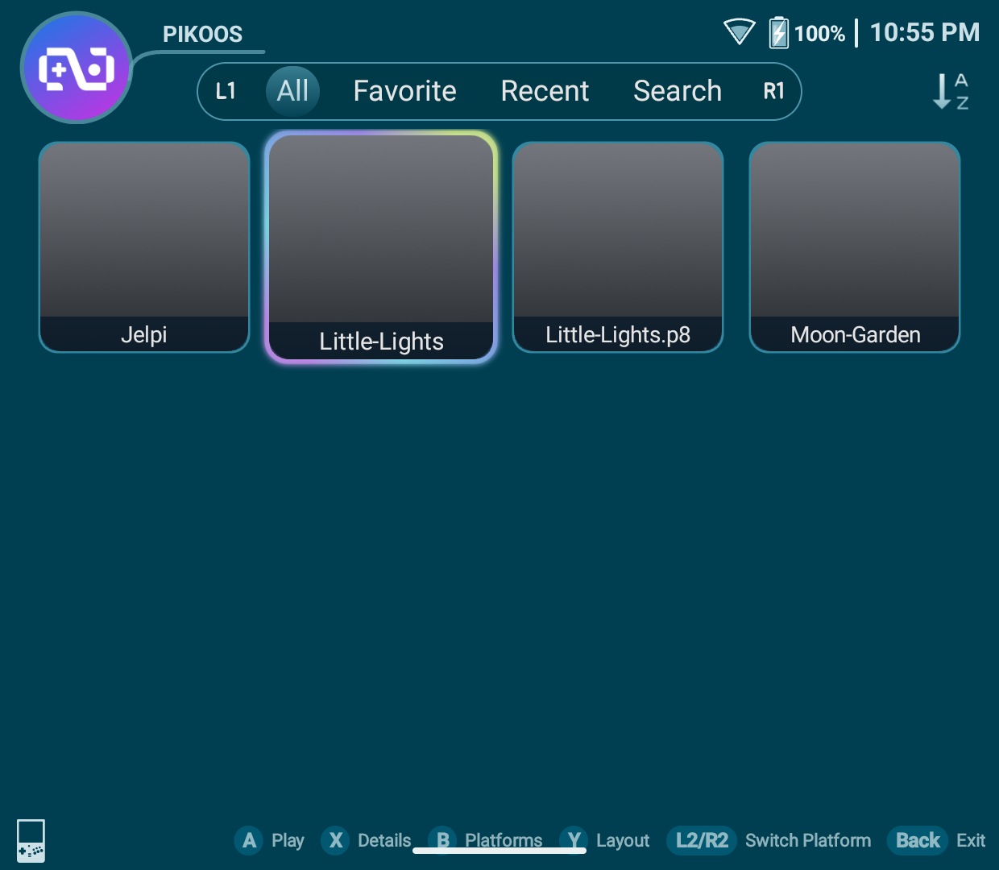

# Возврат после Home и продолжение живой игры — 0.0.38

2026-10-03. Host 0.0.38 / Runtime Test `1.6.6-pikoos.7`, база `f2c9fdd`.
Локальные debug APK установлены поверх данных на Retroid Pocket Classic / Android 14.
GitHub APK release/prerelease не выпускался. Это ограниченный R03.2, не полная
приёмка runtime recovery или авторского цикла.

## Что исправлено

В 0.0.37 после Test → Home → прямого resume wrapper → выхода Android мог показать
последний лаунчер вместо мастерской. Само посещение MainActivity также очищало
ожидание игры, хотя процесс PICO-8 ещё работал.

Теперь сеанс имеет отдельное наблюдаемое состояние и адрес возврата. Посещение
PikoNest при живой игре открывает «Игра ждёт». A/Start продолжает её, B возвращает
в лаунчер; A/B учитывают настройку мастерской. Пока этот экран открыт, новый
картридж не отправляется. Неизвестное состояние и ещё не подтверждённый запуск
имеют отдельные сообщения. Одновременное редактирование при живом runtime в этом
срезе не поддерживается.

После обычного завершения PICO-8 открывается исходная мастерская/Play либо
исходный внешний лаунчер, даже если порядок Android-задач изменился.

## Реализация

- Переносимый `RuntimeSession` разбирает ограниченную запись и различает UNKNOWN,
  PREPARING, RUNNING, EXITED и INTERRUPTED. Старый/чужой token не подтверждает выход.
- До передачи картриджа host создаёт UUID, сохраняет его и вызывает защищённый
  общей подписью provider. `beginSession` отказывает при занятом/неясном сеансе.
  Ошибка dispatch отменяет только собственную ещё не запущенную запись.
- Подготовка хранит PID/start-time wrapper; после запуска pinned Godot monitor
  записывает PID/start-time запущенного процесса. Записи RUNNING/EXITED заменяются
  атомарно. Повторное использование PID не оживляет старый сеанс; неизвестная
  ошибка чтения procfs не выдаётся за подтверждённый выход.
- При нормальном выходе monitor сначала пишет EXITED, затем вызывает Java hook
  через `JavaClassWrapper`, и только после этого закрывает Godot. Обычных Android
  pause/destroy callbacks оказалось недостаточно: Godot может завершиться раньше.
- На UI-потоке hook отправляет неизменяемый одноразовый PendingIntent host только
  при совпавшем token/EXITED и resumed Activity. Переход не производится из фона.
  Ожидание UI-потока ограничено одной секундой; принудительного убийства процессов нет.
- MainActivity сохраняет исходный проект/полку; LaunchActivity отдельно хранит
  исходный `android-app` referrer и открывает launcher entry этого пакета. Referrer
  используется только для навигации, не для доверия файлам или аутентификации.
  Для отсутствующего/unlaunchable caller остаётся обычный Android task fallback.
- Host 0.0.38 требует Runtime Test 7 для обычного запуска; старой версии показывает
  просьбу обновить адаптер. Проприетарные бинарники и изменения `.p8` не добавлены.

Первичные API: [Godot Android Java bridge](https://docs.godotengine.org/en/4.5/tutorials/platform/android/javaclasswrapper_and_androidruntimeplugin.html),
[Android Activity/referrer](https://developer.android.com/reference/android/app/Activity#getReferrer()).
Это небольшой мост адаптера запуска, не новый API для кода игры.

## Проверки

Проверки выполнены через ADB: кнопки, наблюдаемые touch-действия, снимки,
журналы и идентичность процессов. Физическую эргономику владелец в этом срезе
не проверял. Скорые последовательности ввода во время переходов Android иногда
не попадали в ожидаемое окно; итоговые выходы проверены по видимому меню/выбору,
экрану назначения и отсутствию `pico8_64`, а не только по отправке клавиш.

| Путь | Подтверждённое наблюдение |
| --- | --- |
| Play → Petal-Gate → Home → MAIN resume wrapper → выход | Вернулась полка PikoNest с Petal-Gate; ошибка 0.0.37 не повторилась |
| Посетить host во время игры → A/Start | Показан экран продолжения, журнал ожидания не очищен, тот же PID игры, второго запуска нет |
| Test → Home → host → продолжить → выход | Счёт 1 сохранён; вернулся код проекта `blank-0003`, строка 20 |
| Beacon → Jelpi → Home/другой лаунчер → resume → выход | Вернулся Beacon с выбранным Jelpi, внешний журнал очищен после EXITED |
| Retroid Launcher → Little-Lights → Home/Recents → продолжить | Живой сеанс сохранён; позднее выход вернул Retroid с Little-Lights |
| Потеря процесса host при внешней игре | Host 10622 завершён отдельно, runtime 11317 оставлен живым; новый host 11531 показал продолжение; PID игры тот же; выход вернул исходный Retroid Launcher |
| Потеря процесса host при Test | Host 11531 завершён отдельно, runtime 11843 оставлен живым; новый host 11889 восстановил продолжение; выход вернул проект и строку 20 |
| Отдельный force-stop host при Jelpi | Runtime 12783 продолжил работу; после явного выхода callback на этом Android 14 всё же доставился, вернув Beacon и очистив журнал. Это не доказательство восстановления при отменённом PendingIntent |
| Компактный экран | Продолжение и обе кнопки помещаются в 720×960; физический размер затем восстановлен |

В двух проверках потери процесса host он завершался адресно под своим UID после ухода в фон, без force-stop,
очистки данных или остановки runtime. Это проверка потери host, не симуляция всех
вариантов Android low-memory kill. На runtime процессах принудительный выход не применялся.

Полная host-сборка и прежние core-проверки прошли. Новые **16** проверок проверяют
состояния сеанса, несовпадающий token, неизвестные/повреждённые записи, смерть или
смену PID и отсутствие ложного успешного результата. Runtime APK прошёл проверку
всех **262** sparse resource entries. Финальные APK установлены; после уточнения
текста экрана продолжения повторён Play → Home → host → continue → exit. После
финальной защиты от оставшегося журнала завершённой игры повторён запуск из Beacon
и отдельная проверка force-stop host выше. Недоставленный callback на устройстве
не воспроизведён; ветка сверки старого журнала с EXITED остаётся без такого fault-теста.

Все **22 файла** проектов/библиотеки совпали побайтно с backup до работы. Настройки
папок не менялись. Экран возвращён к 1080×1240, media остаётся muted. Проверка
provider из shell через `content call` не выполнена: эта команда отсутствует в ROM;
явный signature permission guard присутствует в коде и manifest.

## Снимки

## Что остаётся открытым

Общий сбой/force-stop самого runtime, зависание PREPARING, восстановление после
перезагрузки, исчезнувший caller, другие Android/API/устройства и физическая
UX-приёмка не закрыты. INTERRUPTED означает потерю наблюдаемого процесса, а не
успешную игру или проверку всей возможной осиротевшей process tree. R03/Q02 остаются
частичными. Следующий авторский срез — сквозная ACC-01.

## Локальные артефакты

| Файл в `.local/artifacts/` | Байты | SHA-256 |
| --- | ---: | --- |
| `pikoos-runtime-lab.apk` | 226076 | `5bfaba37236209282f0acca761b5385cee2a306a2e4bd07097258575462a77f7` |
| `pikoos-runtime-test.apk` | 50856084 | `ac28cf82fc1115221e5c66c86b0e7384f9fb9c4f03be7e79f92aa681a68e0dd0` |
