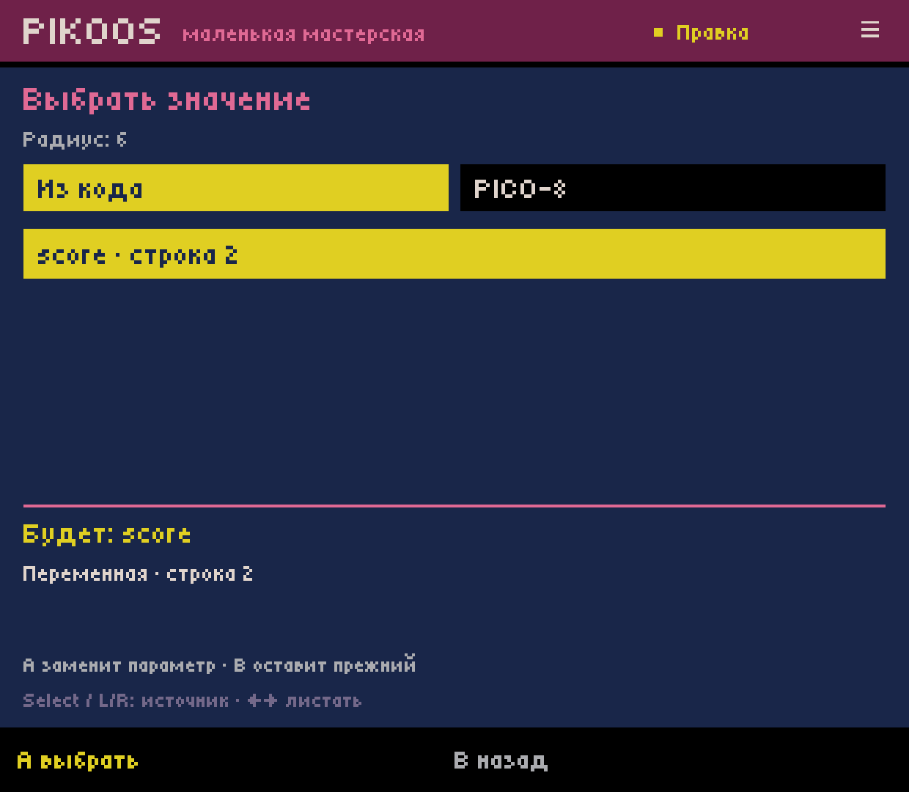
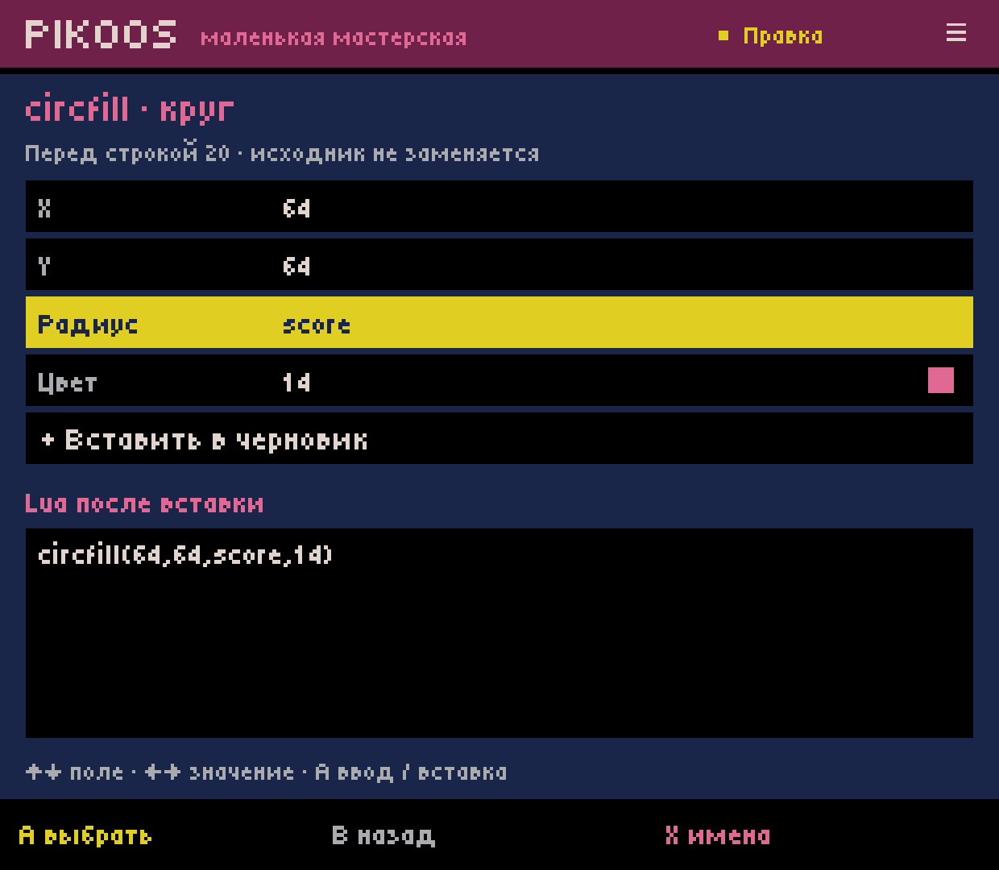
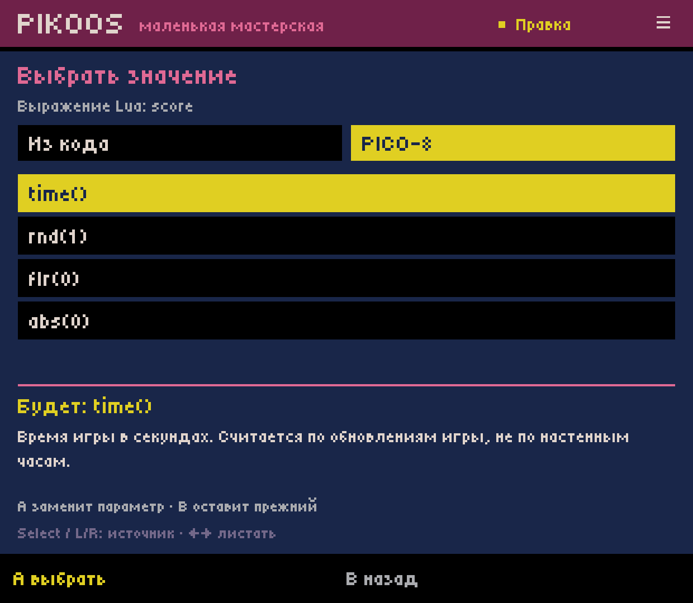
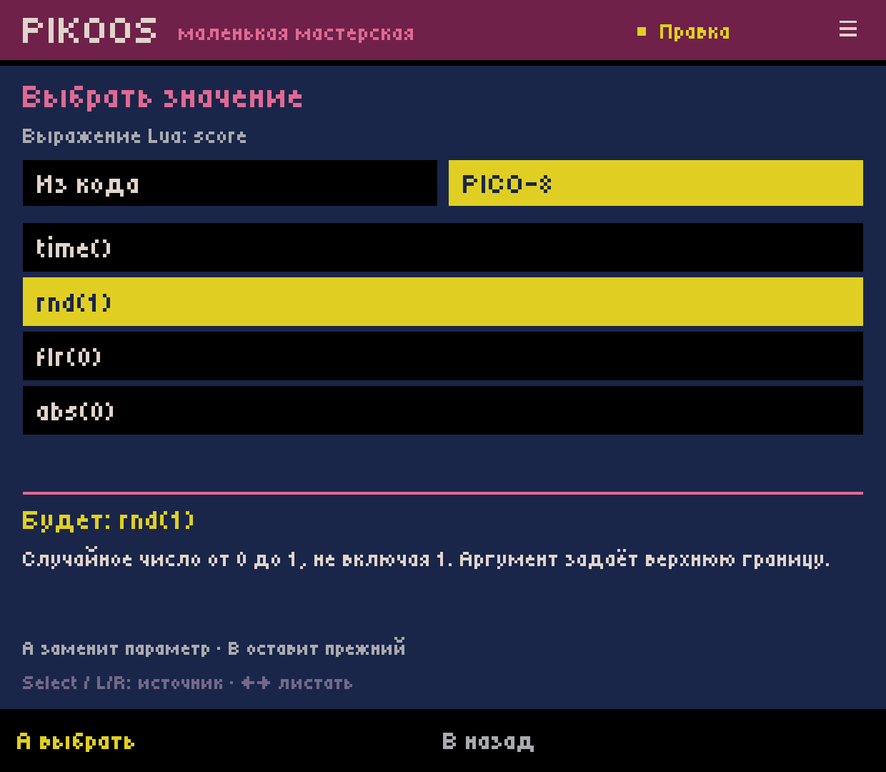
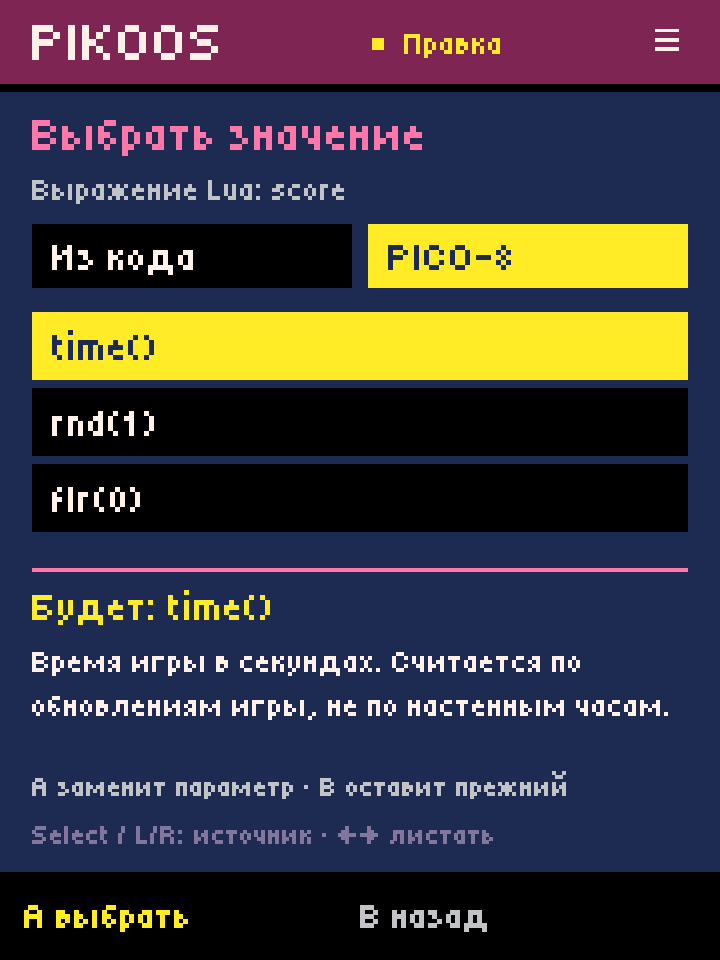
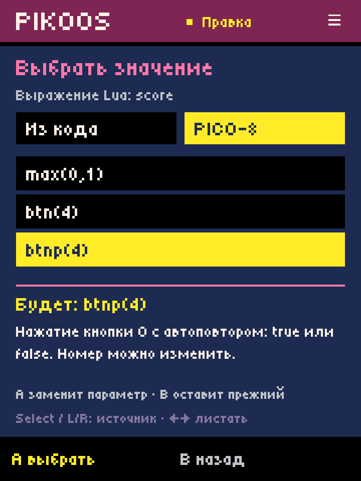
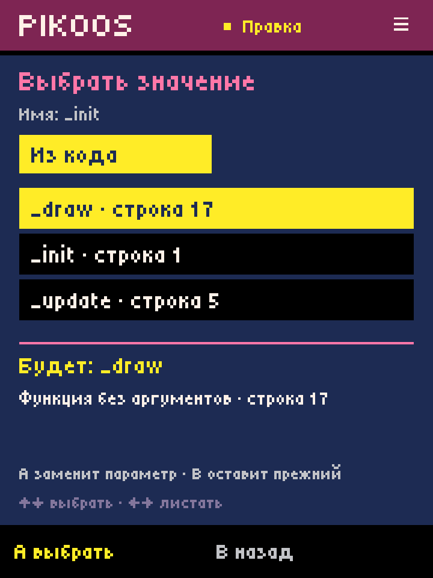
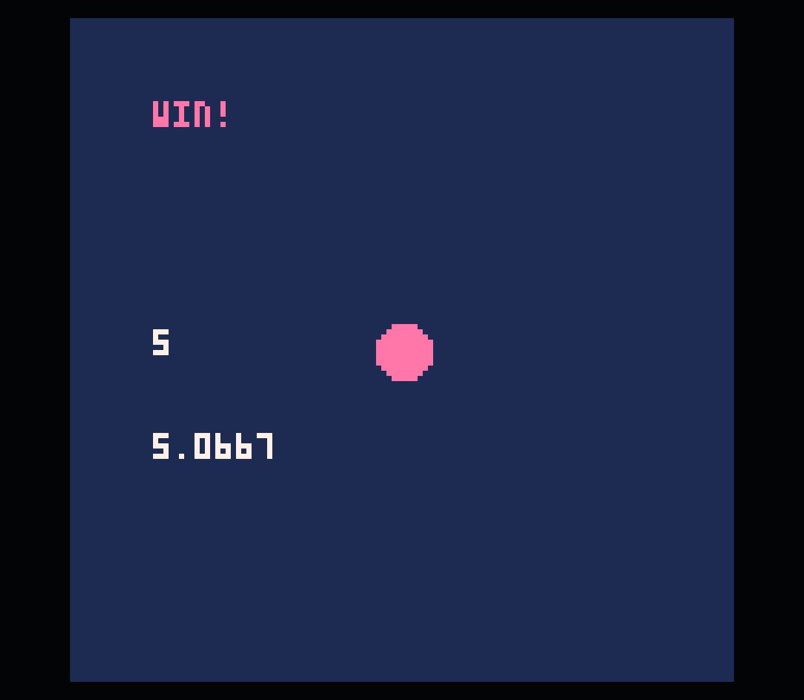
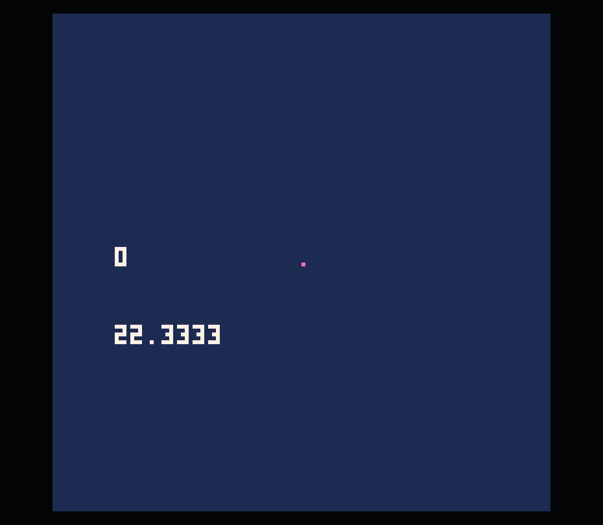

# Name and API choices — Android lab 0.0.33

2026-10-03. C03.1 extends [parameterized insertion](../android-insert-32/README.md).
This is a bounded authoring slice, not complete code completion or M1 acceptance.
No GitHub APK release/prerelease was created.

## User path

Code → A edit → X insert → select a construct → select an expression/name field
→ **X имена**. The list shows shared names from the current unsaved Lua with their
source line. Expression fields also offer a PICO-8 tab containing eight calls:
`time()`, `rnd(1)`, `flr(0)`, `abs(0)`, `min(0,1)`, `max(0,1)`, `btn(4)`, `btnp(4)`.
These are editable sample expressions, not hidden components or runtime bindings.

- Up/down selects; left/right pages six entries. Select or L/R switches source.
- A replaces the proposed parameter and returns to the full Lua preview.
- B cancels the choice and keeps the previous parameter. Start neither saves nor
  launches from the list. Source changes only on explicit insertion into the draft.
- Assignment/increment name fields show variables; the no-argument call field
  shows literal no-argument functions. New function/counter names and literal
  strings retain manual entry rather than suggesting conflicting declarations.
- The list is controller/touch accessible; typing a prefix is not required.

## Conservative indexing contract

Portable `LuaSymbols` uses the current `LuaDraft`, including unsaved changes.
Strings/comments are masked, string values retain a token boundary, constructor
keys and member assignments are excluded. It recognizes simple assignments and
simple named/assigned no-argument functions. Names used by a local declaration,
function parameter, implicit method `self`, or loop variable anywhere in the draft
are excluded globally. This intentionally omits some valid globals when shadowing
exists; it does not imply that a local is available outside its scope.

This is not scope/type/control-flow analysis. Initialization order, conditional
definitions, dynamic `_G` writes, metatables, aliases and includes are not resolved.
No other file is indexed. Simple declarations/assignments that collide with an API
name hide that built-in suggestion. Qualified names, functions with parameters,
ambiguous function assignments and P8SCII identifiers are not offered in this slice.
Valid unsupported source is preserved; absence from the list is not incompatibility.

The index is bounded to 100,000 lexical items and 256 items per function signature
as editor guards, not PICO-8 limits. An incomplete/oversized signature or index
shows an empty fallback state while literal editing remains available. This is
not a syntax diagnosis. Recovery format 3 saves group/selection and reconstructs
choices from the recovered source; formats 1 and 2 remain readable.

## Checks and installed device

Full `experiments/android-host/build.ps1` passed, including **46 new symbol/workflow
checks**, 157 insertion checks, 119 literal-editor checks and existing suites.
Coverage includes string/comment masking, declaration line numbers across LF/CRLF/CR,
local/parameter/loop collisions, table members, API collisions, bounded malformed
input, filter kinds, modal input/Start guards, cancellation, proposal recovery,
format-2 migration, one-step undo, failed save/retry and untouched other sections.

Installed on Retroid Pocket Classic, Android 14, versionCode **33 / 0.0.33**,
with existing Runtime Test 4. Final local APK SHA256:
`594f23f4cbd32d664a12d72c80ae61cd7debbf44258bf4d2e6a71dc41c4f82fc`.
Pre-update project/library/preferences backup: `.local/code-33/before-projects.tar`
(local only). Media remained muted with stream volume 0.

Device authoring used controller-style ADB events in the host, without editing
the source through shell or injecting a cartridge:

1. Opened the previously UI-authored score game. Inserted `circfill` before its
   goal condition; selected `score` from the name list for its radius.
2. Prepared a value-print insertion and opened the PICO-8 choices. Highlighted
   `rnd(1)`, then Home → force-stop → relaunch → Workshop restored the unsaved
   circle insertion, current API tab, highlighted entry and unchanged field value.
3. Selected `time()`, changed Y to 80 with arrows, applied, undid/redid the whole
   insertion, then explicitly saved/Tested. The read-back [cart](score-game.p8)
   contains ordinary `circfill(64,64,score,14)` and `print(time(),16,80,7)`.
4. Official PICO-8 0.2.7 showed changing elapsed time. Five held keyboard Z events
   through ADB increased score/radius and displayed the goal; keyboard X reset
   score/radius. `time()` continues after this custom `_init()` call, as intended:
   this sample's reset resets score, not runtime elapsed time. Returned with Ctrl+Q.
5. Checked native 1240×1080 and simulated 720×960 (logical 360×480) lists, descriptions,
   tab switching, paging to the final API entry, function-only list and cancellation.
   Restored physical size 1080×1240. No game changes from these cancelled proposals.

The final build additionally tightens malformed-signature bounds, multiple-assignment
classification and declaration-line consistency. Runtime screenshots exercise the
same emitted game code; the other seven API expressions were model/catalogue checked,
not all runtime-tested this turn. Physical controller ergonomics and controller-only
runtime exit still require separate R03/Q02 acceptance; ADB is not that proof.

API behavior and local-variable semantics were checked against the official
[PICO-8 0.2.7 manual](https://www.lexaloffle.com/dl/docs/pico-8_manual.html).
The short Russian explanations are our own. C03/H01 remain partial; there is no
standalone API reference, full local-scope resolver or inline completion yet.

Next: C02.2, safely reopen supported existing calls as parameter forms; then
navigation/diagnostics C03/C06 and controller-only return R03/Q02 toward ACC-01.
