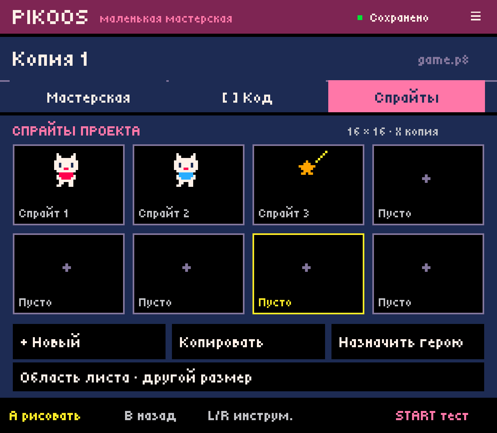

# Названия ресурсов — Android 0.0.8

Небольшая правка существующего редактора по требованию владельца: «Спрайт»,
«Спрайты проекта», «Новый спрайт героя», «Весь спрайт» в навигации, подсказках
и сообщениях. Действия «рисовать», «кисть» и «линия» сохраняют свои названия.
Произвольное выделение по-прежнему называется «Область листа».

Это настоящий снимок Android-приложения на Retroid Pocket Classic, 1240×1080.
APK 0.0.8 (versionCode 8) установлен поверх 0.0.7 через `adb install -r`.
SHA-256 APK: `c3ead4decf0d3af699e1b10cd4dad67406be1b3e3dc2890e9432348c5a3a6a63`.

Проверка: штатная сборка со всеми существующими core-тестами прошла; переход
на вкладку спрайтов и лист выполнен инъекцией R1/D-pad/Confirm. Это проверка
маршрутизации кнопок и отображения, не новая проверка физической эргономики.
SHA-256 всех трёх канонических картриджей до и после обновления совпали:

- `moon-garden`: `e9c5161d8c52d9dc3648ff018c336ca0a85a219c369a375958e9f0ab7682f59b`;
- `garden-0001`: `df4bf0636f39d1621983eb4561056b7a12547a07d4c3c95aad950b343a920d8c`;
- `remix-0001`: `e0ea70bce657dd98155be51d32dd2beafb9922a562457e3bfa686371b8c9c64d`.

Игровая логика и формат сохранения не изменялись; повторный запуск официального
runtime в этой проверке не выполнялся. [Общая библиотека ресурсов](../../ASSET_LIBRARY.md)
и [мастер первого запуска](../../FIRST_RUN_SETUP.md) пока описаны требованиями,
а этот экран показывает прежние восемь быстрых участков листа одного проекта.
