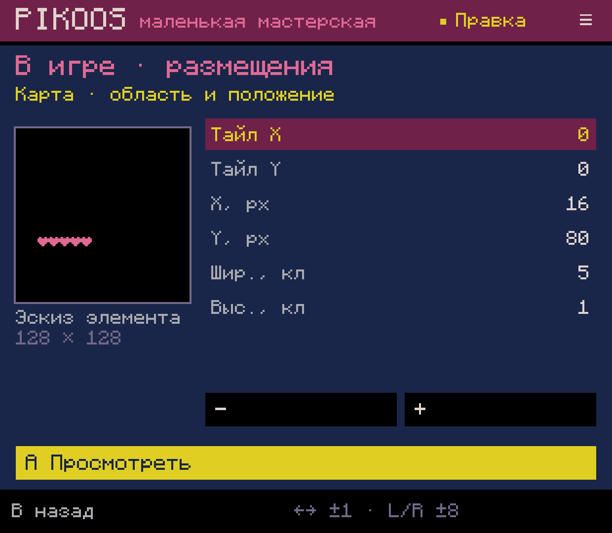
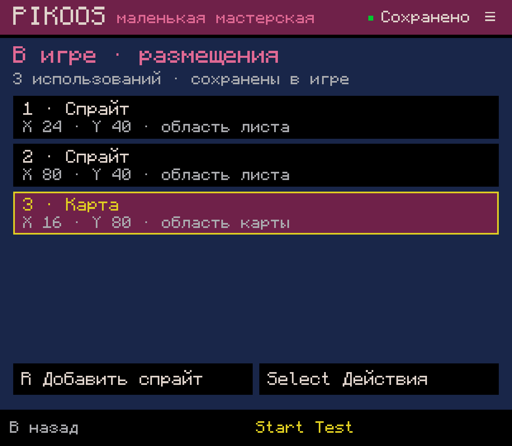
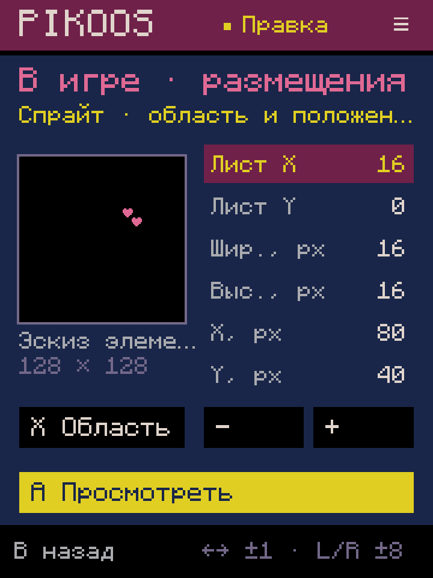
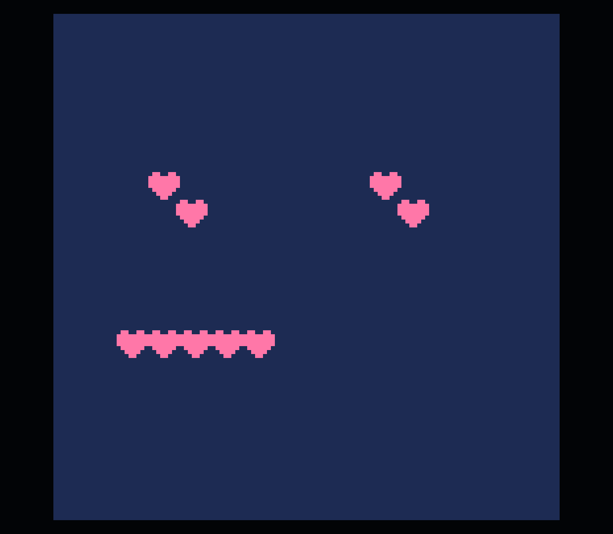

# 0.0.62 — от ресурса к размещению в игре

2026-10-04, пакет G04.2 поверх `2c8c358`. Это общий путь из редакторов спрайтов
и карты, без игрового шаблона, обязательного героя и открытия Lua.

## Путь пользователя

- Select в мастерской → **Размещения в игре**: список известных использований.
- В спрайтах/карте Select → **Использовать спрайт/карту в игре** начинает форму
  выбранного ресурса. В пустом списке A тоже начинает создание.
- В списке ↑↓ выбирают элемент; A открывает его форму. R добавляет ресурс текущего
  редактора, Select предлагает спрайт, карту, дублирование, удаление и необязательный Lua.
- В форме ↑↓ выбирают поле, ←→ меняют значение на 1, L/R — на 8. X у спрайта
  открывает выбор области листа. Touch-кнопки дублируют основные действия.
- A показывает ресурс, положение и понятное описание операции; повторное A
  сохраняет. B возвращает в форму/список без записи. Исходник читать не требуется.
- Удаляется использование, а не пиксели/тайлы. Y/R2 в списке отменяют/повторяют
  одну сохранённую операцию. Start запускает сохранённый cart, выход возвращает
  к выбранному использованию.

Числовые значения отделены от подписей: на компактном экране размеры не обрезаются.
Эскиз показывает только выбранный элемент на поле 128×128, не выполняет игру
и не заменяет официальный runtime.

## Что реализовано и где граница

`GameUses` — переносимая модель известных прямых `spr` (3 аргумента), `sspr`
(6 аргументов) и `map` (6 аргументов), с целыми параметрами и явной исходной позицией.
Формы существующих вызовов переиспользуют `LuaCall`; сохранение проходит через
`CartEdit` и порт `WorkshopSession`, до публикации состояния и истории.

Поддержан один простой глобальный `function _draw()` с плоскими распознанными
вызовами и комментариями. Вставка идёт после существующих элементов перед `end`;
если callback отсутствует и контекст однозначен, создаётся обычный `_draw` с `cls(1)`.
Порядок остальных строк, комментарии, форматирование и другие секции сохраняются.

Вложенные блоки, короткий синтаксис callback, динамические выражения, переопределённые
API, неоднозначные определения, ненулевая камера и неизвестные команды отрисовки
дают явное ограничение **всего списка**, без попытки восстановить сцену наугад.
Нормальное положение/сброс камеры с нулевыми аргументами допустимы. Расширенная
поддержка камеры, анимаций, мировых координат, слоёв и порядка ещё нужна.
Это ограничения формы PikoNest, не ограничения обычного PICO-8.

Восстановление сохраняет исходные байты cart, список/выбор, параметры, фазу
подтверждения и вложенный выбор области. Изменившийся исходник и повреждённый
журнал отклоняются; ошибка записи оставляет форму для повтора. Undo-история пока
только в памяти. Холодный запуск и смена размера экрана возвращают на Play;
после входа в мастерскую прежняя форма восстанавливается. Прямое восстановление
экрана при Android configuration change остаётся UX-долгом Q02.

Официальные SPR/SSPR/MAP и callback-семантика сверены с локальным руководством
0.2.7; [мануал издателя](https://www.lexaloffle.com/dl/docs/pico-8_manual.html).
Новых секций, runtime API или обязательных metadata у игры нет.

## Проверки

- **92 новых проверки ядра**: создание/копия/редактура/удаление, только выбранные
  аргументы, LF/CRLF/CR, сохранность прочих секций, отказ небезопасного контекста,
  устаревший источник, ошибки записи, Undo/Redo и восстановление.
- Полная штатная сборка и существующий набор тестов прошли. Повторная сборка
  потребовалась после найденного на compact обрезания значений; промежуточных
  установок на каждую операцию не было.
- На Retroid Pocket Classic через события контроллера ADB создан **blank-0008**:
  собственные пиксели, два размещения, карта из пяти тайлов, отдельная правка второго
  использования, удаление/Undo/Redo, восстановление предложения после force-stop,
  native 1240×1080 и compact 720×960, Test/выход. Lua-редактор не открывался,
  файлы проекта не подменялись разработчиком. Это статическая сцена, не законченная игра.
- Официальный PICO-8 0.2.7 / Runtime Test 8: **16 384/16 384** центров пикселей кадра
  совпали с ресурсами и размещениями сохранённого cart. Вверху два использования
  области с двумя сердцами; внизу пять тайлов карты.
- Все **44** прежних файла проектов и библиотеки остались побайтно прежними;
  добавился только новый blank. Громкость не менялась, native-размер восстановлен.

[Машиночитаемая проверка и SHA-256](verification.json),
[созданный через UI обычный картридж](final.p8).
Физическая эргономика контроллера и приёмка владельца остаются открытыми.
Пакет не закрывает G04/M2 или создание всей игры без Lua (C02.4).

Далее — базовые операции с областями карты и согласованная gfx/map-память G01/G03,
затем управление анимацией/камерой; каталог шаблонов не расширяется вместо этих работ.
