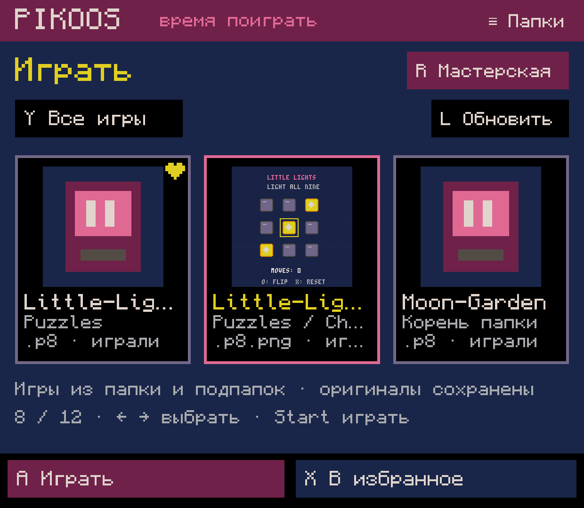
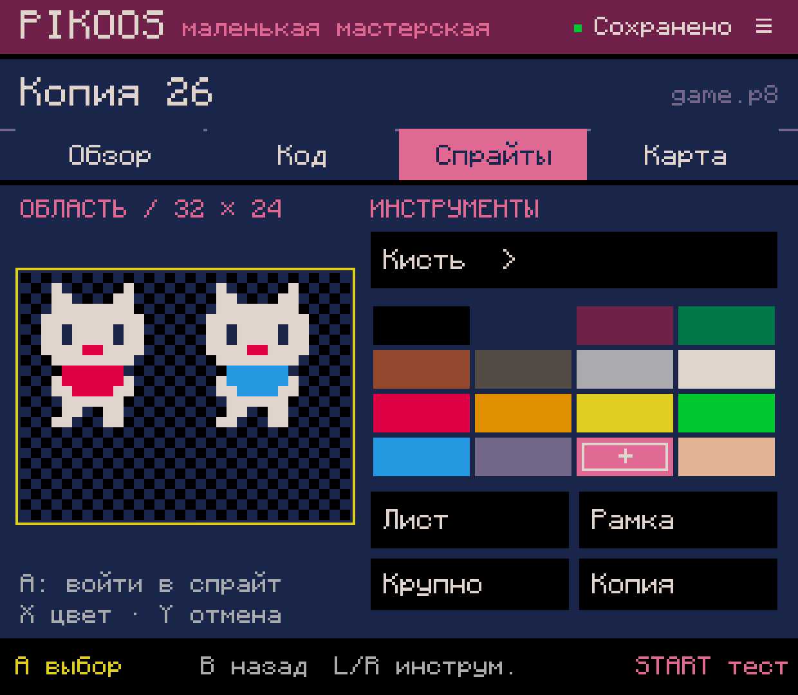
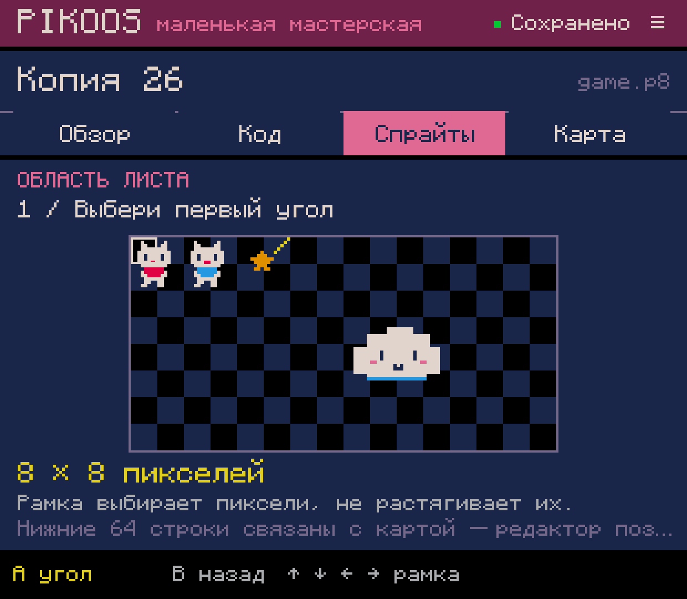
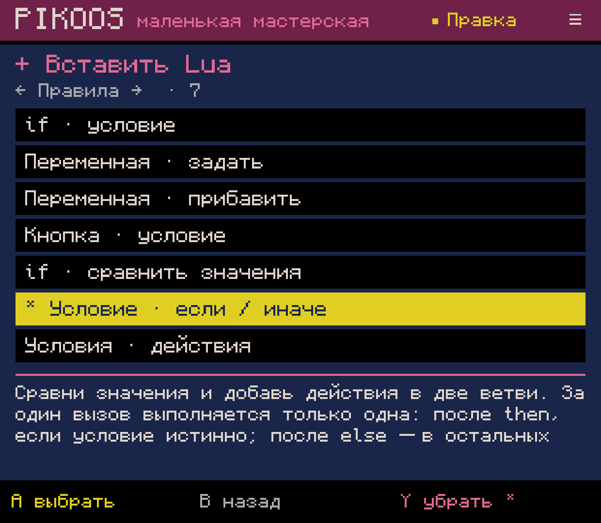
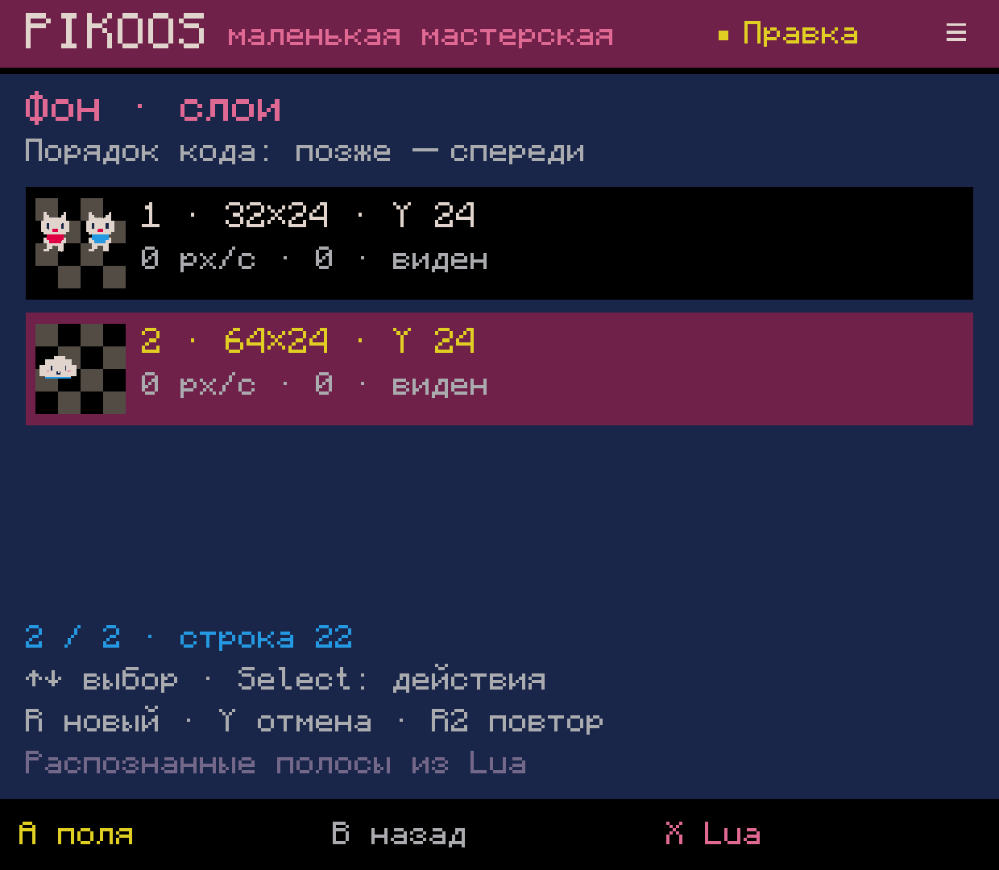
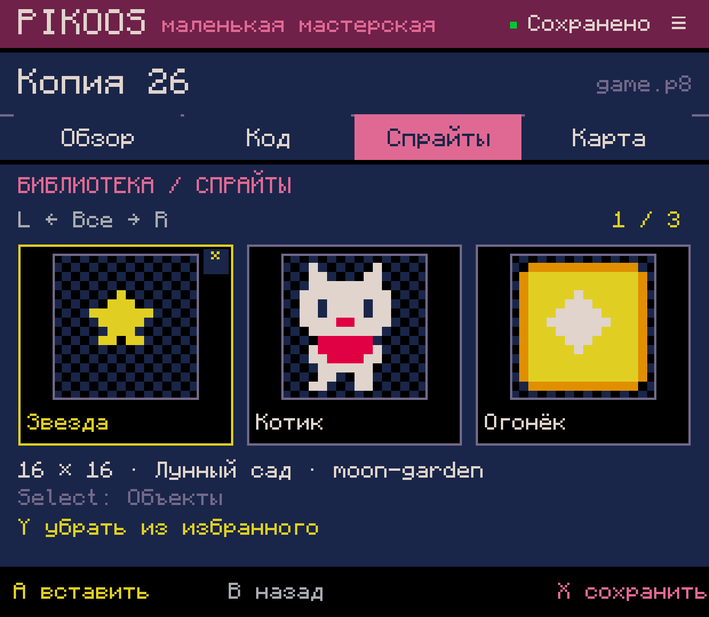

# PikoNest — свежие скриншоты 0.0.61

Снято **4 октября 2026** на **Retroid Pocket Classic**, установленная Android lab
**0.0.61**, код `0ca31f4`. Семь оригинальных PNG **1240×1080** прямо с устройства:
без ретуши, дорисовки интерфейса, обрезки или масштабирования.

Проект теперь называется **PikoNest**. На оригинальных кадрах версии 0.0.61
ещё видно прежнее имя **PIKOOS**; изображения после переименования не изменялись.

Для первого впечатления лучше всего подойдут **02, 06 и 07**: спрайты,
переиспользование ресурсов и игра. 01 показывает отдельный вход «просто поиграть»,
04–05 — инструменты создания. Полные изображения открываются по ссылкам.

| Скриншот | Что показывает / подпись для описания |
| --- | --- |
| [01 · Игровая библиотека](01-play-library.png) | **Выбирай картридж и играй.** Отдельная полка готовых игр, обложки, избранное и переход в мастерскую. Обложка из картриджа показана там, где она есть; для остальных — стандартная заглушка. |
| [02 · Редактор спрайтов](02-sprite-editor.png) | **Маленькие пиксели, свои персонажи.** Выбранная область листа 32×24 с двумя котами, палитра PICO-8 и инструменты редактирования. |
| [03 · Спрайт-лист](03-sprite-sheet.png) | **Выбирай нужную область.** Лист с котами, звездой и облаком; рамка выбирает пиксели ресурса. |
| [04 · Каталог инструментов](04-tool-catalogue.png) | **Собирай правила и знакомься с Lua по ходу работы.** Категория «Правила», избранный инструмент «если / иначе» и пояснение обычной конструкции Lua. |
| [05 · Фоновые слои](05-background-layers.png) | **Настраивай фон с контроллера.** Миниатюры полос, положение, скорость, параллакс и видимость; доступны создание, копия, порядок, удаление и отмена. |
| [06 · Библиотека ресурсов](06-asset-library.png) | **Сохраняй находки для следующих игр.** Спрайты «Звезда», «Котик» и «Огонёк», категория, источник и избранное. |
| [07 · Игра в официальном PICO-8](07-game-runtime.png) | **От мастерской — к игре.** Демонстрационный Moon Garden, запущенный через PikoNest в пользовательском официальном PICO-8. |

## Галерея

## Контекст для текста о проекте

PikoNest — разрабатываемая мастерская PICO-8 для Android-портативок с физическими
кнопками: играть, создавать, редактировать и переиспользовать ресурсы.
Пиксельная стилистика и управление с контроллера — часть основного замысла.
Проекты сохраняют обычный формат `.p8`; официальный runtime импортирует пользователь
из своей покупки, приложение не включает проприетарные бинарники PICO-8.

Это снимки работающей экспериментальной версии, а не объявление готового релиза.
Показанная библиотека ресурсов пока охватывает спрайты и наборы параметров;
полный звуковой редактор, весь цикл разработки и самостоятельная установка среды
ещё в работе. Фоновые слои на этих кадрах — горизонтальные полосы спрайт-листа.
Кадр 07 показывает выполнение демонстрационной игры, а не интерфейс редактора
или доказательство, что весь её код создан текущими визуальными инструментами.

Съёмка не меняла код приложения и сохранённые проекты/ресурсы; новой сборки не было.
Технические метаданные и контрольные суммы: [capture.json](capture.json).
