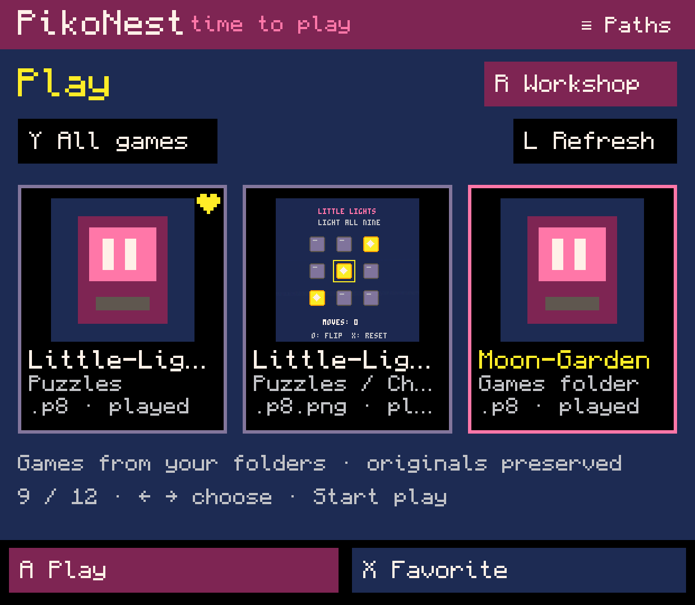

# PikoNest — English website screenshots

Nine fresh screenshots captured on **Retroid Pocket Classic**, **4 October 2026**.
Original PNG files, **1240 × 1080**. Suggested lead images: **02, 08 and 09**.

These are real screens from a working **0.0.65 development build**, with English
presentation labels and the current PikoNest name. Labels were translated in an
isolated capture build before rendering. The PNGs have no painted-over text,
retouching, cropping or resizing. The regular app's complete localization and
language selector are still planned; this pack does not announce an English release.

## Images and ready-to-use captions

| Image | Suggested caption | Alt text |
| --- | --- | --- |
| [01 · Play library](01-play-library.png) | **Pick a cartridge. Start playing.** | PikoNest's Play library with cartridge covers, favorites and a separate Workshop entrance. |
| [02 · Sprite editor](02-sprite-editor.png) | **Small pixels. Big personality.** | Two cat sprites in a 32 by 24 pixel region, alongside the PICO-8 palette and drawing tools. |
| [03 · Sprite sheet](03-sheet-region.png) | **Choose the pixels you need.** | A rectangular sprite-sheet selection containing two cats; a star and a smiling cloud occupy other regions. |
| [04 · Map editor](04-map-editor.png) | **Build a world, one tile at a time.** | A tile grid containing grass, flowers and a path, with tile selection and editing controls. |
| [05 · Animation editor](05-animation-editor.png) | **Bring your sprites to life.** | An animation with two heart frames, frame duration, ordering and playback controls. |
| [06 · Camera preview](06-camera-preview.png) | **Frame your world. Keep the interface in place.** | A camera preview showing sprite and map placements, a world offset and the number of affected placements. |
| [07 · Background layers](07-background-layers.png) | **Give your backgrounds their own rhythm.** | Two background strips with thumbnails, draw order, speed, parallax values and visibility. |
| [08 · Asset library](08-asset-library.png) | **Keep your creations for the next adventure.** | A reusable sprite library with a star, a cat and a glowing tile, including category, source and favorite controls. |
| [09 · Official PICO-8 runtime](09-official-runtime.png) | **From the workshop to playtime.** | The Moon Garden demonstration game running in the user's official PICO-8 runtime. |

## Short website description

PikoNest is a handheld-first PICO-8 workshop in development for Android gaming
devices. Play cartridges, draw sprites, build maps, arrange animations and reuse
your creations through a playful interface designed around physical controls.
Projects use ordinary `.p8` cartridges, with the user's purchased official PICO-8
runtime providing game execution.

## Editorial notes

- This is a development preview. The complete game-creation workflow, audio
  editors, full localization and independent first-run setup are not finished.
- The asset library shown here stores sprites. It is not yet a complete music,
  SFX and dependency library. Names displayed in English are presentation
  translations; the saved user assets were not renamed.
- Background layers currently use recognized horizontal sprite-sheet strips.
  Their existing editor still opens through the code tools; the common workshop
  connection is the next development task. Both captured layers have zero speed.
- The camera image is a resource preview, not execution of arbitrary game Lua.
  The animation image shows real frame-editing controls in a paused preview.
- Image 09 is a demonstration game, not evidence that all of its logic was
  authored through the current visual tools.
- Existing project and asset files were preserved. The regular 0.0.65 APK and
  workshop preferences were restored after capture. No APK release was published.

## Gallery

Capture metadata and file hashes: [capture.json](capture.json).
The isolated build preparation and label dictionary are in
[tools/showcase](../../../tools/showcase/prepare_english.py).
