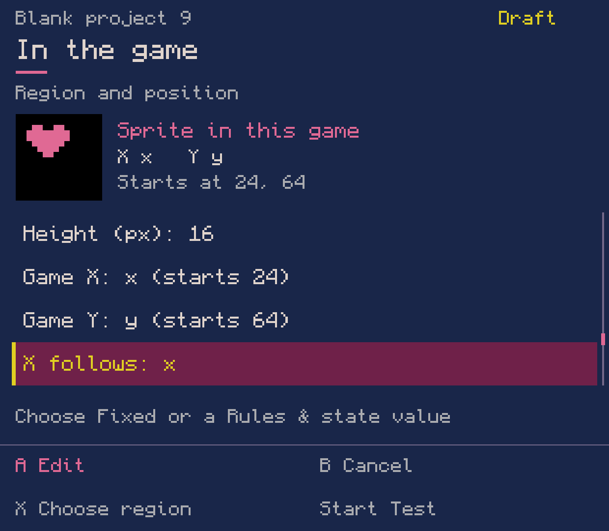
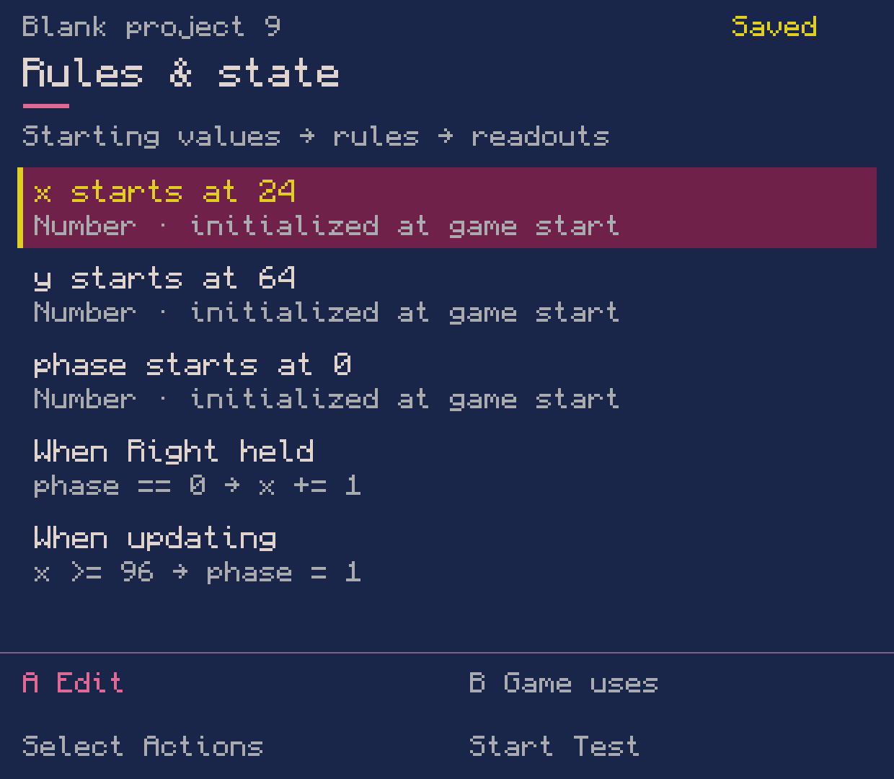
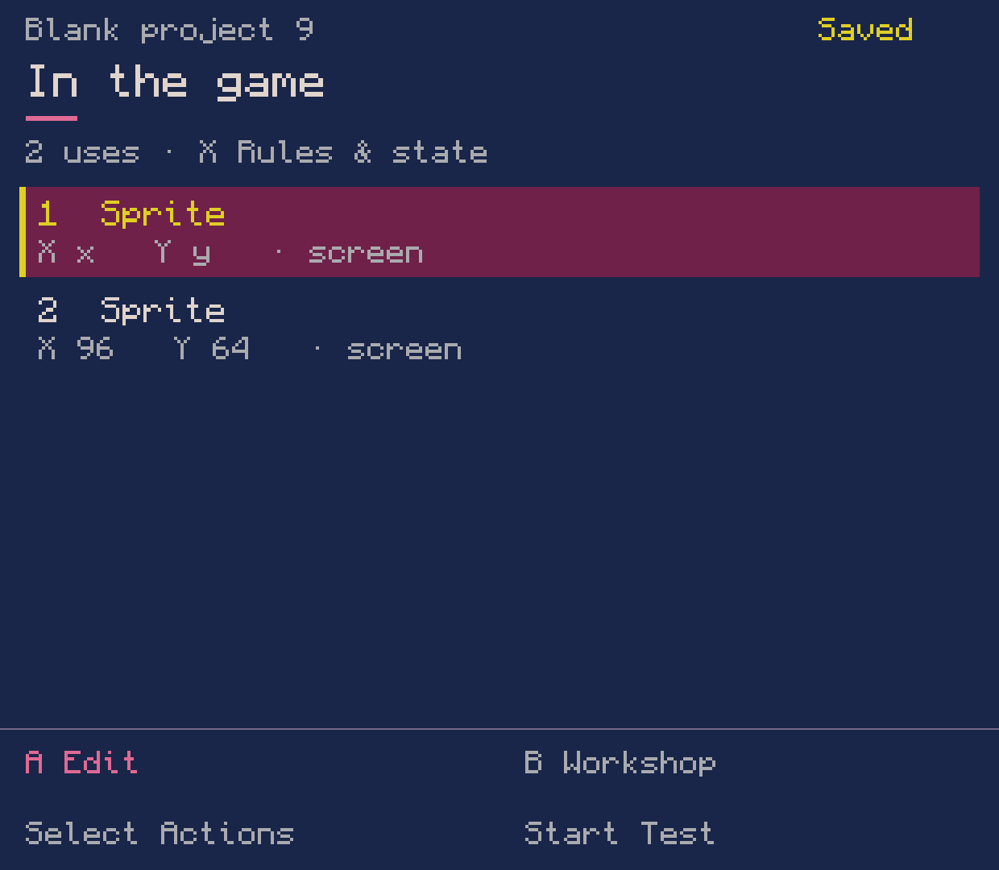
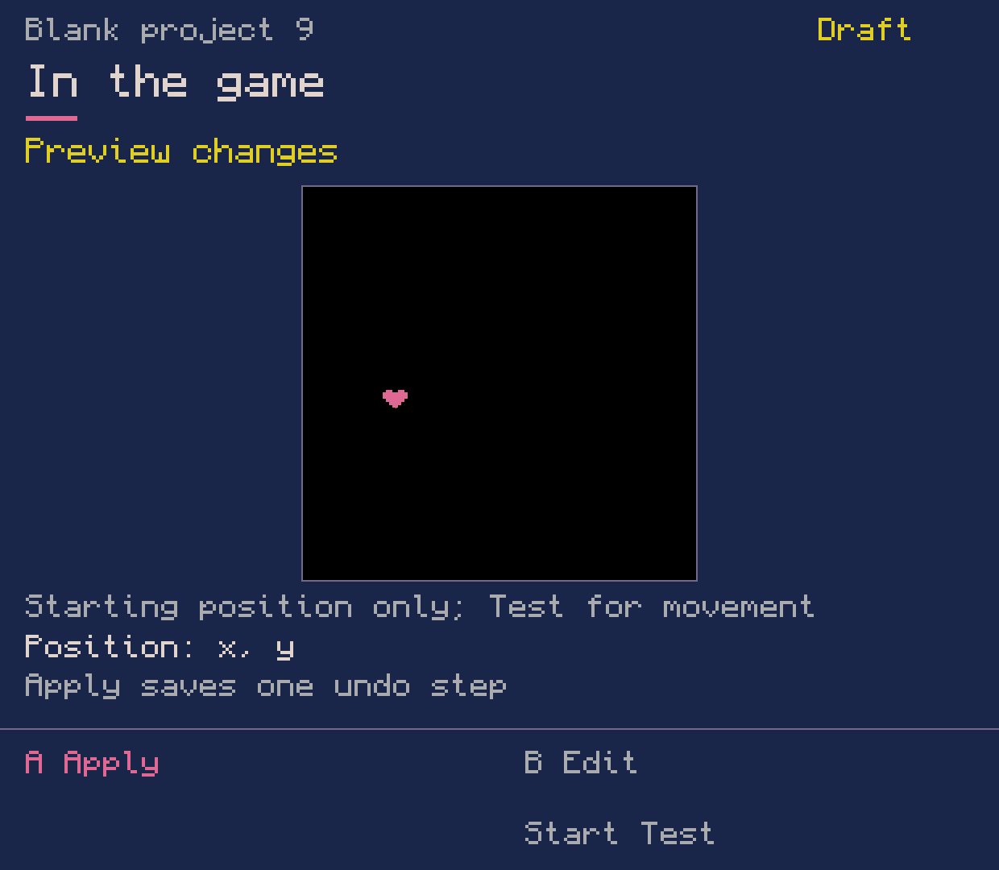
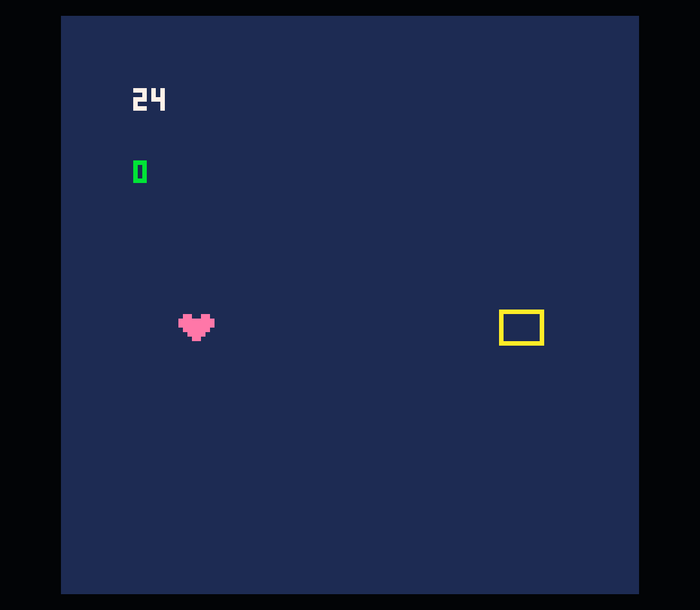
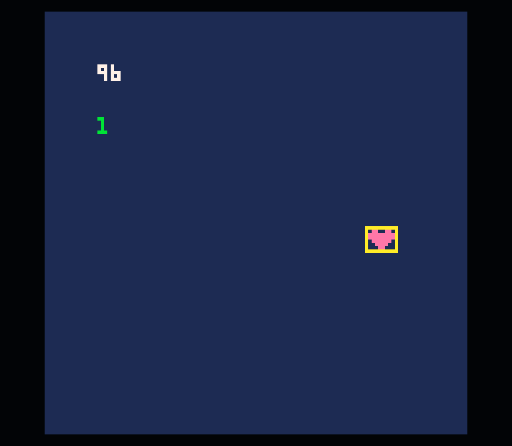
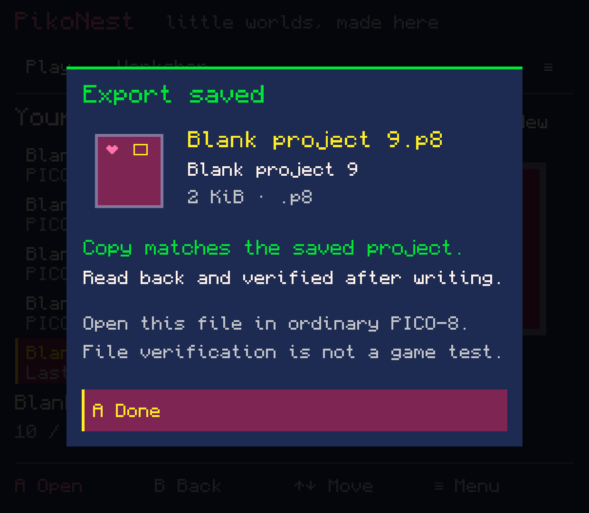

# Rules move sprites — lab 0.0.72

A tiny original game made through the Workshop: draw a heart and a target, add
numeric starting values, connect held Right to movement, stop at a goal, and reset.
The game began with **New project / Blank**. Its Lua was generated by the tools;
no developer project-file edits, injected cartridge or mandatory hero adapter were used.

These eight original English captures are from the regular one-APK development
build on Retroid Pocket Classic, 7 October 2026. Pixel painting and several entry
actions still use the older interface; full localization and shared-memory drawing
are unfinished. The provenance and exact artifact hash are in [capture.json](capture.json).

## What this package adds

- Sprite and map destination X/Y can follow recognized numeric starting values,
  or remain fixed. The forms emit ordinary `spr`, `sspr` and `map` arguments.
- Placement forms share A edit/done, B field revert, navigation, selection,
  preview, isolated draft Test and one Apply/Undo transaction.
- Bindings reopen from the ordinary cart. Journal v7 preserves in-progress
  binding edits and reads journals v1–6; changed source refuses stale recovery.
- Linked-coordinate previews show the starting position, not simulated Lua.
  The selected sprite thumbnail now shows the actual selected region.

## Demonstrated workflow

The native UI created `x=24`, `y=64`, `phase=0`; held Right while `phase==0`
adds 1 to x, `x>=96` sets phase to 1, and PICO-8 X calls `_init()`.
The heart uses `sspr(0,0,16,16,x,y)` and the target stays at 96,64.
Both resources were painted in the app. Apply/Undo/Redo for the placement was
verified against saved bytes, and reopening after the final APK update restored
the same placement review and its links.

Official PICO-8 displayed the start, moved the heart into the target, changed
phase to 1, and reset to the starting values. Two bounded Test sessions exited
normally and returned to the preserved review. Runtime input used injected,
long-pressed keyboard Right/V events; this is not physical-button acceptance.
Android SAF exported the saved cart and read it back byte-for-byte. The original
48 project/library files were unchanged; runtime home and independent apps were
preserved. Sound remained muted. No APK release was created.

[Download the exact exported cartridge](heart-goal.p8?raw=true).
It needs only ordinary PICO-8, with no PikoNest library or metadata dependency.
Outside-PikoNest execution has not been independently demonstrated in this batch.

The full core build suite passed; the focused coordinate suite passed 85 checks
after the review-recovery correction. Subsequent packaging was limited to that
correction and a visibly undersized thumbnail fix. Tests cover exact no-op edits,
comments/newlines, fixed/linked coordinates, copy/remove, stale recovery,
field cancel, write failure/retry, Undo/Redo and unsafe-source refusal.

## Limits and remaining acceptance

This is a bounded C02.4/G04 workflow, not completed M1, M2 or ACC-01. Recognized
flat draw calls and simple integer globals in `_init()` are the current editor
slice. Arbitrary Lua expressions, dynamic initializers, included sources and
shadowed globals remain preserved and are refused by these forms. Integer form
ranges are editor limitations, not the full PICO-8 coordinate model. Converting
a linked sprite to the current time-based animation is refused so its coordinates
cannot silently become fixed. State/event animation and audio remain open.
Reset calls `_init()`; it does not reset all runtime state.

Still required: physical controls and owner acceptance, independent exported-cart
execution, general sprite/map painting and allocation, event/resource connections,
sound editors and the rest of the complete creation workflow. Next implementation
package is the basic sprite/map editors, before adding more presets.

## Images

### Choose a starting value for a sprite coordinate.

### Numeric state, held input and a goal condition.

### One sprite follows game values; the target stays fixed.

### The placement review restored after the APK update and reopening the project.

### The UI-authored game running in official PICO-8: x=24, phase=0.

### Held Right moves the sprite to x=96; the goal changes phase to 1.

### The reset rule calls _init(): x=24, phase=0 again.

### Android export was read back and matched the saved cartridge.

