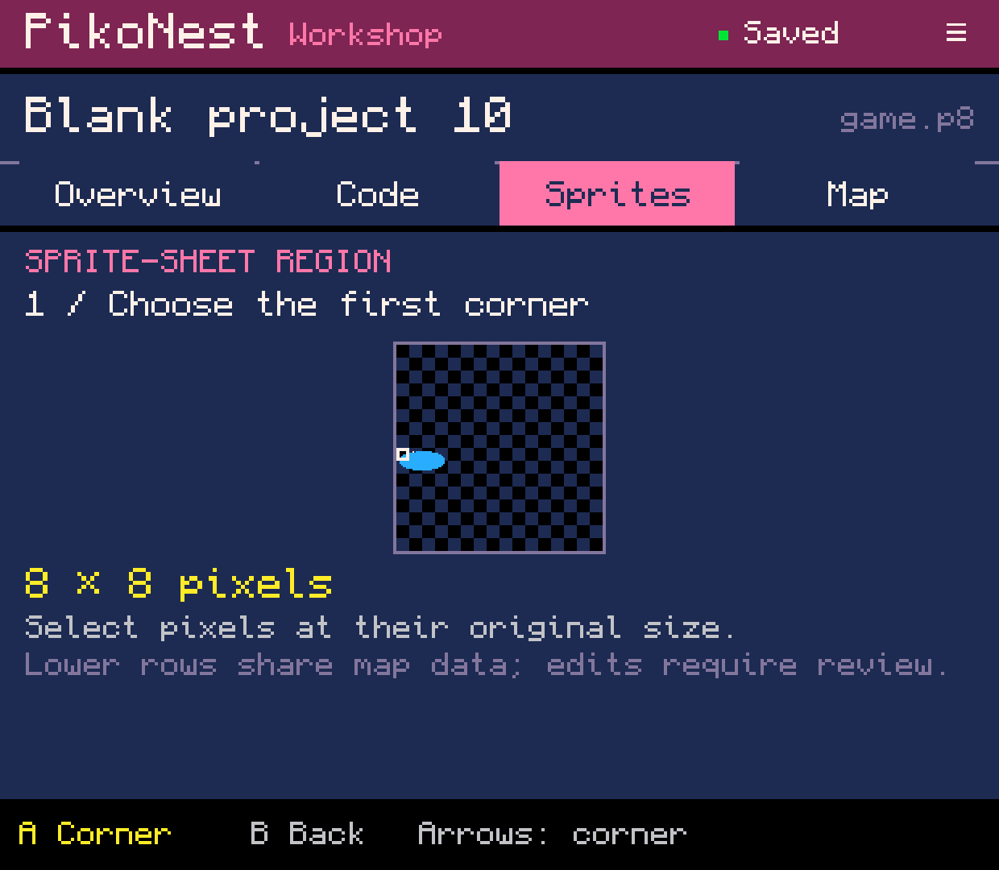
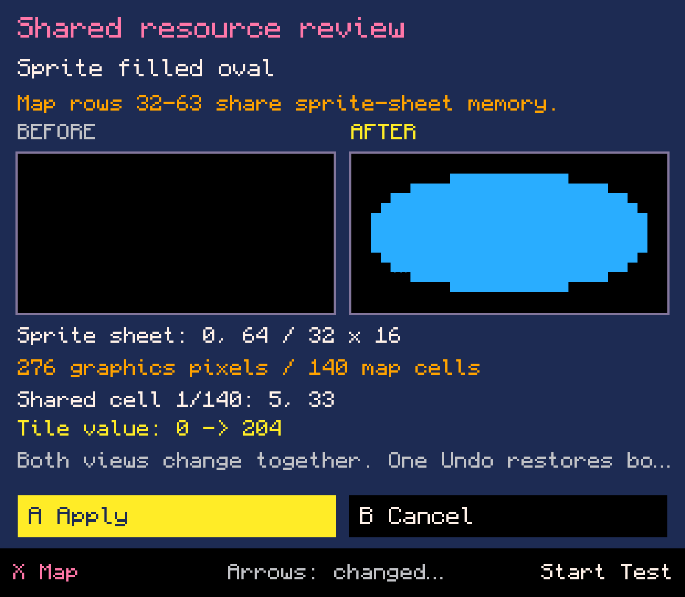
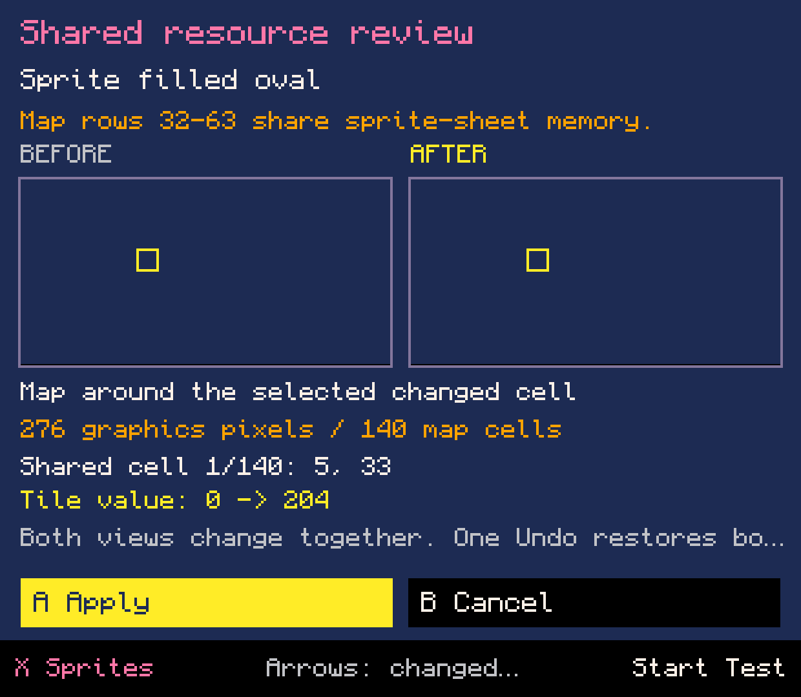
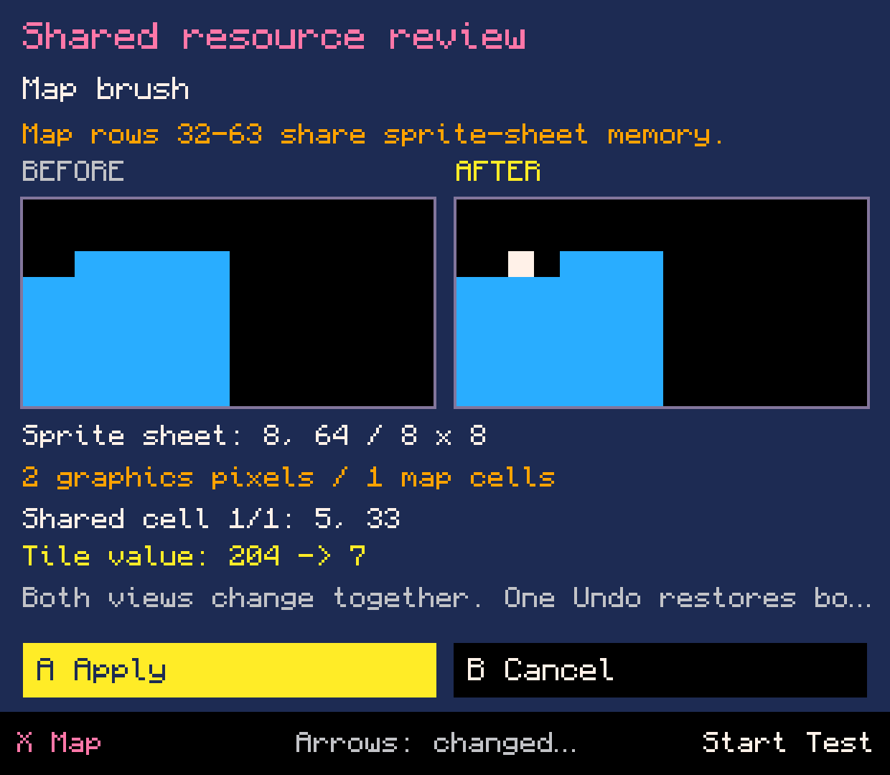
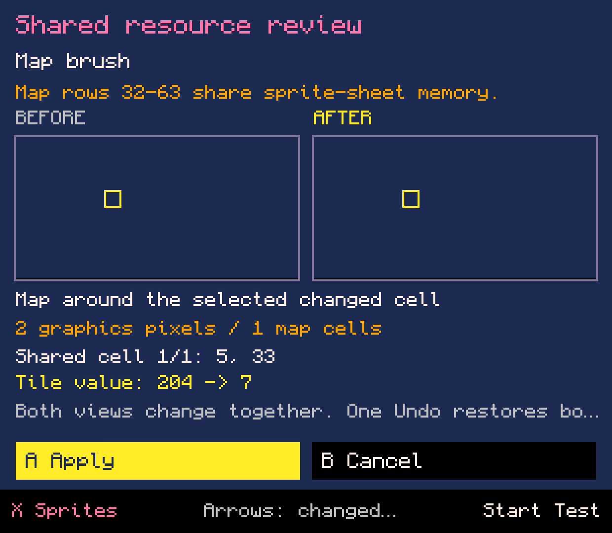
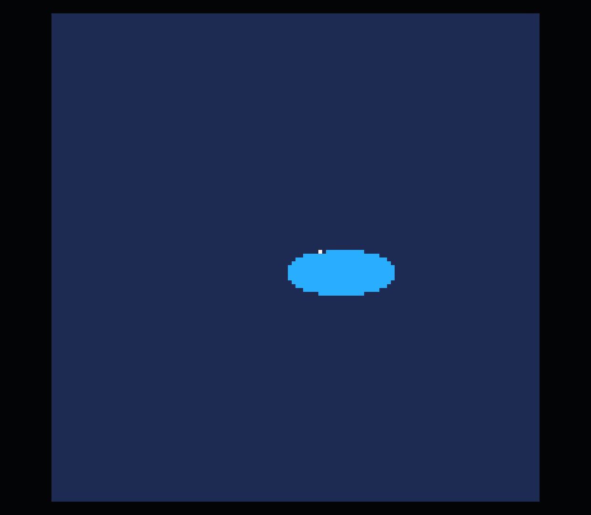

# Shared sprite and map editing - lab 0.0.73

Choose the full sprite sheet, paint a lower-half sprite, then inspect what that
edit changes in the map before saving. The same review handles map edits that
change graphics. This follows the default PICO-8 memory layout: sprite-sheet
rows 64-127 and map rows 32-63 alias the same bytes.

Six original English captures from the normal one-APK development build on
Retroid Pocket Classic, 7 October 2026. [Capture provenance](capture.json).
The new review and affected painting/map surfaces are English; localization of
older menus and other tools is still incomplete.

## What works

- Sprite brush, eraser, fill, line, rectangles and ovals can propose lower-half
  and boundary-crossing graphics edits. Full-sheet rectangular selection is available.
- Map brush, rectangle and connected fill address the standard 128 x 64 map.
- Shared changes pause in a resource-only before/after review. X switches between
  graphics and map; arrows browse changed shared cells; A applies, B cancels,
  Start tests an isolated snapshot. Unrelated Lua, flags and audio are preserved.
- One Apply produces one Undo transaction for both resources. Source changes
  refuse stale proposals; write failure preserves the draft for retry.
- The source-hashed proposal and review selection survive Workshop process death.

## Device evidence

A new Blank project was created through native UI. Its 32 x 16 lower-half region
received a filled blue oval: 276 graphics pixels and 140 shared map cells changed.
The proposal remained unsaved, survived an observed process termination, and
reopened in the same map review. Apply/Undo/Redo matched saved cartridge bytes.

The existing placement form inserted `sspr(0,64,32,16,60,60)`. A map brush at
5,33 changed tile value 204 to 7, replacing two packed graphics pixels.
Official PICO-8 displayed the altered oval from the draft while the saved cart
remained unchanged. Exit returned to the review; Apply/Undo/Redo passed again.
The resulting ordinary cart is [available here](shared-oval.p8?raw=true).
This copy was read from app storage, not exported through SAF in this batch.

All 49 pre-existing project/library files stayed byte-identical. Runtime home
`61aad8e46dfc`, the separate PICO-8 app/process and legacy helper data were preserved.
Audio volume stayed zero. The PikoNest runtime session ended with EXITED.

The full core build test list passed in segments: the earlier run through
RecolorWorkflowTest, followed by Rectangle/History/Move/Oval after updating their
old refusal expectations. SharedEditingTest passed 122 focused checks. Coverage
includes nibble layout, full-map fill, shape boundaries, source preservation,
Cancel, Test, recovery, failure/retry and exact Undo/Redo. Packaging then passed
without repeating the core suite; the APK contains no purchased runtime binaries.

## Remaining work

G01-G03 and issue #5 remain open. Shared sprite copy/move/transform/recolor are
still refused safely; multi-pixel brush strokes, richer zoom/pan, cross-project
buffers and resource allocation remain unfinished. A shared single-pixel brush
currently asks for confirmation per edit; shapes and fill stage bulk changes.
Empty pixels cannot prove that Lua does not reference an area. The review reports
resource differences, not every gameplay dependency in arbitrary Lua.

This is the default cartridge resource layout, not support for runtime RAM
remapping. Existing map-region review is retained. Physical-controller, other
screens, outside-PikoNest execution and owner acceptance are separate gates.
No public APK release was created. Next continue the remaining basic sprite/map
operations before event animation and audio tools or more presets.

## Images

### Choose a region in the full 128 x 128 sprite sheet.

### Review a 32 x 16 sprite before publishing its shared map changes.

### The same proposal reopens after the Workshop process was killed.

### A map brush changes two packed graphics pixels.

### Switch to the map view and inspect the exact changed cell.

### Official PICO-8 runs the isolated draft, including the white pixel introduced by the map edit.

