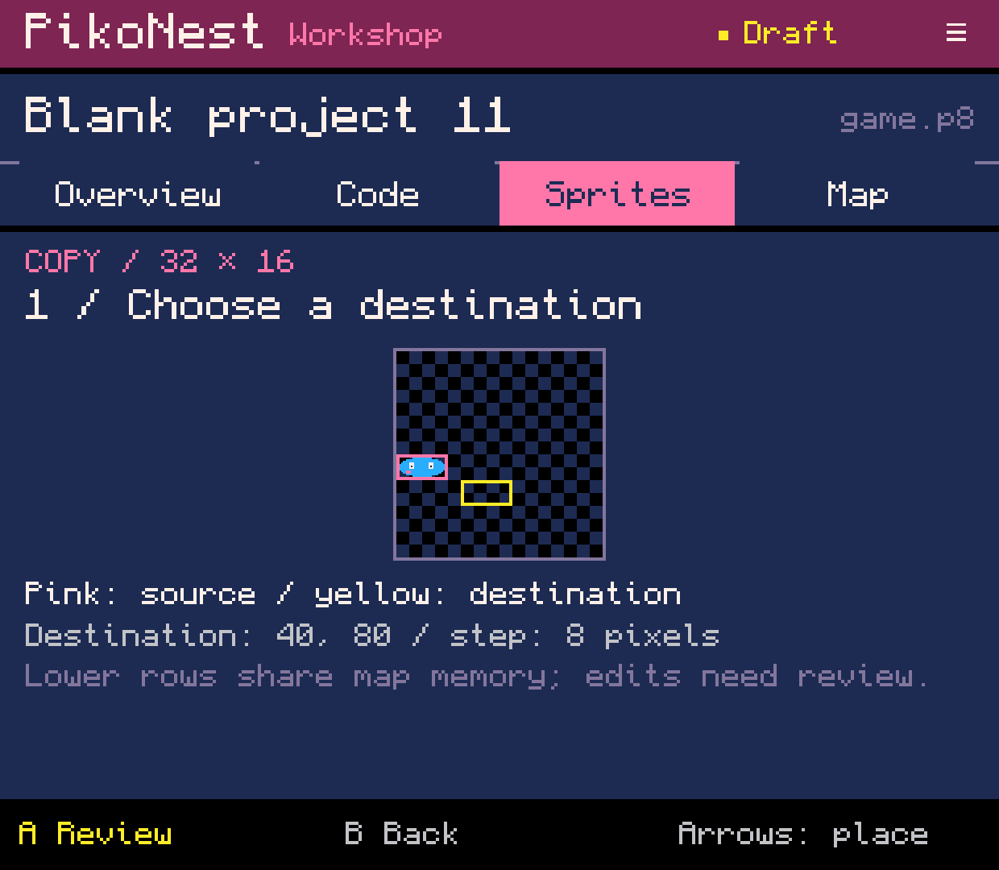
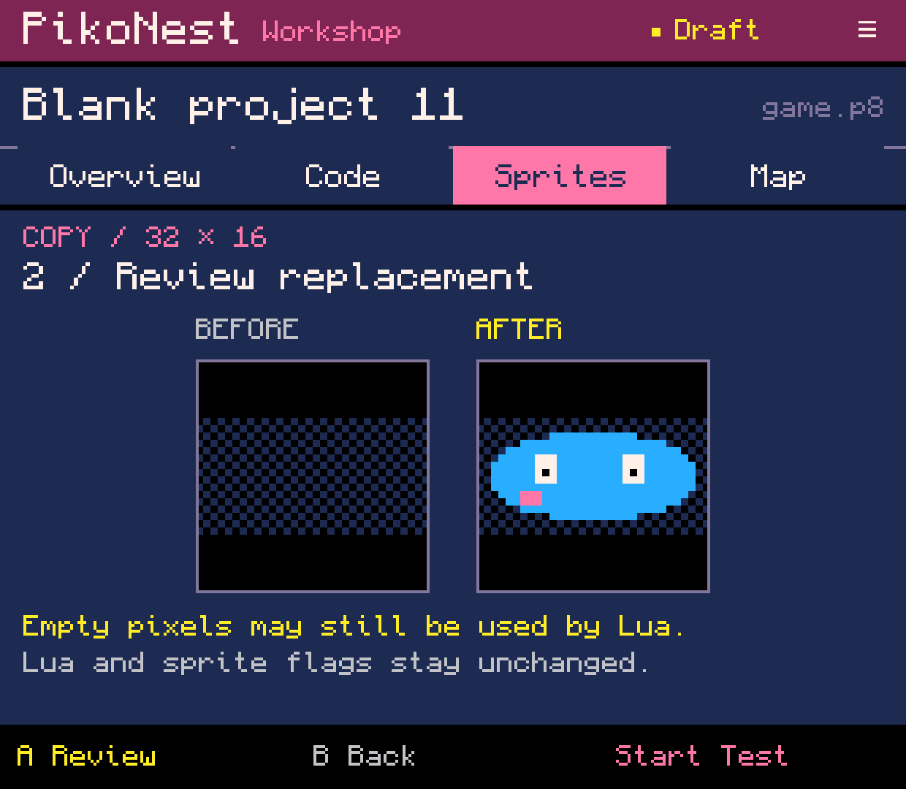
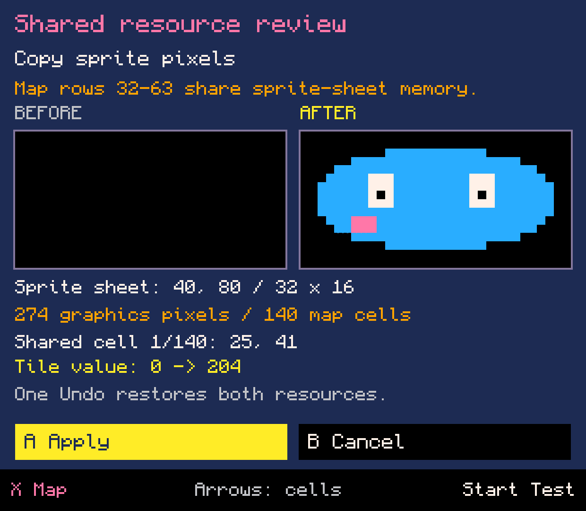
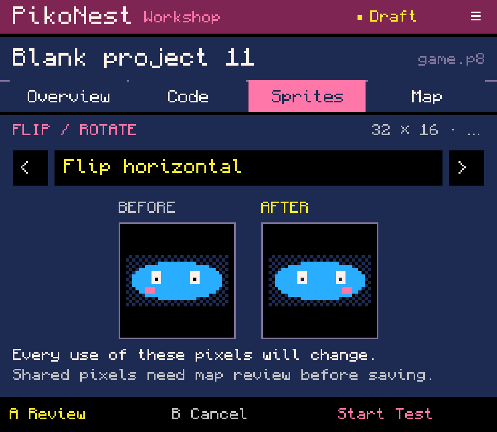
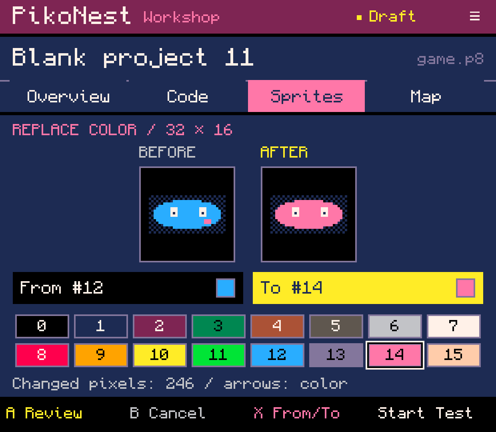
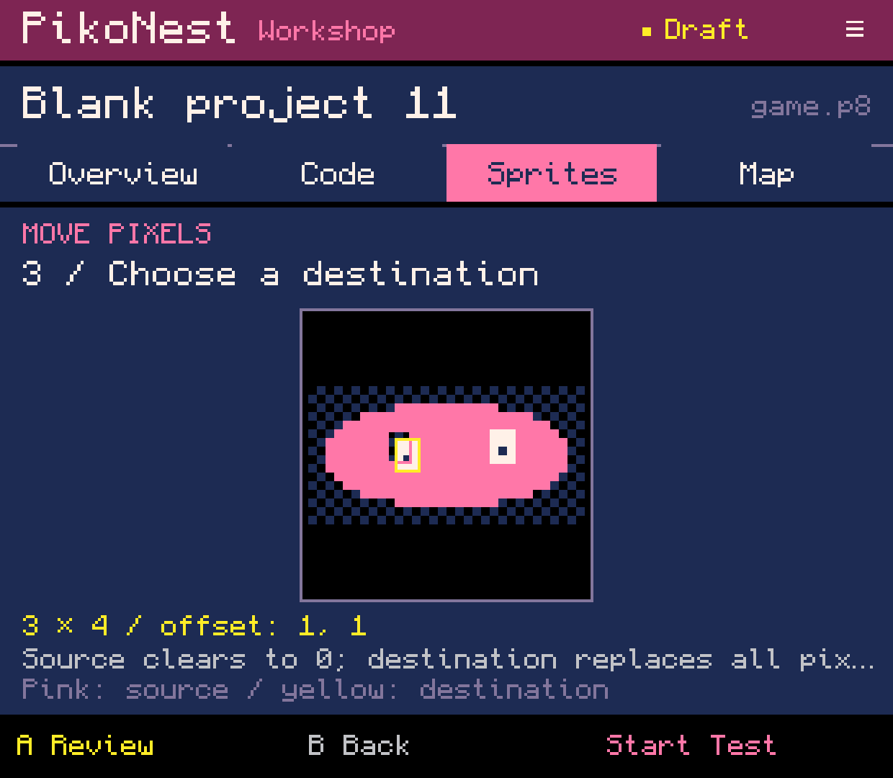
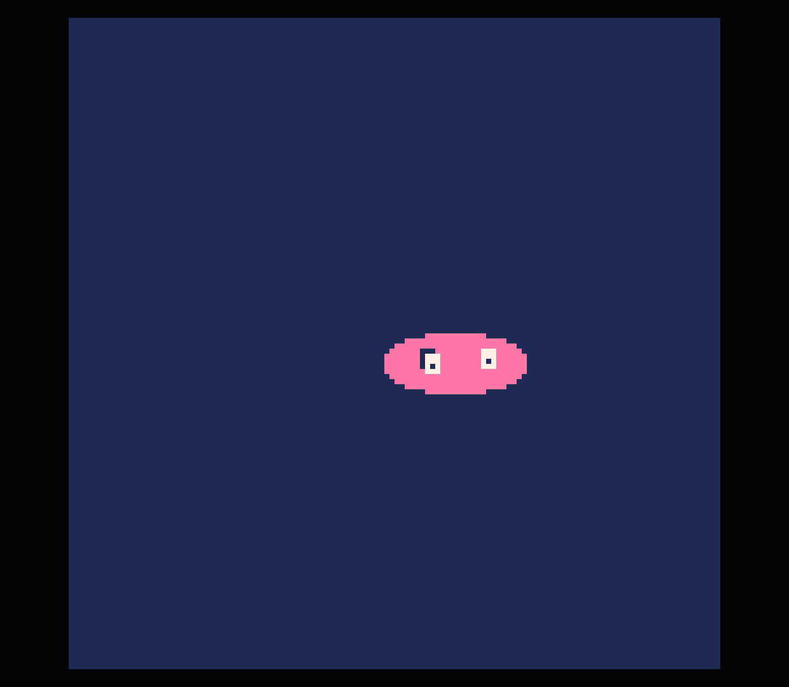

# Copy, transform and move shared sprites - lab 0.0.74

A sprite drawn from Blank can be copied anywhere on the sheet, flipped,
recolored and moved without leaving the Workshop. Lower-sheet operations now
review their map changes before writing. The same workflow supports inserting
an independent library sprite into that part of the sheet.

These seven original English captures are from the regular one-APK development
build on Retroid Pocket Classic, 7 October 2026. [Capture provenance](capture.json).
Affected operation forms are English; older painting/library menus and full
localization remain unfinished.

## What this batch adds

- Copy destinations cover the full 128 x 128 sprite sheet. Copying with overlap
  uses an original pixel snapshot and explicitly warns that source pixels may
  also be replaced. Lua references and sprite flags are never rewritten.
- Lower-half and boundary-crossing copy, move, flip, rotation and color replacement
  pass through the shared graphics/map review introduced in 0.0.73.
- Back from the shared review retains the operation form and its parameters.
  Apply releases that intent only after a successful durable save, then returns
  to the editor; copy opens its chosen destination. One Undo restores both resources.
- Start from a ready operation form or the shared review tests an isolated cart
  snapshot. Selecting corners and placing a destination do not write the project.
- Restored shared proposals must match both the saved source hash and the restored
  operation candidate. Missing or mismatched operation context refuses recovery.
- Library insertion uses the same review, supports tile-aligned assets up to the
  real sheet bounds, and leaves the library's independent pixels unchanged.

## Demonstrated on the device

The native UI created Blank project 11 and painted a blue 32 x 16 sprite at 0,64.
It copied that sprite to 40,80. The copy waited in shared review, Back returned to
replacement preview, and the proposal restored after an observed Workshop process
termination and reopening the project. Copy Apply/Undo/Redo matched saved bytes.

The copy was flipped horizontally, recolored from index 12 to 14, and connected
through the existing placement form as `sspr(40,80,32,16,60,60)`. A 3 x 4 eye fragment
was moved by one pixel in each axis with overlap. Back retained each operation;
Apply/Undo/Redo were byte-exact for flip, color replacement and move as well.

Start from the ready move form launched the altered sprite in official PICO-8
while the saved cart stayed unchanged. Exit returned to that ready form; the move
was then reviewed and applied. The final ordinary cart is
[available here](shared-sprite.p8?raw=true). It was read from app storage, not
exported through SAF or independently executed outside PikoNest in this batch.

All 51 previous project/library files remained byte-identical. The runtime home
`61aad8e46dfc`, the separate PICO-8 process and disabled legacy helper/data stayed
intact. Audio volume remained zero. The PikoNest runtime session ended with EXITED.

## Validation and remaining work

The complete local build list of 71 core test suites passed, followed by APK
packaging and one installation. SharedOperationsTest passed 98,707 checks; the
previous shared-painting suite still passes its 122 checks. Tests cover resource
boundaries, snapshot overlap, unknown-source preservation, LF/CRLF, operation
recovery/mismatch, failed writes/retry, no-op edits, form/draft Test and exact Undo/Redo.

G01-G03 and issue #5 remain open. Continuous drawing strokes, richer zoom/pan,
cross-project buffers, resource allocation and remaining map brush/stamp/line
workflows are unfinished. The fragment move remains inside the selected editor
region. Quarter rotation currently requires a square; that is an editor restriction,
not a PICO-8 limit. Copy/library destination stepping currently uses whole 8 x 8 tiles.

The review follows the default map/gfx alias and reports data differences, not
all possible gameplay dependencies or runtime RAM remapping. Empty pixels cannot
prove an area is unused by Lua. Physical-controller, broader screen coverage and
owner acceptance remain separate. No APK release was created.

Next finish the remaining basic drawing/buffer and large-region workflows before
expanding presets or advancing to state/event animation and the sound editors.

## Images

### Choose a destination anywhere in the sprite sheet.

### Review replacement before changing destination pixels.

### The shared copy proposal restored after Workshop process death.

### Flip the same sprite and inspect both orientations.

### Replace a palette index without repainting every pixel.

### Move a selected fragment with overlap from a pixel snapshot.

### Official PICO-8 displays the unsaved move from the operation form.

