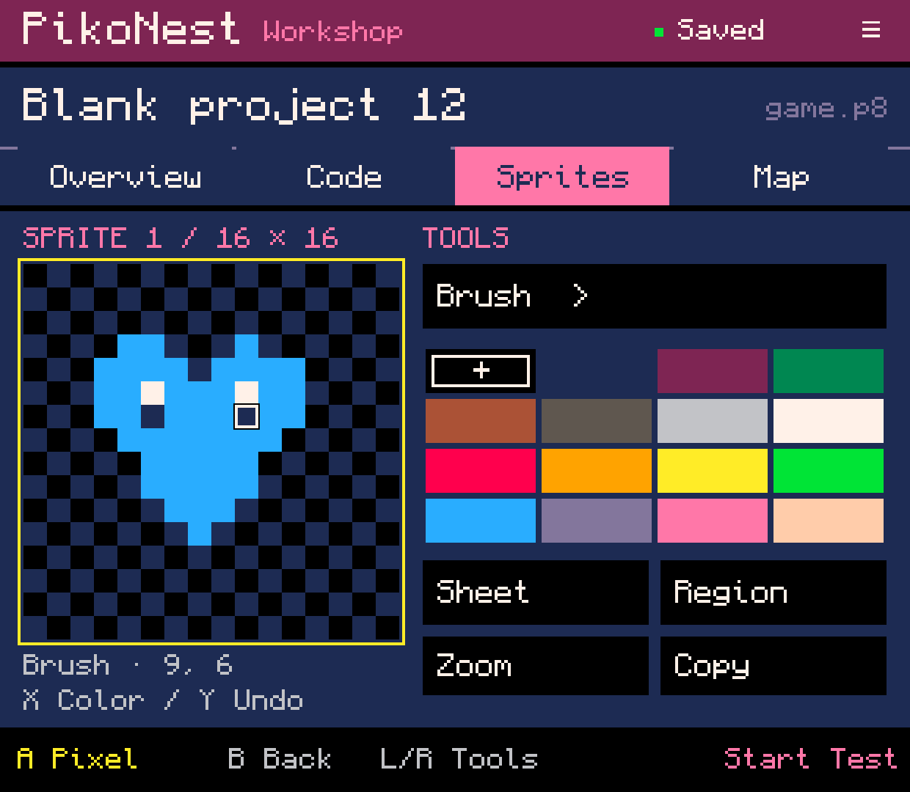
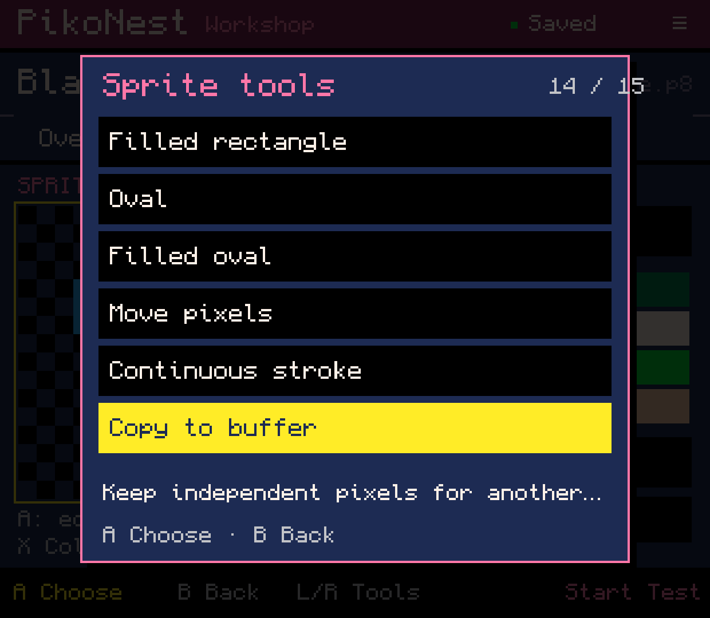
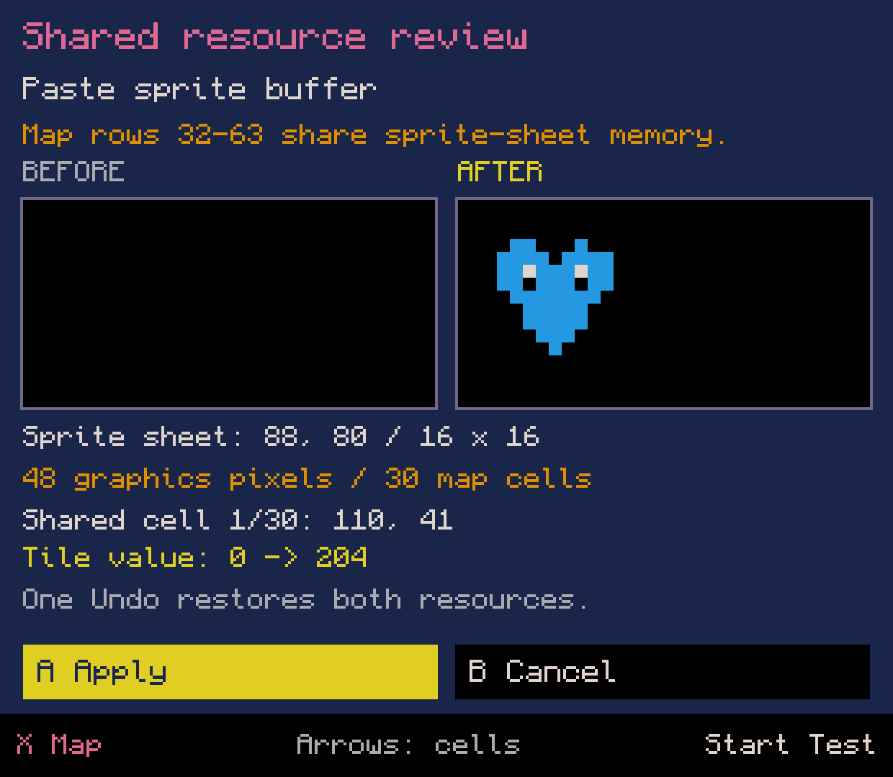
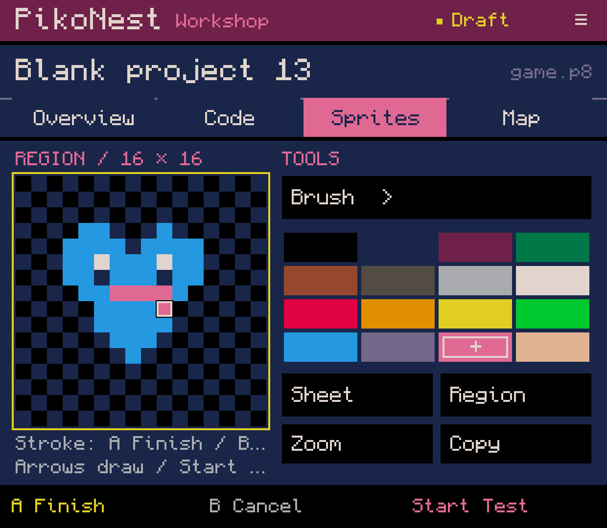
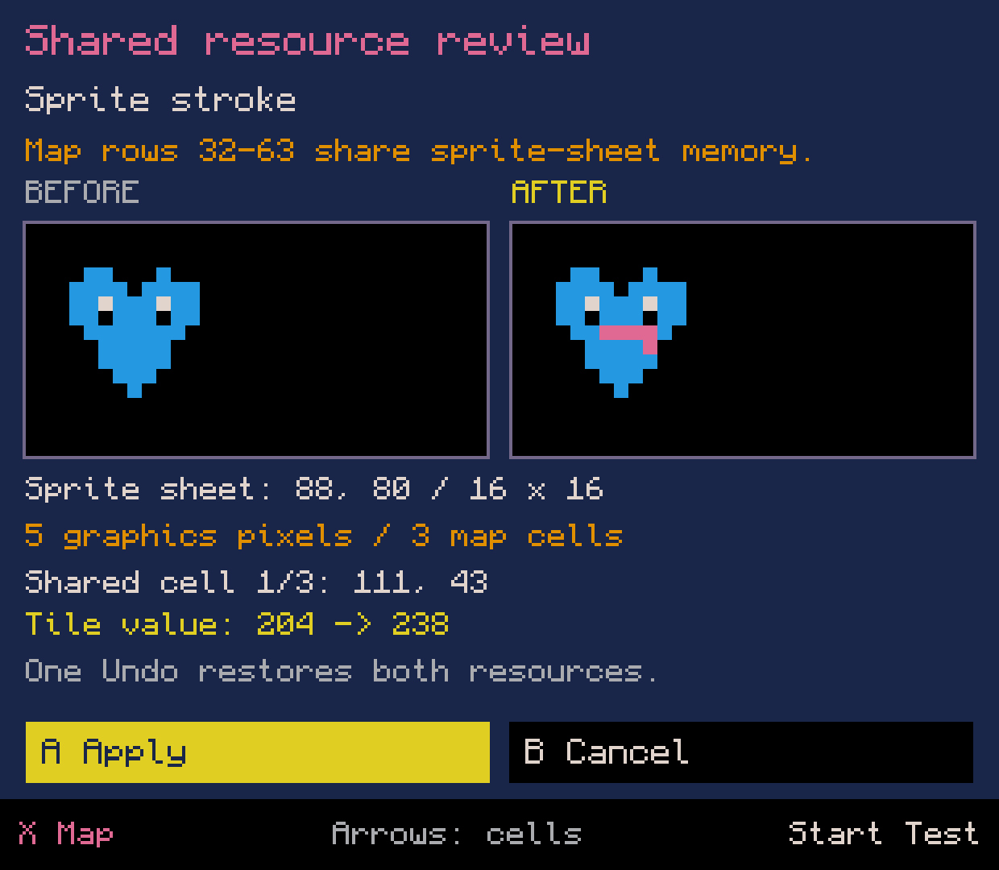
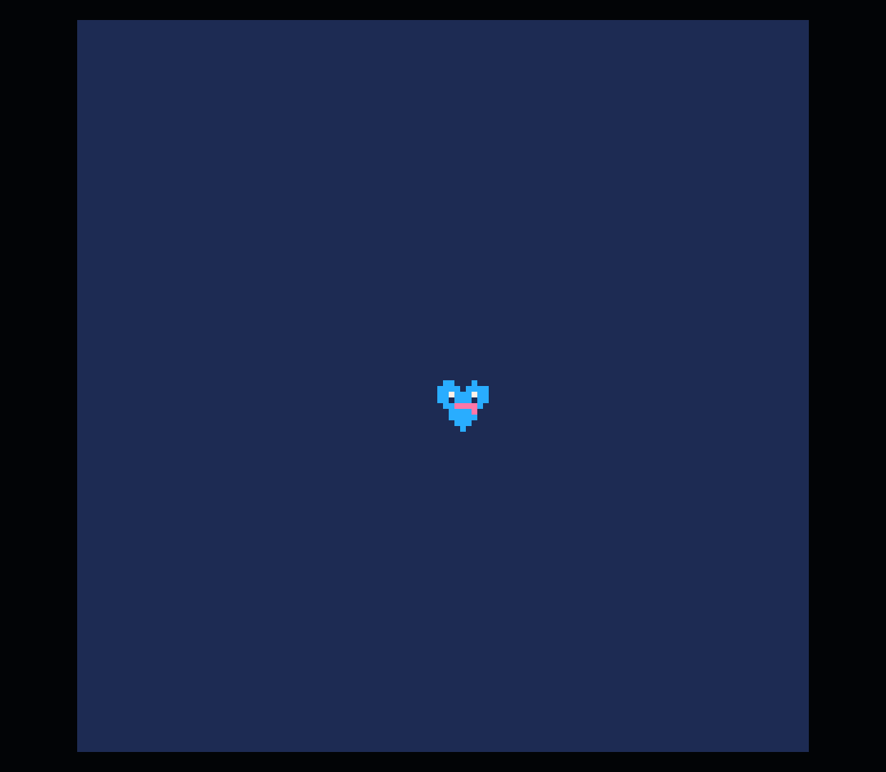
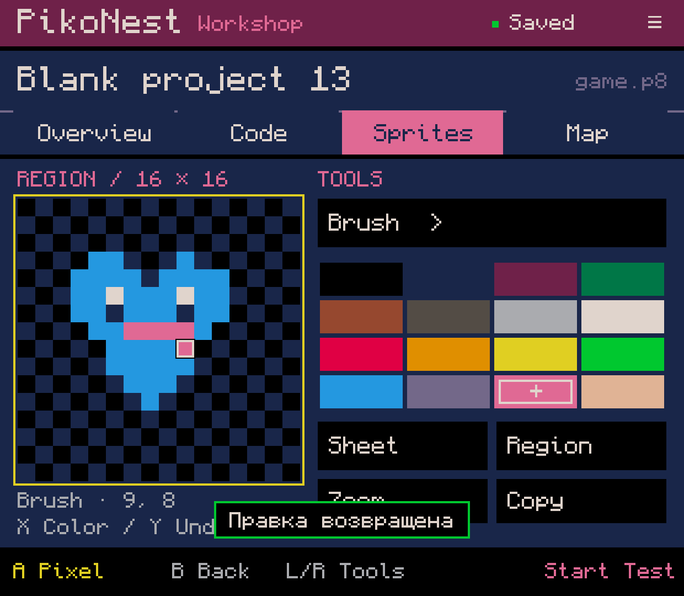

# PikoNest 0.0.75 - strokes and a sprite buffer

Native screenshots from Retroid Pocket Classic, Android 14. All seven PNGs are
unedited captures of the normal single-APK development build. New surfaces are
English; the entire older app has not yet been localized. This is development
evidence, not an APK release or owner acceptance.

## What changed

- Drag a brush or eraser over the canvas to create one connected stroke. Sparse
  input samples connect with the same line rasterization as the pixel editor.
  The viewport stays fixed during a touch gesture. Releasing completes it;
  Android gesture cancellation discards the unsaved stroke.
- Choose **Continuous stroke** for a controller path. Arrows draw, A finishes,
  B/Y cancels the whole stroke, Start tests the isolated draft. The chosen color
  is fixed for the stroke; choosing Eraser uses color 0. Swapped A/B is respected.
- Lower-half edits review the shared sprite/map consequences once after a whole
  stroke. Back retains the complete path; Apply saves one Undo transaction.
  Failed writes retain the draft and successful retry creates one history item.
- Source-hashed stroke drafts recover their region, color and path. Shared review
  recovery must match the restored stroke. Unsafe recovery preserves saved data.
- **Copy to buffer / Paste buffer** reuse the replacement and shared-memory review.
  The buffer stores independent indexed pixels, dimensions and provenance across
  projects and process restarts. A pending paste retains its captured pixels even
  if the global buffer is replaced later. Copying does not change source history.
- The canvas uses a nearest-neighbor bitmap to reduce drawing commands. Error
  return state is separated from menu return state, preserving existing placement
  Undo/retry and keeping failed buffer operations navigable. Map help now reflects
  available lower-half edits and their review.

## Demonstrated workflow

A heart was drawn by touch in **Blank project 12**. The initial connected outline
was undone in one action and restored byte-for-byte. Pixels were copied to the
persistent buffer and pasted at sheet position **88,80** in **Blank project 13**.
The paste review recovered after the editor process was killed in the background;
Back, Apply, Undo and Redo preserved the expected bytes. The global buffer survived.

Native **In the game** placed the heart through ordinary
`sspr(88,80,16,16,60,60)`. A pink stroke was drawn with directional input, recovered
through process death and reviewed. Start ran the draft in official PICO-8 while
the saved cart stayed unchanged. All **16,384 frame pixels** matched the ordinary
`cls`/`sspr` result. Exit was observed as EXITED and returned to review. The stroke
was cancelled, recreated, applied, undone and redone; final saved bytes matched
the tested draft exactly. No source cartridge or Lua was injected into a project.

All **71 core test suites in the full build** passed, including **170 focused
stroke/buffer checks** across LF/CRLF, boundary-crossing regions, maximum scope,
eraser/color 0, no-ops, stale/invalid recovery, write failures, isolated Test,
Cancel and snapshot insertion. The final UI-only bitmap change was packaged with
core tests skipped; the unchanged core had already passed. The final APK was
installed and the native scenario completed on that artifact.

All **52 pre-existing project/library files** remained byte-identical. The runtime
home stayed unchanged, the owned session ended and media remained muted.

[Saved ordinary cartridge](stroke-buffer-heart.p8) · [Capture metadata](capture.json)

## Remaining scope

This is a one-item, sprite-only app-private buffer. Map/audio/animation buffers,
user-folder storage/backup and automatic dependency or resource allocation are
unfinished. Paste currently places whole 8x8-tile-aligned regions and replaces all
captured pixels including color 0. It does not copy Lua, sprite flags, animation
bindings or sound. Blank pixels are not proof that a target is unused by Lua.

Richer zoom/pan, rectangular quarter turns, remaining map stroke/stamp/line work,
remapped RAM, broader screens and physical-controller/owner acceptance remain
open. Touch samples on Retroid were injected, not a physical-finger acceptance
session; secondary pointers and OS cancellation were implemented but not exercised
on the device. This batch did not repeat SAF export or independent outside-PikoNest
execution and does not close the complete simple-game creation criterion.

## Screenshots

### A sprite painted in a new Blank project.

### Copy independent pixels for another project.

### The shared-memory paste review recovered after process death.

### A complete controller stroke recovered before saving.

### Review both sprite and map changes before applying one stroke.

### The unsaved stroke shown by the purchased official PICO-8 runtime.

### The complete stroke saved, undone and redone as one edit.

