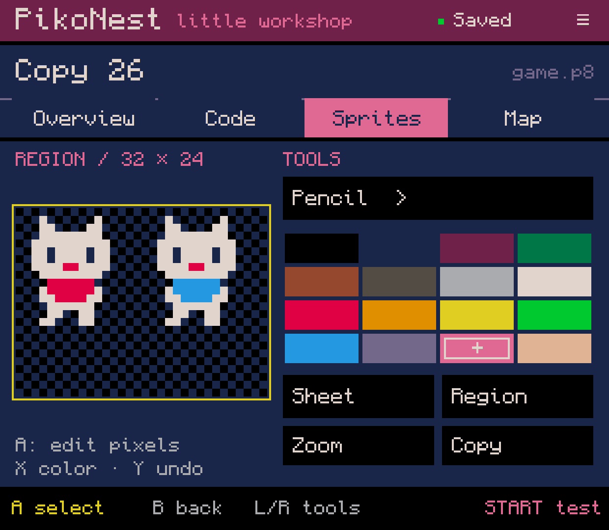
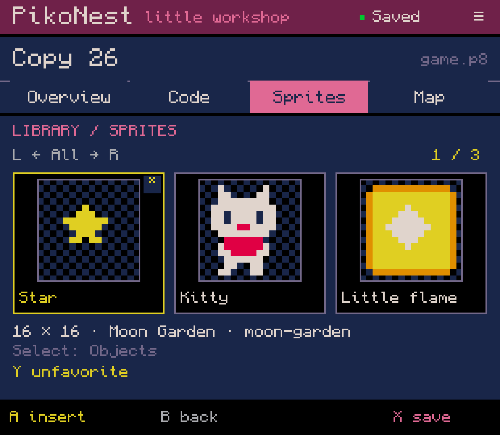
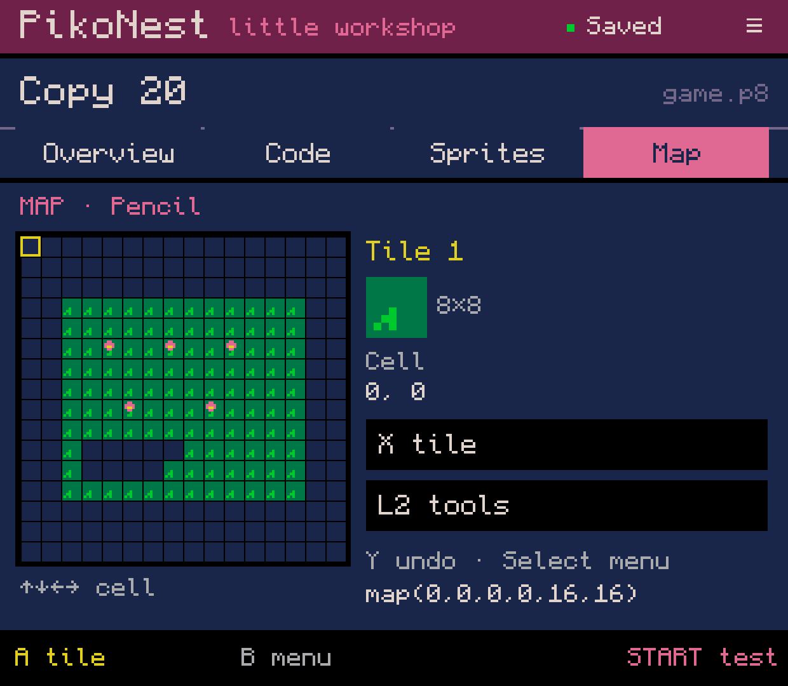
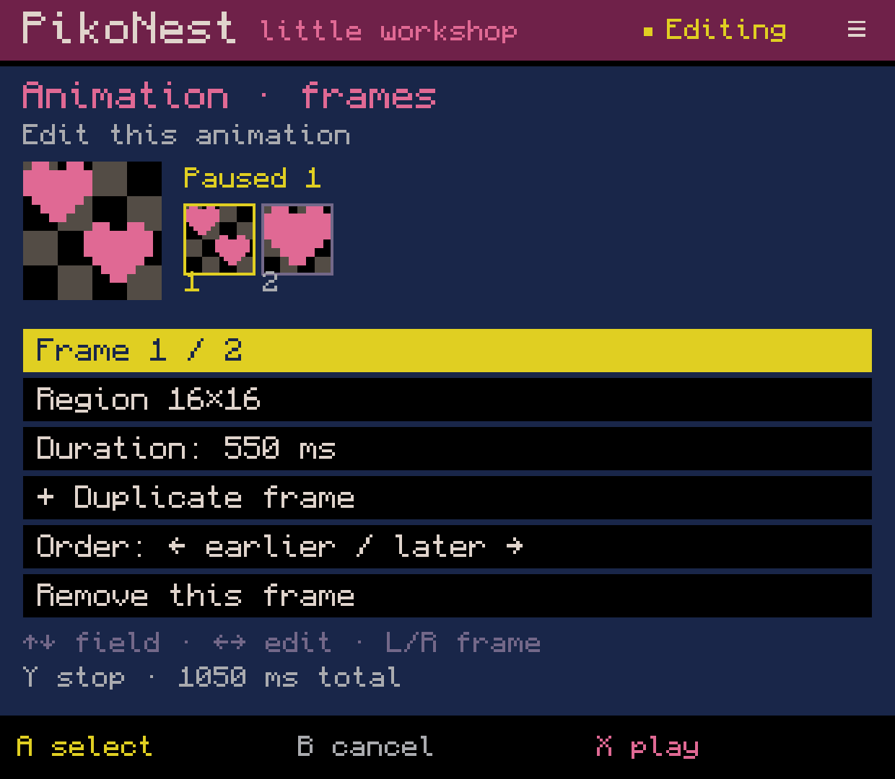
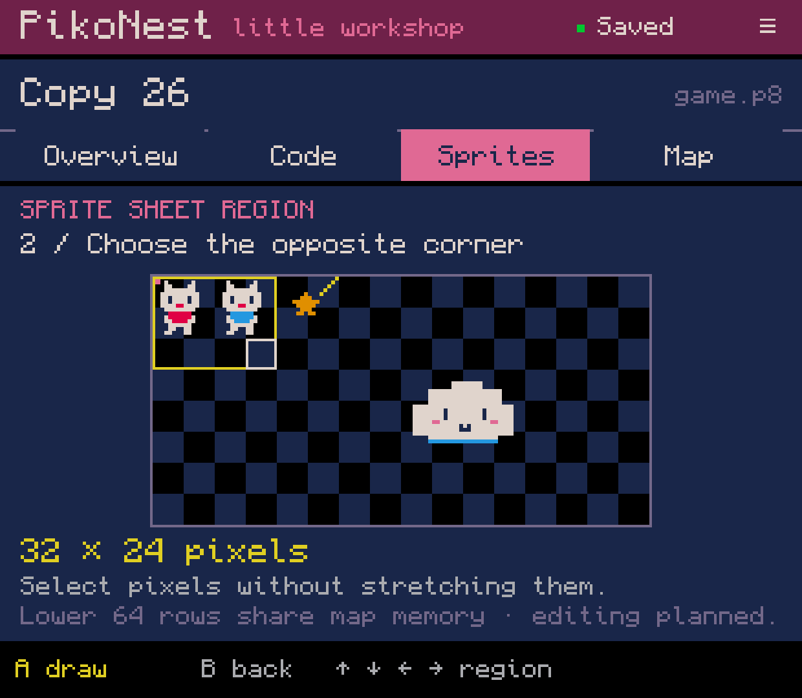
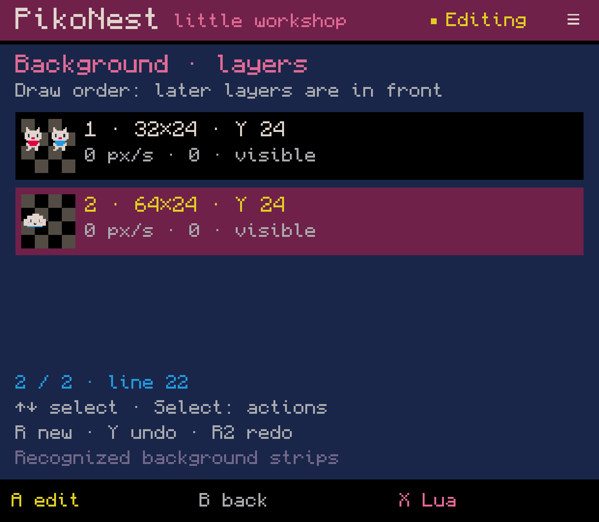
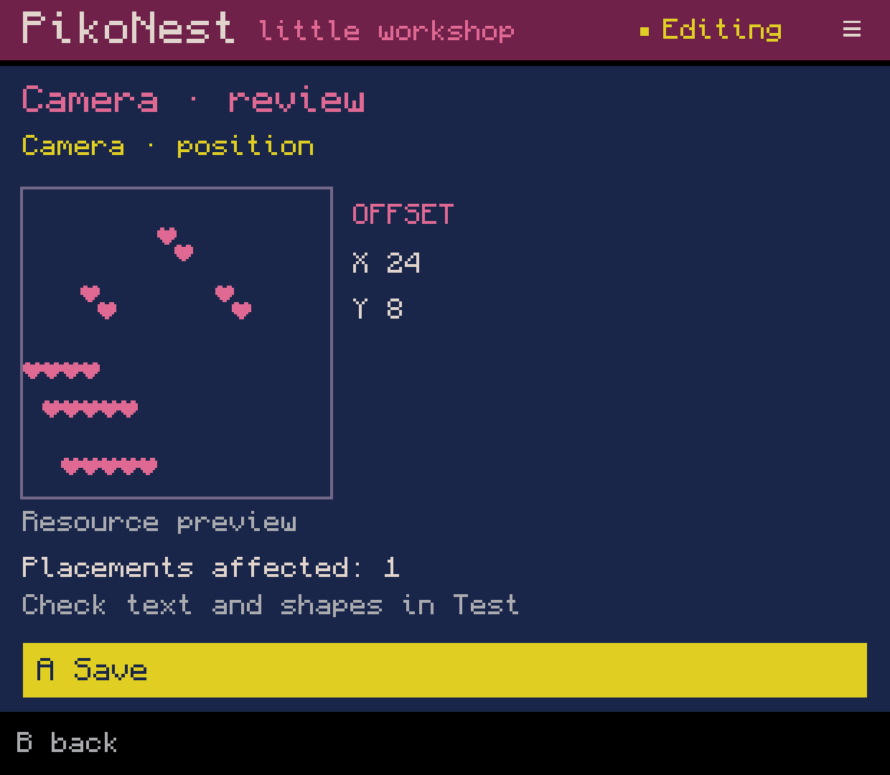
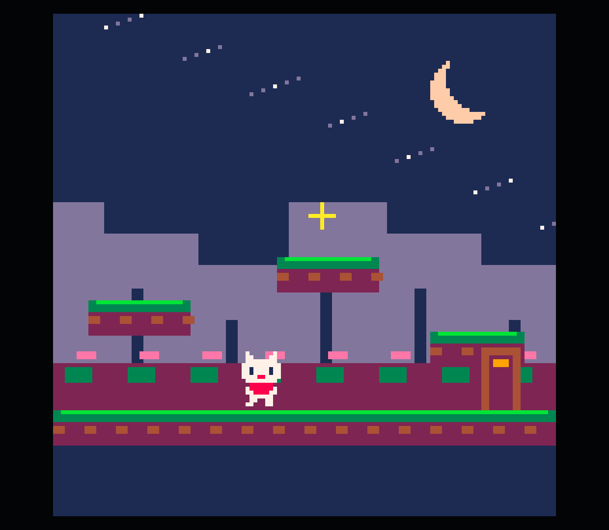
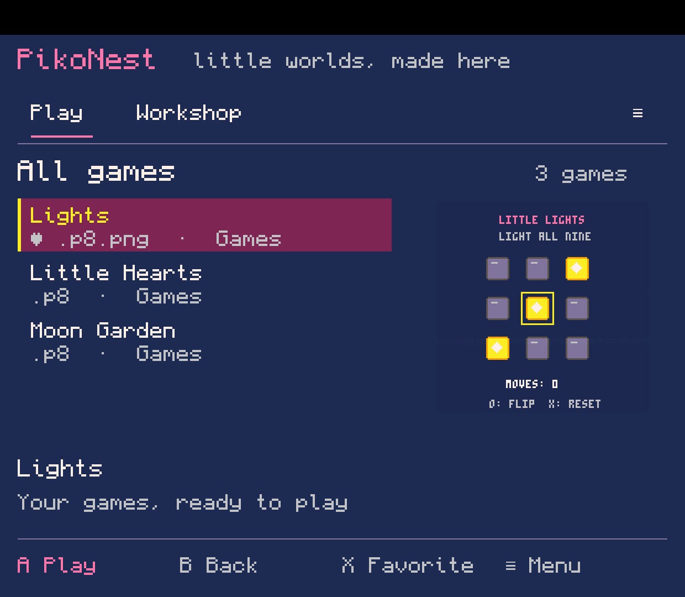
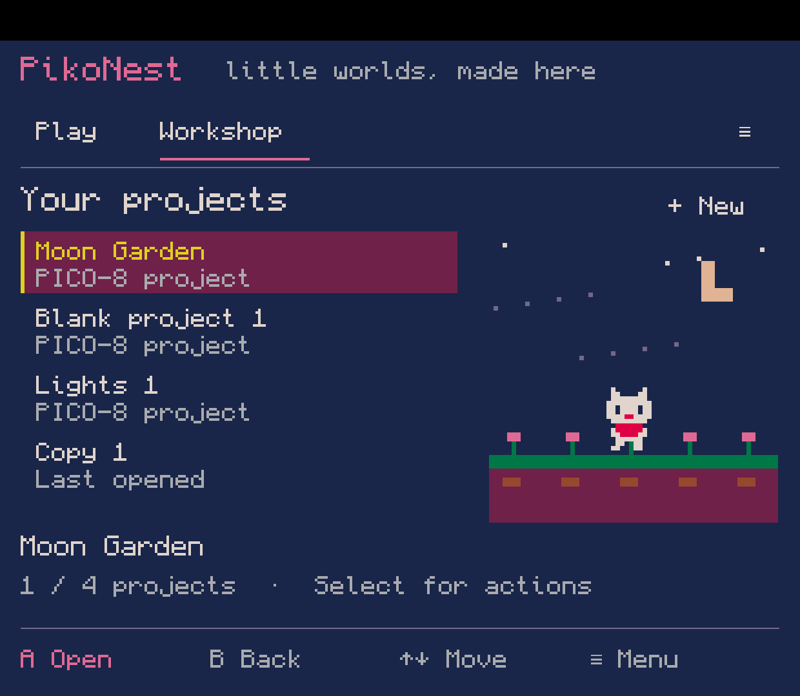

# PikoNest — English website gallery

[Lab 0.0.74: full-sheet copy, transform/color/move and official draft Test](0.0.74-en/README.md). Seven unedited English device captures; partial G01-G03.

[Lab 0.0.73: shared sprite/map review, native recovery and official draft Test](0.0.73-en/README.md). Six unedited English device captures; partial G01-G03.

Latest: [0.0.72 rules move sprites](0.0.72-en/README.md) — eight original English
Retroid captures of coordinate bindings, rules, a UI-authored game in official
PICO-8, goal/reset and verified export. Includes the exact exported `.p8`.
Full physical-controller and independent export acceptance remain open.

Earlier: [0.0.71 runtime data import](0.0.71-en/README.md) — six original English
Retroid captures: conflict review, verified import, retained save, clean Play and
Workshop Test. [0.0.70 one Android application](0.0.70-en/README.md) records the
first integration and Home/resume. Earlier editor packs remain useful for tools.

Also: [0.0.69 Rules & state](0.0.69-en/README.md) — eight English captures of
starting values, input/conditions, reset, readouts and export from a blank project.
[Download the rules pack](PikoNest-rules-en-0.0.69.zip?raw=true).

Also: [0.0.68 background workflow](0.0.68-en/README.md) — seven original English
captures from the regular APK, covering resource selection, layers and parallax.
[Download the background pack](PikoNest-backgrounds-en-0.0.68.zip?raw=true).

Also: [0.0.67 shared animation/camera editors](0.0.67-en/README.md) — seven English
captures from the regular APK, including field editing, preview and a compact layout.
[Download the new editor pack](PikoNest-editors-en-0.0.67.zip?raw=true).
The older download below remains an explicitly versioned collection.

A tool-focused selection assembled on 5 October 2026: **10 original PNGs**.
Lead with the **sprite editor, asset library and map editor**; use Play and
Workshop to explain how people enter and leave creation.

[Download all 10 images, captions and provenance](PikoNest-website-en.zip?raw=true).

This collection combines existing captures; it is not a new capture session.
The editors and game are from **0.0.65**, captured on Retroid Pocket Classic on
4 October with an isolated English presentation build. The shelves are from the
regular **0.0.66** build, captured on an Android emulator on 5 October. All PNGs
are preserved byte-for-byte at 1240 × 1080. Full editor localization and migration
to the new shared interface are still in progress.

The source packs contain detailed evidence and limitations:
[0.0.65 editors](0.0.65-en/README.md) · [0.0.66 shelves](0.0.66-en/README.md).

The sprite library currently covers sprites. The camera is a resource preview;
both pictured background layers have zero speed. Moon Garden demonstrates the
official runtime, not a game wholly created with the visual tools. Audio editors
and the complete game-creation workflow remain unfinished, so no audio-editor
screenshot is included.

## Images and captions

### Small pixels. Big personality.

[Original PNG](0.0.65-en/02-sprite-editor.png) · 0.0.65-en

### Keep your creations close.

[Original PNG](0.0.65-en/08-asset-library.png) · 0.0.65-en

### Build a world, one tile at a time.

[Original PNG](0.0.65-en/04-map-editor.png) · 0.0.65-en

### Bring your sprites to life.

[Original PNG](0.0.65-en/05-animation-editor.png) · 0.0.65-en

### Choose the pixels you need.

[Original PNG](0.0.65-en/03-sheet-region.png) · 0.0.65-en

### Arrange your background layers.

[Original PNG](0.0.65-en/07-background-layers.png) · 0.0.65-en

### Frame your world.

[Original PNG](0.0.65-en/06-camera-preview.png) · 0.0.65-en

### From the workshop to playtime.

[Original PNG](0.0.65-en/09-official-runtime.png) · 0.0.65-en

### Pick a cartridge. Start playing.

[Original PNG](0.0.66-en/01-play-library.png) · 0.0.66-en

### A home for your projects.

[Original PNG](0.0.66-en/03-workshop.png) · 0.0.66-en

